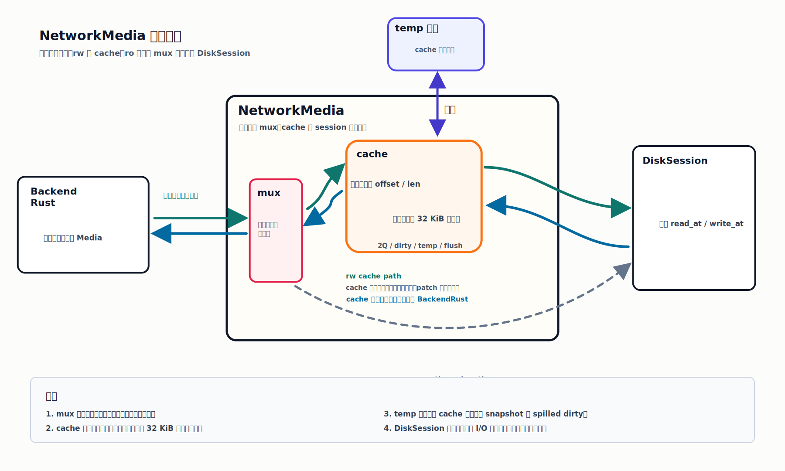

# Cache

## 定位

`docs/cache` 是当前 `NetworkMedia` 缓存设计的正式入口。

当前版本只覆盖权威侧 `rw` 缓存，`ro` 继续直通，不做缓存。



缓存仍然落在 `NetworkMedia` 内部，整体结构固定为：

```text
BackendRust <-> NetworkMedia <-> DiskSession
                    |
                    +-> mux
                    +-> cache
```

这里的边界先收紧为 4 条：

- `mux` 只负责复用和分流，不负责对齐、拼接、裁剪
- `cache` 左侧面对 `BackendRust`，接受任意起始字节和任意长度
- `cache` 右侧面对 `DiskSession`，只产出 `32 KiB` 对齐、固定块大小的 `read_at/write_at`
- `DiskSession` 继续只负责远端块 I/O

## 文档目录

- [主要组件](./components.md)
- [使用模型](./usage-model.md)
- [缓存策略](./cache-strategy.md)
- [逻辑策略](./logic-policies.md)

## 当前固定口径

- 只缓存 `rw`；`ro` 继续直通
- 块大小固定为 `32 KiB`
- resident 使用 `2Q = FIFO + LRU`
- dirty 数据离开 resident 前，必须先落 temp
- 同一块同一时刻只允许一个 active flush snapshot
- temp 按单盘文件数限流，不按总字节数限流
- miss 需要 dirty eviction 且 temp 已满时，前台请求必须阻塞
