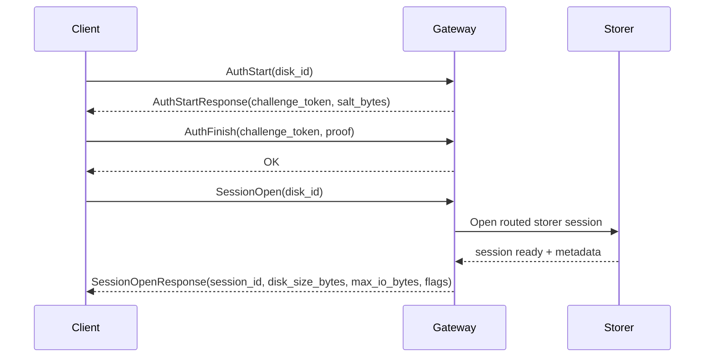
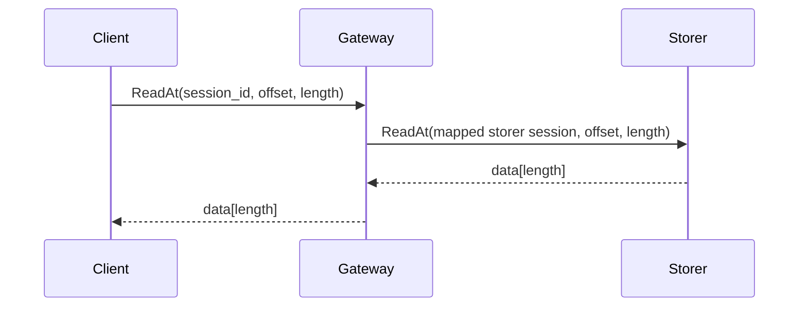
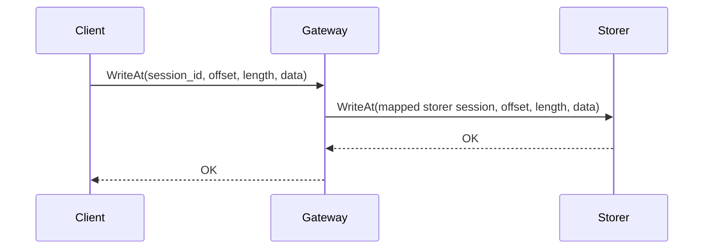

# YumeDisk Client-and-Gateway Business Protocol v1

## 1. 文档定位

本文档是 `network-disk-go-server` 第一版 `client <-> gateway` 业务层协议 SDK 文档。

作用：

- 定义 `client <-> gateway` 的正式业务层二进制协议
- 固定字段布局、字节序、取值范围、错误码和时序要求
- 作为后续 `GatewayConnection`、`ConnectionAuthenticator`、`SessionOpener`、`DiskSession`、`NetworkMedia` 与 `gateway` 外部接口实现的唯一协议依据

优先级：

- 本文档高于 `overview.md`、`auth-routing.md`、`data-plane.md` 中的叙述性描述
- 本文档不替代 `transport.md`
- 若其他文档与本文档冲突，以本文档为准，并应同步修正其他文档

当前范围：

- 只覆盖第一版最小闭环
- 只覆盖 `client <-> gateway` 业务层协议面
- 默认运行在 [transport.md](transport.md) 定义的传输层之上
- 不覆盖未来分布式存储、复制、分片、元数据协调

## 2. 主路径与边界

唯一主路径：

```text
client <-> gateway <-> storer
```

边界约束：

- `client` 只连接 `gateway`
- `gateway` 负责认证、路由、转发
- `storer` 持有真实存储介质并执行块读写
- 认证成功后，`client` 不直接连接 `storer`
- `gateway` 内部维护 `session_id -> storer session` 映射

当前 client 侧必须明确以下对象边界：

- `GatewayConnection`：connection 复用核心
- `ConnectionAuthenticator`：认证阶段模块
- `SessionOpener`：会话建立阶段模块
- `DiskSession`：已打开会话对象
- `NetworkMedia`：只绑定 `DiskSession` 的 `Media` 适配层

协议边界拆分：

- 本文档：`client <-> gateway` 业务层协议
- [transport.md](transport.md)：通用传输层拆帧协议
- `gateway <-> storer` 业务层协议：后续独立定义，不在本文档中固定

当前口径：

- `gateway <-> storer` 不要求复用本文档
- 后续即使两侧字段相近，也应视为独立协议面
- `gateway <-> storer` 可以针对内部转发语义做不同设计

## 3. 版本与兼容策略

### 3.1 协议版本

本文档定义：

- 协议名：`YumeDisk Client-and-Gateway Business Protocol`
- 协议版本：`v1`
- 版本号字段：`protocol_version = 1`

### 3.2 兼容策略

第一版不保留长期双轨兼容。

约束：

- `client` 与 `gateway` 的 `protocol_version` 必须一致
- 收到未知版本时，直接返回 `ERR_PROTOCOL_VERSION`
- 第一版不协商降级版本

## 3.3 业务语义分层

当前 `client-and-gateway` 协议虽然属于同一份业务协议，但语义上必须拆成三段：

1. 认证层
2. 会话建立层
3. 数据面层

硬约束：

- 认证成功不等于会话已建立
- 认证成功只授予“申请打开该盘会话”的资格
- 只有会话建立层成功后，才能创建 `DiskSession`

## 4. 基础约定

### 4.1 传输层引用

本文档所有业务消息都承载在 [transport.md](transport.md) 定义的单帧 payload 中。

这里不重复定义传输层长度头、拆帧和收包流程，只引用以下结果：

- 单帧 payload 实际长度范围：`1..65536`
- 一条业务消息必须完整落在一个 transport frame 的 payload 中
- 传输层不负责业务重组

### 4.2 字节序

除特别说明外，所有整数都使用 `big-endian`。

### 4.3 字符与编码

#### 固定 ASCII 字段

| 名称 | 长度 | 编码 | 说明 |
| --- | --- | --- | --- |
| `disk_id` | 16 字节 | ASCII | 仅允许 `0-9a-zA-Z` |

#### 可变字节字段

| 类型名 | 编码形式 | 长度字段 | 说明 |
| --- | --- | --- | --- |
| `bytes_u16` | `u16be len + bytes[len]` | `u16be` | 用于 opaque token 等原始字节 |
| `utf8_u16` | `u16be len + utf8[len]` | `u16be` | 预留给未来文本字段；v1 外部协议不强依赖 |

### 4.4 基础数值类型

| 类型 | 字节数 | 范围 |
| --- | --- | --- |
| `u8` | 1 | `0..255` |
| `u16` | 2 | `0..65535` |
| `u32` | 4 | `0..4294967295` |
| `u64` | 8 | `0..18446744073709551615` |

### 4.5 保留字段

文中标为 `reserved` 的字段：

- 发送方必须写 `0`
- 接收方必须校验为 `0`
- 非 `0` 视为 `ERR_BAD_BODY` 或 `ERR_BAD_HEADER`

## 5. 认证计算口径

`claim_code` 不直接上网传输，仅用于本地计算认证材料。

### 5.1 领盘码格式

| 字段 | 长度 | 说明 |
| --- | --- | --- |
| `disk_id` | 16 字符 | 领盘码前 16 字符 |
| `claim_secret` | 64+ 字符 | 领盘码剩余部分 |
| `claim_code` | 80+ 字符 | `disk_id + claim_secret` |

字符集：

```text
0-9 a-z A-Z
```

### 5.2 认证算法 v1

`algo_version = 1` 对应算法：

```text
auth_verifier = SHA512(claim_code_bytes)
proof = HMAC-SHA512(key = auth_verifier, msg = salt_bytes)
```

说明：

- `claim_code_bytes` 为 `claim_code` 的原始 ASCII 字节
- `auth_verifier` 长度固定为 `64` 字节
- `proof` 长度固定为 `64` 字节
- `proof` 在线上按原始 `64` 字节传输，不传十六进制字符串
- `gateway` 只需要缓存 `auth_verifier`，不需要保存原始 `claim_code`

## 6. payload 通用头

每个 payload 都以固定头开始。

### 6.1 通用头布局

固定头总长度：

```text
24 bytes
```

布局：

| 偏移 | 长度 | 字段 | 类型 | 说明 |
| --- | --- | --- | --- | --- |
| `0` | 1 | `protocol_version` | `u8` | 当前固定为 `1` |
| `1` | 1 | `header_len` | `u8` | 当前固定为 `24` |
| `2` | 1 | `op_code` | `u8` | 命令码 |
| `3` | 1 | `flags` | `u8` | 方向与控制位 |
| `4` | 2 | `status_code` | `u16` | 请求时固定为 `0` |
| `6` | 2 | `reserved` | `u16` | 固定为 `0` |
| `8` | 8 | `request_id` | `u64` | 请求配对标识 |
| `16` | 8 | `session_id` | `u64` | 会话标识；未开会话时为 `0` |

### 6.2 通用头规则

#### `protocol_version`

- 请求和响应都必须为 `1`
- 非 `1` 直接返回 `ERR_PROTOCOL_VERSION`

#### `header_len`

- 第一版固定为 `24`
- 非 `24` 直接返回 `ERR_BAD_HEADER`

#### `flags`

当前只定义 1 个 bit：

| bit | 名称 | 含义 |
| --- | --- | --- |
| `0` | `FLAG_RESPONSE` | `1` 表示响应，`0` 表示请求 |

其他 bit：

- 发送方必须写 `0`
- 接收方发现未知 bit 被置位时，返回 `ERR_BAD_HEADER`

#### `status_code`

- 请求包必须为 `0`
- 响应包：
  - `0` 表示成功
  - 非 `0` 表示失败

#### `request_id`

- `0` 保留，禁止使用
- 同一条 TCP 连接上，所有“仍在飞行中的请求”必须唯一
- 请求方可在收到响应后重用旧 `request_id`
- 响应方必须原样回显请求的 `request_id`

#### `session_id`

- `AuthStart` / `AuthFinish` / `SessionOpen` 请求固定为 `0`
- `SessionOpen` 成功响应使用新分配的 `session_id`
- 其他数据面请求必须带有效非 `0` `session_id`

### 6.3 头部示意图

```text
 0        1        2        3        4        5        6        7
+--------+--------+--------+--------+--------+--------+--------+--------+
|   pv   |  hlen  |   op   | flags  |   status_code   |    reserved     |
+--------+--------+--------+--------+--------+--------+--------+--------+

 8        9       10       11       12       13       14       15
+--------+--------+--------+--------+--------+--------+--------+--------+
|                          request_id (u64)                             |
+--------+--------+--------+--------+--------+--------+--------+--------+

16       17       18       19       20       21       22       23
+--------+--------+--------+--------+--------+--------+--------+--------+
|                          session_id (u64)                             |
+--------+--------+--------+--------+--------+--------+--------+--------+

legend:
pv     = protocol_version
hlen   = header_len
op     = op_code
```

## 7. 通用 body 约束

### 7.1 成功响应

- 成功响应使用与请求同一 `op_code`
- 成功响应 `status_code = 0`
- 成功响应 body 结构由具体命令定义

### 7.2 失败响应

- 失败响应使用与请求同一 `op_code`
- 失败响应 `status_code != 0`
- 第一版失败响应 body 固定为空
- 失败原因完全由 `status_code` 表达

### 7.3 未知命令

- 未知 `op_code` 返回 `ERR_UNSUPPORTED_OP`

## 7.4 `GatewayConnection` 复用核心职责

本协议默认运行在一个 connection 复用模型上：

```text
NetworkMedia1 -> DiskSession1 \
NetworkMedia2 -> DiskSession2  -> GatewayConnection -> Transport -> TCP
NetworkMedia3 -> DiskSession3 /
```

这里的关键约束是：

- 多个 `NetworkMedia` 不直接抢 `TCP`
- 多个 `NetworkMedia` 通过各自的 `DiskSession` 复用同一个 `GatewayConnection`
- `GatewayConnection` 是 connection-scoped 并发复用核心

因此必须由 `GatewayConnection` 管理：

- `request_id` 分配
- pending request map
- 响应配对
- 连接断开广播失败

这些职责不属于：

- `NetworkMedia`
- `DiskSession`
- 认证层

## 8. 操作码表

| `op_code` | 名称 | 方向 | 说明 |
| --- | --- | --- | --- |
| `0x01` | `AuthStart` | request/response | 发起 challenge |
| `0x02` | `AuthFinish` | request/response | 提交 proof |
| `0x03` | `SessionOpen` | request/response | 打开远端盘会话 |
| `0x10` | `ReadAt` | request/response | 读取远端盘数据 |
| `0x11` | `WriteAt` | request/response | 写入远端盘数据 |
| `0x12` | `Ping` | request/response | 保活会话 |
| `0x13` | `Close` | request/response | 关闭会话 |

保留范围：

| 范围 | 用途 |
| --- | --- |
| `0x00` | 保留 |
| `0x04..0x0F` | 认证/控制扩展保留 |
| `0x14..0x7F` | 数据面扩展保留 |
| `0x80..0xFF` | 内部实验保留，不进入正式实现 |

## 9. 状态码表

### 9.1 成功码

| `status_code` | 名称 | 说明 |
| --- | --- | --- |
| `0x0000` | `OK` | 请求成功 |

### 9.2 协议层错误

| `status_code` | 名称 | 说明 |
| --- | --- | --- |
| `0x1001` | `ERR_PROTOCOL_VERSION` | 协议版本不支持 |
| `0x1002` | `ERR_BAD_HEADER` | 通用头非法 |
| `0x1003` | `ERR_BAD_BODY` | body 编码非法 |
| `0x1004` | `ERR_INVALID_REQUEST_ID` | `request_id` 非法 |
| `0x1005` | `ERR_UNSUPPORTED_OP` | 不支持的 `op_code` |

### 9.3 认证层错误

| `status_code` | 名称 | 说明 |
| --- | --- | --- |
| `0x1101` | `ERR_AUTH_FAILED` | 认证失败；对外统一口径 |
| `0x1102` | `ERR_AUTH_EXPIRED` | challenge 已过期 |
| `0x1103` | `ERR_AUTH_CHALLENGE_INVALID` | challenge token 非法或不属于当前连接 |
| `0x1104` | `ERR_AUTH_REQUIRED` | 当前连接尚未完成指定盘认证 |

说明：

- `ERR_AUTH_FAILED` 对外同时覆盖：
  - 假盘
  - 真盘但领盘码错误
  - 不希望额外暴露的统一认证失败情形

### 9.4 会话层错误

| `status_code` | 名称 | 说明 |
| --- | --- | --- |
| `0x1201` | `ERR_SESSION_NOT_FOUND` | `session_id` 不存在 |
| `0x1202` | `ERR_SESSION_EXPIRED` | `session_id` 已过期 |
| `0x1203` | `ERR_SESSION_CLOSED` | `session_id` 已关闭 |

### 9.5 I/O 层错误

| `status_code` | 名称 | 说明 |
| --- | --- | --- |
| `0x1301` | `ERR_IO_OUT_OF_RANGE` | `offset + length` 越界 |
| `0x1302` | `ERR_IO_TOO_LARGE` | `length > max_io_bytes` |
| `0x1303` | `ERR_IO_READ_ONLY` | 只读盘写入 |
| `0x1304` | `ERR_IO_FAILED` | 远端盘 I/O 失败 |

## 10. 命令详细定义

当前命令必须按语义阶段阅读，而不是堆成一层理解：

- 认证层：`AuthStart / AuthFinish`
- 会话建立层：`SessionOpen`
- 数据面层：`ReadAt / WriteAt / Ping / Close`

## 10.1 AuthStart

作用：

- client 发起 challenge 请求
- gateway 无论真盘还是假盘，都返回统一形态 challenge
- 属于认证层

### 10.1.1 请求头

| 字段 | 值 |
| --- | --- |
| `op_code` | `0x01` |
| `flags` | `0` |
| `status_code` | `0` |
| `request_id` | 非 `0` |
| `session_id` | `0` |

### 10.1.2 请求 body

固定长度：

```text
16 bytes
```

| 偏移 | 长度 | 字段 | 类型 | 说明 |
| --- | --- | --- | --- | --- |
| `0` | 16 | `disk_id` | ASCII[16] | 只允许 `0-9a-zA-Z` |

### 10.1.3 成功响应头

| 字段 | 值 |
| --- | --- |
| `op_code` | `0x01` |
| `flags` | `FLAG_RESPONSE` |
| `status_code` | `0` |
| `request_id` | 与请求相同 |
| `session_id` | `0` |

### 10.1.4 成功响应 body

布局：

| 偏移 | 长度 | 字段 | 类型 | 说明 |
| --- | --- | --- | --- | --- |
| `0` | 1 | `algo_version` | `u8` | 当前固定为 `1` |
| `1` | 2 | `ttl_seconds` | `u16` | challenge 生存期 |
| `3` | 16 | `salt_bytes` | `bytes[16]` | v1 固定 16 字节随机盐 |
| `19` | 2 | `challenge_token_len` | `u16` | token 长度 |
| `21` | `N` | `challenge_token` | `bytes[N]` | opaque token |

约束：

- `challenge_token_len >= 1`
- `algo_version = 1`
- `ttl_seconds >= 1`
- `salt_bytes` 为原始随机字节，不传 hex

### 10.1.5 gateway 行为约束

- 真盘与假盘都必须返回同样结构
- 不允许在 `AuthStart` 阶段暴露“盘不存在”
- 不允许在 `AuthStart` 阶段触发 `storer` 数据面

## 10.2 AuthFinish

作用：

- client 提交基于 `claim_code` 和 `salt_bytes` 计算出的 `proof`
- gateway 完成认证判定
- 属于认证层

### 10.2.1 请求头

| 字段 | 值 |
| --- | --- |
| `op_code` | `0x02` |
| `flags` | `0` |
| `status_code` | `0` |
| `request_id` | 非 `0` |
| `session_id` | `0` |

### 10.2.2 请求 body

布局：

| 偏移 | 长度 | 字段 | 类型 | 说明 |
| --- | --- | --- | --- | --- |
| `0` | 2 | `challenge_token_len` | `u16` | token 长度 |
| `2` | `N` | `challenge_token` | `bytes[N]` | 来自 `AuthStartResponse` |
| `2 + N` | 64 | `proof` | `bytes[64]` | `HMAC-SHA512(key = auth_verifier, msg = salt_bytes)` |

约束：

- `challenge_token_len >= 1`
- `proof` 固定 `64` 字节原始摘要

### 10.2.3 成功响应头

| 字段 | 值 |
| --- | --- |
| `op_code` | `0x02` |
| `flags` | `FLAG_RESPONSE` |
| `status_code` | `0` |
| `request_id` | 与请求相同 |
| `session_id` | `0` |

### 10.2.4 成功响应 body

成功时 body 为空。

### 10.2.5 失败响应

失败时：

- `status_code` 取下列之一：
  - `ERR_AUTH_FAILED`
  - `ERR_AUTH_EXPIRED`
  - `ERR_AUTH_CHALLENGE_INVALID`
- body 为空

### 10.2.6 gateway 行为约束

- 所有认证失败统一随机延迟 `2..5s`
- 延迟只加在 `AuthFinish` 失败路径
- 失败后清理当前未认证上下文
- 不允许通过错误码区分真盘与假盘

### 10.2.7 认证层硬约束

- `AuthFinish` 成功后不得直接创建 `DiskSession`
- `AuthFinish` 成功后只表示当前 connection 已对目标 `disk_id` 完成认证
- 后续是否能真正拿到会话，必须进入 `SessionOpen`

## 10.3 SessionOpen

作用：

- 在当前 `gateway` 连接上为某个已认证盘打开一个数据面会话
- 属于会话建立层
- 是认证资格进入真实会话的唯一入口

### 10.3.1 请求头

| 字段 | 值 |
| --- | --- |
| `op_code` | `0x03` |
| `flags` | `0` |
| `status_code` | `0` |
| `request_id` | 非 `0` |
| `session_id` | `0` |

### 10.3.2 请求 body

固定长度：

```text
16 bytes
```

| 偏移 | 长度 | 字段 | 类型 | 说明 |
| --- | --- | --- | --- | --- |
| `0` | 16 | `disk_id` | ASCII[16] | 目标盘 ID |

### 10.3.3 成功响应头

| 字段 | 值 |
| --- | --- |
| `op_code` | `0x03` |
| `flags` | `FLAG_RESPONSE` |
| `status_code` | `0` |
| `request_id` | 与请求相同 |
| `session_id` | 新分配的非 `0` 会话 ID |

### 10.3.4 成功响应 body

布局：

| 偏移 | 长度 | 字段 | 类型 | 说明 |
| --- | --- | --- | --- | --- |
| `0` | 8 | `disk_size_bytes` | `u64` | 远端盘容量 |
| `8` | 4 | `max_io_bytes` | `u32` | 单次最大 I/O 大小 |
| `12` | 4 | `session_ttl_seconds` | `u32` | 会话 TTL |
| `16` | 2 | `session_flags` | `u16` | 见下表 |
| `18` | 2 | `reserved` | `u16` | 固定 `0` |

`session_flags` 取值：

| bit | 名称 | 含义 |
| --- | --- | --- |
| `0` | `SESSION_FLAG_READ_ONLY` | `1` 表示只读 |

其他 bit：

- v1 必须为 `0`

### 10.3.5 `max_io_bytes` 硬约束

传输层 payload 最大为 `65536` 字节。

#### `WriteAt` 请求最大数据长度

`WriteAt` body 结构为：

```text
offset(u64) + length(u32) + data[length]
```

固定开销：

- 通用头：`24`
- `offset`：`8`
- `length`：`4`

总开销：

```text
36 bytes
```

因此：

```text
max_write_payload = 65536 - 36 = 65500
```

#### `ReadAt` 响应最大数据长度

`ReadAt` 成功响应 body 只有数据段：

```text
data[length]
```

固定开销：

- 通用头：`24`

因此：

```text
max_read_payload = 65536 - 24 = 65512
```

综合收敛：

```text
v1 absolute_max_io_bytes = 65500
```

所以：

- `1 <= max_io_bytes <= 65500`
- 建议 `gateway/storer` 实际下发值不超过 `60 KiB`

### 10.3.6 语义约束

- `SessionOpen` 的前提是当前 connection 已对目标 `disk_id` 完成认证
- `SessionOpen` 的成功与否由 `storer` 打开策略决定
- 同一连接上，`SessionOpen` 可针对多个不同盘执行
- 同一盘重复 `SessionOpen` 默认创建新的独立会话
- `SessionOpen` 成功后才允许构造 `DiskSession`
- `NetworkMedia` 构造必须使用本响应返回的 `session_id`

## 10.4 ReadAt

作用：

- 从远端盘读取指定区间数据
- 属于数据面层

### 10.4.1 请求头

| 字段 | 值 |
| --- | --- |
| `op_code` | `0x10` |
| `flags` | `0` |
| `status_code` | `0` |
| `request_id` | 非 `0` |
| `session_id` | 非 `0` |

### 10.4.2 请求 body

固定长度：

```text
12 bytes
```

| 偏移 | 长度 | 字段 | 类型 | 说明 |
| --- | --- | --- | --- | --- |
| `0` | 8 | `offset` | `u64` | 起始偏移 |
| `8` | 4 | `length` | `u32` | 读取长度 |

约束：

- `1 <= length <= max_io_bytes`
- `offset + length <= disk_size_bytes`

### 10.4.3 成功响应头

| 字段 | 值 |
| --- | --- |
| `op_code` | `0x10` |
| `flags` | `FLAG_RESPONSE` |
| `status_code` | `0` |
| `request_id` | 与请求相同 |
| `session_id` | 与请求相同 |

### 10.4.4 成功响应 body

成功响应 body 为原始数据段：

```text
data[length]
```

约束：

- body 长度必须与请求 `length` 完全相等
- 不允许成功响应短读
- 若无法返回完整数据，必须返回 `ERR_IO_FAILED`

## 10.5 WriteAt

作用：

- 向远端盘写入指定区间数据
- 属于数据面层

### 10.5.1 请求头

| 字段 | 值 |
| --- | --- |
| `op_code` | `0x11` |
| `flags` | `0` |
| `status_code` | `0` |
| `request_id` | 非 `0` |
| `session_id` | 非 `0` |

### 10.5.2 请求 body

布局：

| 偏移 | 长度 | 字段 | 类型 | 说明 |
| --- | --- | --- | --- | --- |
| `0` | 8 | `offset` | `u64` | 起始偏移 |
| `8` | 4 | `length` | `u32` | 写入长度 |
| `12` | `N` | `data` | `bytes[N]` | 写入数据 |

约束：

- `N` 必须等于 `length`
- `1 <= length <= max_io_bytes`
- `offset + length <= disk_size_bytes`

### 10.5.3 成功响应头

| 字段 | 值 |
| --- | --- |
| `op_code` | `0x11` |
| `flags` | `FLAG_RESPONSE` |
| `status_code` | `0` |
| `request_id` | 与请求相同 |
| `session_id` | 与请求相同 |

### 10.5.4 成功响应 body

成功时 body 为空。

### 10.5.5 语义约束

- 成功响应表示远端已经接受本次写入，并承担一致性责任
- 不允许把“仅进入本地缓存”当作成功
- 只读盘写入必须返回 `ERR_IO_READ_ONLY`

## 10.6 Ping

作用：

- 保活 `session_id`
- 检测连接与会话仍有效
- 属于数据面层

### 10.6.1 请求头

| 字段 | 值 |
| --- | --- |
| `op_code` | `0x12` |
| `flags` | `0` |
| `status_code` | `0` |
| `request_id` | 非 `0` |
| `session_id` | 非 `0` |

### 10.6.2 请求 body

固定长度：

```text
8 bytes
```

| 偏移 | 长度 | 字段 | 类型 | 说明 |
| --- | --- | --- | --- | --- |
| `0` | 8 | `nonce` | `u64` | client 自定义 nonce |

### 10.6.3 成功响应 body

固定长度：

```text
8 bytes
```

| 偏移 | 长度 | 字段 | 类型 | 说明 |
| --- | --- | --- | --- | --- |
| `0` | 8 | `nonce` | `u64` | 原样回显请求值 |

## 10.7 Close

作用：

- 关闭指定 `session_id`
- 属于数据面层

### 10.7.1 请求头

| 字段 | 值 |
| --- | --- |
| `op_code` | `0x13` |
| `flags` | `0` |
| `status_code` | `0` |
| `request_id` | 非 `0` |
| `session_id` | 非 `0` |

### 10.7.2 请求 body

请求 body 为空。

### 10.7.3 成功响应 body

成功时 body 为空。

### 10.7.4 语义约束

- `Close` 只关闭目标 `session_id`
- 不关闭整条 TCP 连接
- `Close` 设计为幂等清理操作
- 若会话已经不存在或已过期，允许直接返回成功

## 11. 时序图

## 11.1 认证与开会话



## 11.2 读请求



## 11.3 写请求



## 12. 并发与生命周期规则

### 12.1 单连接多会话

第一版允许：

- 一个 `GatewayConnection`
- 并发承载多个 `DiskSession`
- 多个 `NetworkMedia` 通过各自的 `DiskSession` 并发复用同一条 `GatewayConnection`

实现要求：

- `GatewayConnection` 必须作为 connection 复用核心存在
- 使用 `request_id` 做响应配对
- 响应允许乱序返回
- 不允许假设“同一会话请求一定串行返回”

### 12.2 连接断开

一条 `GatewayConnection` 断开时：

- 该连接下全部 `DiskSession` 一起失效
- 失效后的读写必须直接失败
- 第一版不自动重连
- 第一版不自动重建会话

### 12.3 session TTL

- `session_ttl_seconds` 由 `SessionOpenResponse` 下发
- 网关和存储器可在 TTL 到期后回收会话
- client 若长期空闲，应在 TTL 到期前发送 `Ping`

## 13. NetworkMedia 实现要求

第一版 `NetworkMedia` 需要遵守：

- 保存：
  - 已打开的 `DiskSession`
  - `disk_size_bytes`
  - `read_only`
  - `max_io_bytes`
- `read_locked()` 按 `max_io_bytes` 主动拆分大请求
- `write_locked()` 按 `max_io_bytes` 主动拆分大请求
- 不做本地写缓存
- 不做自动重试
- 不做断线自动补连

职责边界：

- `NetworkMedia` 不关心认证过程
- `NetworkMedia` 不负责创建连接对象
- `NetworkMedia` 不负责 transport
- `NetworkMedia` 不负责 `request_id` 分配
- `NetworkMedia` 不负责 `SessionOpen`
- `NetworkMedia` 只把盘操作构造成业务协议包并发给一个已经完成的 `DiskSession`

与当前 `BackendRust::Media` 对齐：

- `read_locked()` 返回成功时，必须已拿到完整数据
- `write_locked()` 返回成功时，远端必须已经接受本次写入

## 14. Gateway 实现要求

### 14.1 认证阶段

- 无论真假盘，`AuthStart` 都返回统一结构
- `AuthFinish` 失败统一随机延迟 `2..5s`
- `AuthStart` 与假盘不触发 `storer` 数据面
- 认证成功只记录资格，不创建 `DiskSession`

### 14.2 会话建立阶段

- `SessionOpen` 是认证资格进入真实会话的唯一入口
- `gateway` 必须把会话打开请求交给 `storer`
- 是否允许打开、是否只读、是否共享、是否排它，由 `storer` 决定

### 14.3 转发阶段

- `gateway` 不缓存盘数据
- `gateway` 不篡改 `request_id`
- `gateway` 不篡改 `session_id` 对 client 的可见值
- `gateway` 只做会话查找、请求转发、响应回传

## 15. Storer 实现要求

- `storer` 是块读写和多登录策略的唯一决策点
- `storer` 决定同一 `disk_id` 多登录后的共享、排它和操作权
- `storer` 必须保证：
  - 成功读返回完整数据
  - 成功写表示写入已被接受
  - 越界、只读、I/O 错误都有明确失败返回

## 16. 第一版不做

本文档明确不覆盖：

- `client -> storer` 直连
- 传输层多帧重组
- 压缩
- TLS 强制要求
- 自动重连
- 多 TCP 连接池
- 写缓存确认链
- 增量重传
- 多副本
- 分片
- 元数据协调

## 17. 最小验收清单

实现完成后，至少应满足：

1. `claim_code` 能成功完成认证
2. 假盘与错码在外部观察上都走同样认证流程
3. `SessionOpen` 能返回有效 `session_id`
4. 一个 `GatewayConnection` 上能并发承载多个 `DiskSession`
5. `ReadAt / WriteAt` 能完成真实远端盘读写
6. 大于 `max_io_bytes` 的请求能被 client 正确拆分
7. 连接断开后，全部 `DiskSession` 一起失效
