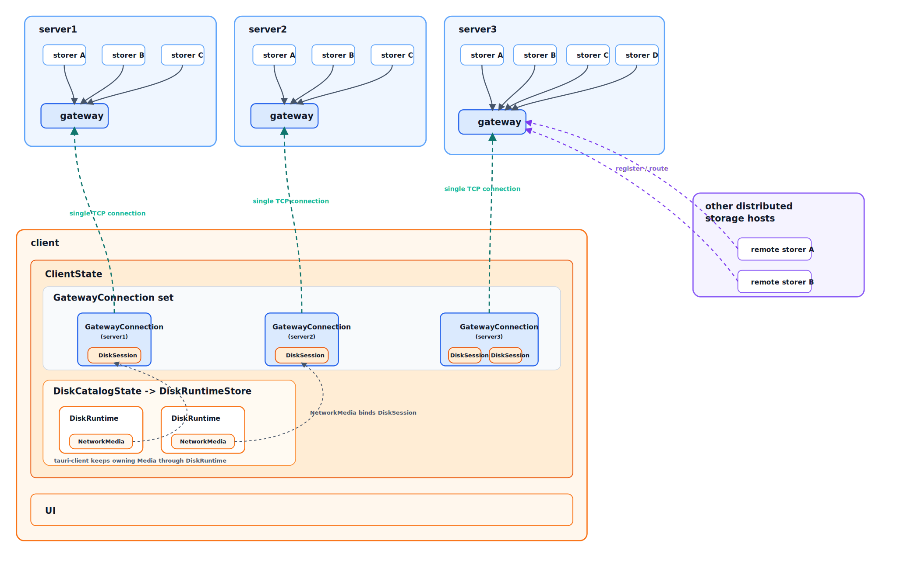

# 总览

## 1. 当前阶段目标

当前阶段只收敛到一条最短、唯一、可实现的主路径：

- `client` 只连接 `gateway`
- `gateway` 负责认证、路由、转发
- `storer` 持有真实存储介质并执行块读写

第一版不引入真正的分布式存储能力，也不保留 `client -> storer` 直连分支。
当前 server 运行角色固定为：

- `whole`：内嵌 `gateway` 的单体部署
- `storer`：只持有后端存储并主动连接外部 `gateway`

唯一主路径：

```text
client <-> gateway <-> storer
```

## 2. 当前模型图

### 2.1 部署拓扑



### 2.2 Client 对象层级

```text
UI
  -> ClientState
    -> DiskCatalogState
      -> DiskRuntimeStore
        -> DiskRuntime
          -> NetworkMedia(Media adapter)
    -> GatewayConnection(server endpoint, connection reuse core)
      -> ConnectionAuthenticator
      -> SessionOpener
      -> DiskSession(gateway session)

ConnectionAuthenticator
  -> authenticate disk_id on GatewayConnection

SessionOpener
  -> open authorized disk session on GatewayConnection

NetworkMedia
  -> bind -> DiskSession
```

对象关系：

- `ClientState` 当前真实持有 `BackendContext` 与 `DiskCatalogState`
- `DiskCatalogState` 当前真实持有 `DiskRuntimeStore`
- `DiskRuntime` 当前真实持有 `media: Option<Box<dyn Media>>`
- 网络盘接入后，`DiskRuntime` 继续持有 `NetworkMedia`
- 一个 `GatewayConnection` 对应一个 server endpoint
- 一个 `GatewayConnection` 下并发承载多个 `DiskSession`
- `GatewayConnection` 是 connection 复用核心
- `GatewayConnection` 只管理连接、收发循环、pending request、request_id 分配和响应配对
- `ConnectionAuthenticator` 运行在 `DiskSession` 创建之前
- `SessionOpener` 运行在认证成功之后、数据面之前
- `NetworkMedia` 绑定一个 `DiskSession`

当前命名口径：

- `GatewayConnection`：client 到某个 server gateway 的单 TCP 连接管理对象
- `ConnectionAuthenticator`：在 `GatewayConnection` 上完成 `disk_id` 认证资格的模块
- `SessionOpener`：在认证资格已成立后请求打开真实盘会话的模块
- `DiskSession`：某个远端盘在 client 侧的已打开会话，不等于仅已认证
- `NetworkMedia`：基于 `DiskSession` 实现的 `Media` 适配层
- `DiskRuntime`：tauri-client 当前真实持有 `Media` 的盘运行时对象

当前模型约束：

- 一个 `GatewayConnection` 对应一个 server endpoint
- 一个 `GatewayConnection` 下可以并发承载多个 `DiskSession`
- 多个 `NetworkMedia` 通过各自的 `DiskSession` 并发复用同一条 `GatewayConnection` 是预期行为
- 认证成功只表示当前 connection 获得某个 `disk_id` 的认证资格
- 只有 `SessionOpen` 经 `storer` 打开策略判定成功后，才能创建 `DiskSession`
- `DiskRuntime` 持有 `NetworkMedia`
- `NetworkMedia` 绑定一个 `DiskSession`
- client 永远只连接 `gateway`，不直接连接 `storer`

## 3. Server 语言与目录组织

`server` 使用单 Go module。

```text
server/
├── go.mod
├── cmd/
│   ├── gateway/
│   └── storer/
└── internal/
    ├── auth/
    ├── config/
    ├── gateway/
    ├── proto/
    ├── route/
    ├── session/
    ├── storage/
    │   └── file/
    └── storer/
```

说明：

- `cmd/gateway`：独立网关进程入口
- `cmd/storer`：独立存储器进程入口
- `internal/auth`：领盘码、challenge、proof
- `internal/route`：盘路由与认证缓存
- `internal/session`：真实盘会话与数据面语义
- `internal/storage/file`：第一阶段唯一存储后端

第一阶段只实现 `file` backend，不提前做数据库 backend。

## 4. 职责边界

### gateway

只负责：

- 接收 `disk_id`
- 返回统一形态的 challenge
- 在本地使用缓存的认证信息校验 `proof`
- 为认证成功的 connection 记录认证资格
- 在 `SessionOpen` 时向 `storer` 申请真实会话
- 维护 `gateway session -> (route connection, storer session)` 映射
- 转发 `ReadAt / WriteAt / Ping / Close`

不负责：

- 真实数据存储
- 块数据落盘
- 多登录后的权限仲裁

### storer

只负责：

- 持有真实存储介质
- 管理真实数据面会话
- 执行块读写
- 决定同一 `disk_id` 多登录后的操作权和共享策略

### embedded gateway 模式

`whole` 角色在单盘部署时内建 `gateway` 能力。

要求：

- 使用与独立 `gateway` 完全相同的认证协议
- 使用同一套业务层请求头和数据面命令
- 只是部署形态不同，不派生第二套认证或数据面逻辑

### 4.3 当前实际启动入口

当前真实入口固定为：

- `cmd/gateway`
  - 独立进程
  - 读取可执行文件同目录 `config.toml`
  - 同时启动：
    - `client.listen_addr`
    - `storer.listen_addr`
- `cmd/storer`
  - 独立进程
  - 读取可执行文件同目录 `config.toml`
  - 内部按 `role = whole | storer` 选择运行形态

当前真实行为：

- `whole`
  - 使用本地 `Core`
  - 装配 embedded gateway
  - 直接监听 client TCP
- `storer`
  - 使用本地 `Core`
  - 不监听 client TCP
  - 主动长连 `gateway.storer.listen_addr`
  - 启动时只尝试连接一次
  - 连接成功后先注册，再复用长连接承接后续数据面请求
### 4.1 角色配置口径

`storer` 可执行文件配置：

```toml
role = "whole" # whole | storer

storage_file_path = "data/disk.img"
claim_code = "..."

[whole]
listen_addr = "127.0.0.1:9736"

[storer]
gateway_addr = "127.0.0.1:9836"
gateway_token = "..."
```

约束：

- `role = "whole"` 时对外监听 client 端口，走 `client-and-gateway` 协议
- `role = "storer"` 时不对外监听 client 端口，而是主动长连 `gateway`
- `claim_code` 仍然只由存储侧持有
- `gateway_token` 是 `storer <-> gateway` 注册信任凭据，不复用 `claim_code`

### 4.2 gateway 配置口径

`gateway` 可执行文件配置：

```toml
[client]
listen_addr = "127.0.0.1:9736"

[storer]
listen_addr = "127.0.0.1:9836"
gateway_token = "..."
```

约束：

- `client.listen_addr` 只承接 `client <-> gateway` 入口
- `storer.listen_addr` 只承接 `storer -> gateway` 注册和后续数据面复用入口
- `gateway_token` 是 `storer <-> gateway` 的唯一基础设施凭据
- `gateway` 不保存 `claim_code`

## 5. 单一真实来源

### storer 本地配置

`storer` 本地配置是以下事实的唯一真实来源：

- 完整领盘码 `claim_code`
- 存储后端配置
- `whole.listen_addr` 或 `storer.gateway_addr`
- 绑定的盘实例

### gateway 路由缓存

`gateway` 本地内存缓存当前保存的最小真实信息为：

- `disk_id`
- `auth_verifier`
- `route_target`
- `connection_id`
- 路由存活信息
- `disk_size_bytes`
- `read_only`
- `max_io_bytes`
- `session_ttl_seconds`

其中：

```text
auth_verifier = SHA512(claim_code_bytes)
```

`gateway` 不保存原始 `claim_code`。

### client 本地配置

client 本地配置只保存网络盘重建所需最小信息：

- `server_endpoint`
- `claim_code`
- `disk_name`
- `auto_mount`

以下信息不在 client 本地持久化：

- `auth_verifier`
- `session_id`
- `disk_size_bytes`
- `read_only`

其中 `disk_id` 可直接由 `claim_code` 前 `16` 个字符解析得到，不单独持久化。

### 多登录策略

认证层不处理“同一 `disk_id` 是否允许多登录”的业务决策。

当前口径：

- 两个连接如果都持有正确领盘码，都可以通过认证
- 认证成功后只是获得“申请打开该盘会话”的资格
- 能不能真的打开、是否只读、是否共享、是否排它，由 `storer` 在 `SessionOpen` 阶段决定
- 第一版先固定为单盘独占打开：同一时刻只允许一个 client 持有该盘活跃会话
- 认证资格绑定在当前连接上，不生成单独的对 client 可见 `auth_id`

## 6. 第一版最小会话模型

认证成功后不向 client 暴露 `storer_addr`，而是在 `gateway` 内部建立转发链。

当前业务语义必须拆成三段：

1. 认证阶段：`AuthStart / AuthFinish`
2. 会话建立阶段：`SessionOpen`
3. 数据面阶段：`ReadAt / WriteAt / Ping / Close`

硬约束：

- 认证成功不等于会话已建立
- 认证成功只授予“申请打开该盘会话”的资格
- 只有 `SessionOpen` 成功后，才能创建 `DiskSession`

会话模型：

```text
DiskSession {
  session_id
  disk_id
  disk_size_bytes
  read_only
  max_io_bytes
  expires_at
}
```

约束：

- `session_id` 由 `gateway` 分配
- `gateway` 持有 `gateway_session_id -> (route_connection, storer_session_id)` 映射
- `client` 后续所有数据面请求只带 `session_id`
- `NetworkMedia` 构造时必须拿到 `disk_size_bytes`、`read_only`、`max_io_bytes`
- `DiskSession` 只表示已打开会话，不表示仅已认证状态
- 第一版同一 `disk_id` 同时只允许一个活跃 `DiskSession`
- 当 `SessionOpen` 返回 busy 时，client 允许保留当前连接与认证资格，稍后继续重试 `SessionOpen`

## 7. 当前实现状态

当前 `server` 已经完成：

1. `whole | storer` 双角色配置与启动入口
2. embedded gateway 单盘最小闭环
3. 独立 `gateway` 运行时
4. `storer -> gateway` 注册与路由缓存
5. `SessionOpen / ReadAt / WriteAt / Ping / Close` 转发
6. `gateway_session_id -> (route_connection, storer_session_id)` 映射
7. `network-auth-open` 对独立 `gateway + storer` 的真实联调验证

## 8. 第一版验收口径

当前第一版已验收以下最小闭环：

1. 假盘与错码在外部观察上都走同样认证流程
2. 一个 `GatewayConnection` 上能同时承载多个 `DiskSession`
3. `NetworkMedia` 能完成真实 `read/write`
4. `tauri-client` 能完成网络盘的添加、挂载、拔出、重挂载
5. 独立 `gateway + storer + network-auth-open` 已验证：
   - auth
   - open
   - busy
   - close
   - reopen
