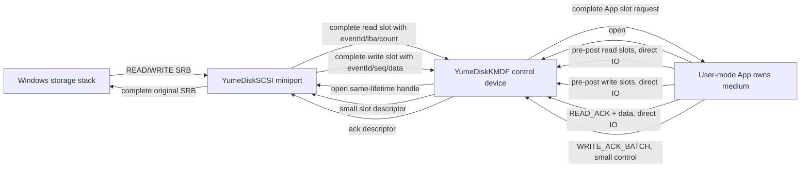
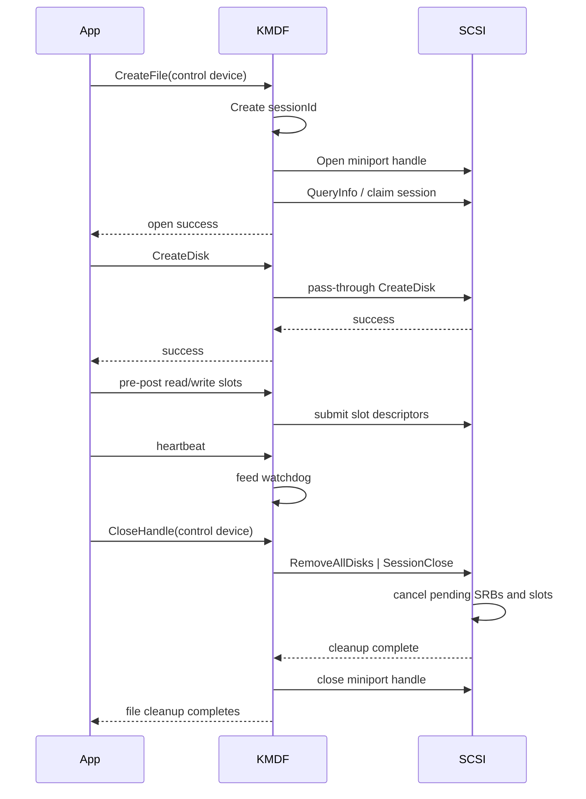
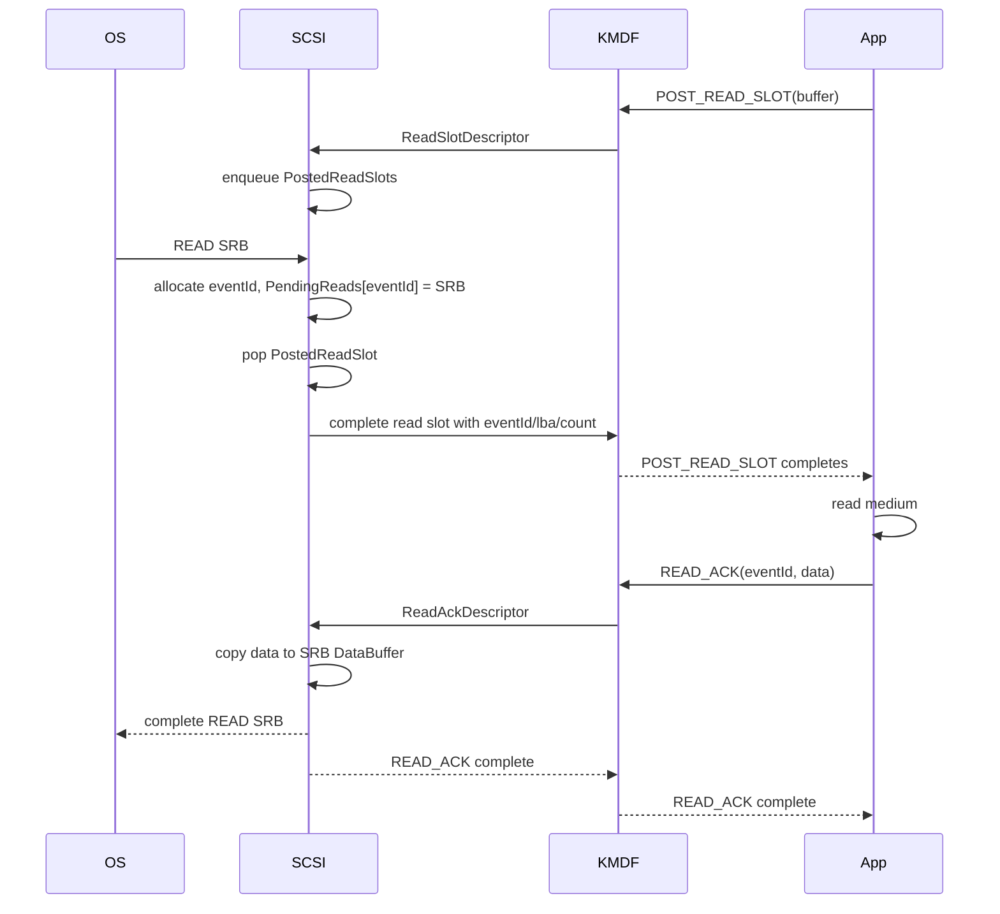
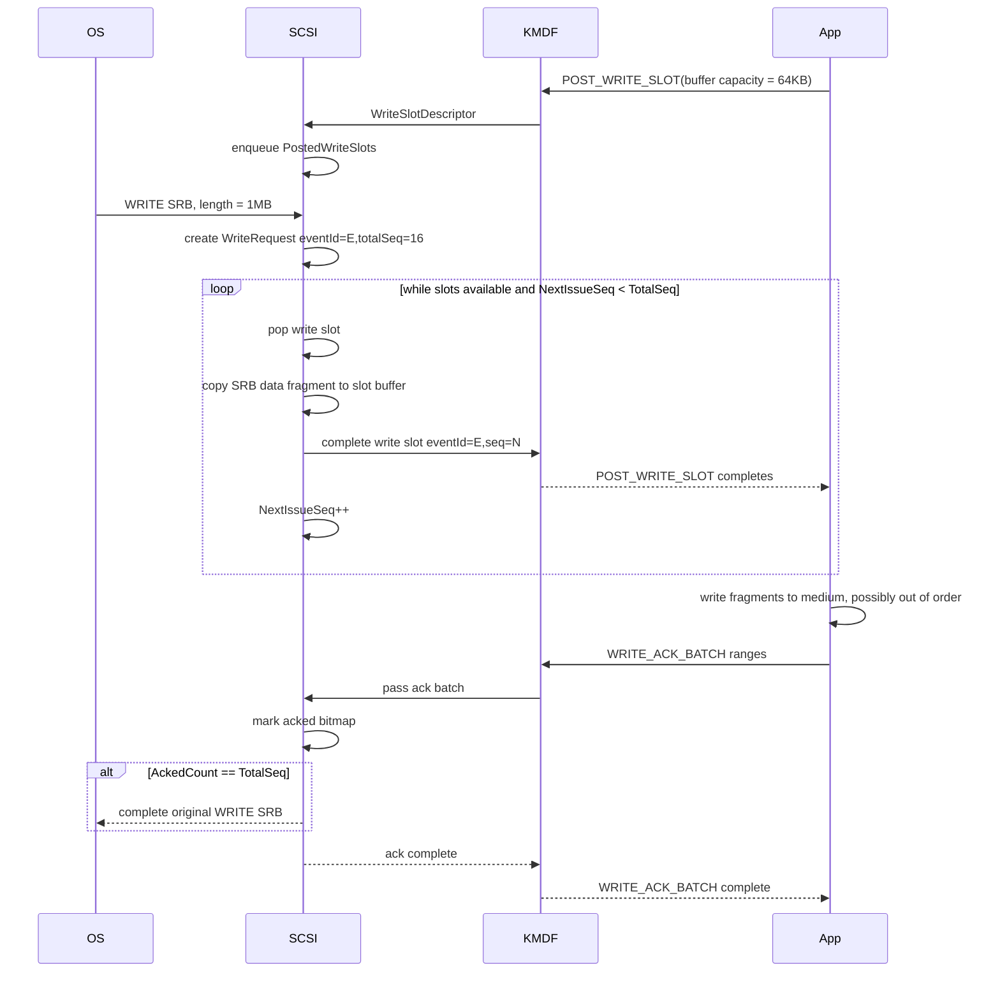
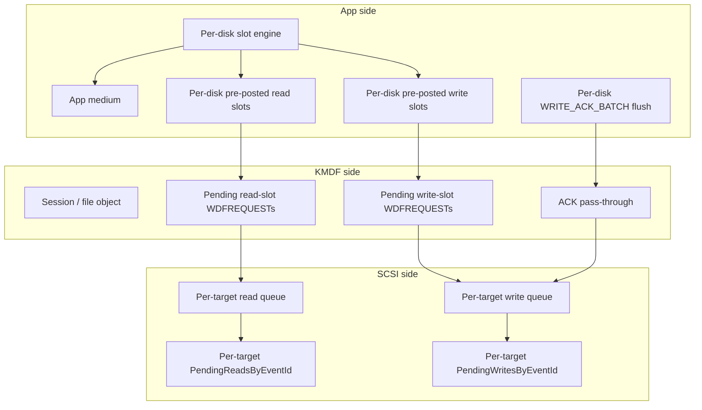

# App-Owned Media Queue Protocol Design

## 1. 背景和目标

当前 Windows 版本的 YumeDisk 由用户态 App 持有实际存储介质，`YumeDiskKMDF` 作为控制入口代理 App 请求到 `YumeDiskSCSI` miniport。现有链路在顺序 1M Q1T1 读写测试中只有约 20 MB/s，且 CPU 占用高、主要消耗在内核时间。

需要保留的底线:

- 实际存储介质必须由 App 管理。
- 驱动可以做少量必要的数据复制，但不能把介质所有权交回内核。
- KMDF 不做自己的数据面协议包装，只负责感知 App 打开句柄、管理 session 生命周期、固定 App direct IO buffer、转发小描述符给 SCSI。
- 读写在驱动层完全并发处理。驱动不做 LBA overlap 检测、不做读写一致性排序。重叠区间一致性全部由 App 负责。

优化目标:

- 避免每个 I/O 都经过 `WAIT_EVENT -> inline data -> READ_REPLY/WRITE_ACK` 的同步控制链路。
- 避免 KMDF 分配大 buffer、清零大 buffer、复制 App payload 到 `SRB_IO_CONTROL` 再复制回来。
- 让 App 预投读写队列，SCSI 直接完成队列元素作为事件通知。
- 写路径支持大系统 WRITE 被拆成多个 App write slot，并通过 `eventId + seq` 支持乱序确认和累计确认。

## 2. 宏观链路



核心变化是把当前的单一 `WaitEvent` 模型改成长期预投的 read/write slot 模型。App 通过 pending IOCTL 把可写/可读 buffer 交给 KMDF，KMDF 把 buffer 的内核映射地址和长度作为 slot 描述符转给 SCSI。SCSI 有系统 I/O 时直接消费 slot，填充事件或数据，然后完成 App 的 pending request。

## 3. 组件职责

### 3.1 App

App 是唯一介质所有者:

- 分配、初始化、维护实际存储介质。
- 决定读写重叠区间的一致性策略。
- 预投读队列和写队列到 KMDF。
- 按 KMDF 规定周期发送 heartbeat 喂狗。
- 接收 read slot 后读取介质，然后发送 `READ_ACK + data`。
- 接收 write slot 后写入介质，然后发送 `WRITE_ACK_BATCH`。
- 可以并发处理读写 slot。
- 如果需要对重叠区间排序，只能在 App 内部实现，驱动不参与。

### 3.2 KMDF

KMDF 是 session-aware pass-through layer:

- App 打开 KMDF file object 时，KMDF 创建 session，并打开 SCSI miniport handle。
- App 关闭 KMDF file object 时，KMDF 先向 SCSI 发送 `RemoveAllDisks | SessionClose`，再关闭 SCSI handle。
- KMDF 负责 heartbeat 看门狗。App 必须在规定时间内喂狗，否则 KMDF 主动失效 session、清盘并关闭自己的 miniport handle。
- KMDF 使用 direct IO 获取 App buffer 的 system VA。
- KMDF 不为大数据分配中间 buffer。
- KMDF 不复制 App 数据面 payload。
- KMDF 不维护自己的数据面队列语义，只把 App 的控制命令、slot 描述符、ACK 描述符透传给 SCSI。
- KMDF 只在对应 App WDFREQUEST 仍 pending 时保证 buffer VA 有效。

### 3.3 SCSI miniport

SCSI 是 I/O 调度和 SRB 完成者:

- 接收系统 READ/WRITE SRB。
- 不参与 heartbeat/watchdog 机制，不维护 App 存活探测状态。
- 对 READ SRB 分配 `eventId`，挂入 `PendingReadsByEventId`，等待 read slot。
- 对 WRITE SRB 分配 `eventId`，按 write slot 容量切成多个 seq fragment，挂入 `PendingWritesByEventId`。
- 消费 App 预投 read/write slot，完成 App request。
- 收到 `READ_ACK` 后把 App 数据复制到原始 `Srb->DataBuffer`，完成 READ SRB。
- 收到 `WRITE_ACK_BATCH` 后更新对应 write fragment bitmap，全部确认后完成 WRITE SRB。
- READ/WRITE 错误只影响对应请求。SCSI 不因为单个 I/O 错误把磁盘判死，也不影响后续 I/O。
- 不做 LBA overlap 管理。
- 不保存已经完成给 App 的 App buffer VA。

## 4. 生命周期



生命周期原则:

- KMDF 的 SCSI handle 生命周期必须和 App file object 生命周期一致。
- 不建议继续使用设备全局 lazy cached handle 作为数据面默认路径。它会模糊 App file object 和 miniport session 的对应关系。
- 一个 KMDF file object 对应一个 active session。
- 当前实现可以继续限制单 App 独占打开。
- KMDF session 创建后启动 watchdog timer，并记录 `LastHeartbeatTick`。
- App 必须周期性发送 heartbeat。heartbeat 只在 KMDF 内完成，不转发到 SCSI；SCSI 也不维护任何 heartbeat 相关状态。
- watchdog 超时时，KMDF 直接进入锁定状态: 先向 SCSI 发送 `RemoveAllDisks | SessionClose` 清盘并取消 pending I/O，然后关闭自己的 miniport handle，并把 session 标记为 locked/closed。
- 进入锁定状态后，在该 App file object 真正关闭之前，KMDF 不再接受该 session 的后续数据面 IOCTL，请求直接失败。
- 驱动不能真正销毁用户进程里的 HANDLE 对象；这里的“强制关闭句柄”含义是 KMDF 主动关闭其持有的 SCSI handle、失效 App 对应 session，并让该 App file object 后续 IOCTL 返回失败。
- session close 之后，旧 `eventId`、旧 slot、旧 ACK 全部无效。
- session close 必须完成或取消所有 pending App slot 和所有 pending system SRB。

## 5. Buffer 所有权和 direct IO 边界

### 5.1 KMDF-App direct IO

KMDF 和 App 之间的大数据 IOCTL 使用 direct IO:

- App 提交 read slot/write slot/READ_ACK data 时传入用户 buffer。
- KMDF 用 `WdfRequestRetrieveOutputBuffer` 或 `WdfRequestRetrieveInputBuffer` 取得 system VA。
- 对于双向 buffer，不建议强行塞进一个 IOCTL。读事件 slot、写数据 slot、READ_ACK data 应拆成方向明确的 IOCTL。

建议:

- `POST_READ_SLOT`: device-to-app，小 event payload，使用 output/direct buffer。
- `POST_WRITE_SLOT`: device-to-app，大 write data，使用 output/direct buffer。
- `READ_ACK`: app-to-device，大 read data，使用 input/direct buffer。
- `WRITE_ACK_BATCH`: app-to-device，小 control payload，可以 buffered 或 direct，但不传大数据。

### 5.2 KMDF-SCSI 传递方式

KMDF 传给 SCSI 的不应该是大 payload，而应该是小描述符:

```c
typedef struct _YUMEDISK_SLOT_DESCRIPTOR {
    UINT64 SessionId;
    UINT64 SlotId;
    UINT32 SlotType;
    UINT32 TargetId;
    UINT64 KernelVa;
    UINT32 Capacity;
    UINT32 Flags;
} YUMEDISK_SLOT_DESCRIPTOR;
```

描述符表达:

- 这是哪个 session 的 slot。
- 这是 read slot 还是 write slot。
- App buffer 的内核 system VA 是多少。
- buffer capacity 是多少。
- 完成该 slot 时应该完成哪个 KMDF/WDF request。

注意:

- SCSI 只能在 slot request pending 期间使用 `KernelVa`。
- KMDF 完成 App request 后，SCSI 不得继续使用该 VA。
- 如果 SCSI 需要异步完成 App request，需要 KMDF 保存 request，并由 SCSI 通过内部完成通知让 KMDF 完成，而不是让 SCSI 直接理解 WDFREQUEST。
- 如果现有 `IOCTL_SCSI_MINIPORT` 无法安全承载长期 pending slot 和 kernel VA 描述符，应考虑 KMDF 到 SCSI 使用更明确的内核内部接口或受控 miniport IOCTL 子协议。

### 5.3 数据复制下限

在 App 管理介质的约束下，理论上仍会有必要复制:

- WRITE: 系统 `Srb->DataBuffer` -> App write slot buffer -> App medium。
- READ: App medium -> App READ_ACK buffer -> 系统 `Srb->DataBuffer`。

目标是消除额外复制:

- 不再有 KMDF 大 buffer 分配。
- 不再有 KMDF `RtlCopyMemory(AppBuffer -> SRB_IO_CONTROL)`。
- 不再有 KMDF `RtlCopyMemory(SRB_IO_CONTROL -> AppBuffer)`。
- 不再有 wait event inline data 的大 payload 往返。

## 6. 读队列设计

### 6.1 数据结构

```c
typedef struct _YUMEDISK_READ_SLOT_EVENT {
    UINT64 EventId;
    UINT32 TargetId;
    UINT32 Reserved0;
    UINT64 Lba;
    UINT32 BlockCount;
    UINT32 DataLength;
} YUMEDISK_READ_SLOT_EVENT;
```

SCSI 内部:

```c
ReadRequest {
    Srb* srb;
    uint64_t eventId;
    uint32_t targetId;
    uint64_t lba;
    uint32_t blockCount;
    uint32_t dataLength;
}

ReadSlot {
    slotId;
    bufferVa;
    capacity;
    pendingAppRequest;
}
```

### 6.2 READ 流程



### 6.3 READ 正确性规则

- `eventId` 在 session 内单调递增，不复用。
- `READ_ACK.eventId` 必须存在于 `PendingReadsByEventId`。
- `READ_ACK.dataLength` 必须等于 pending read 的 `dataLength`，除非 `IoStatus` 为失败。
- 成功 ACK 后完成原始 READ SRB。
- 重复 `READ_ACK` 可以返回 `STATUS_NOT_FOUND` 或定义为幂等成功。建议先返回 `STATUS_NOT_FOUND`，便于发现 App bug。
- 驱动不检查该 read 是否与任何 pending write overlap。
- READ 失败只影响对应 `eventId` 的单个 READ SRB。SCSI 向发起该请求的上层返回单次 I/O 错误即可，不得因此把磁盘判死，也不应影响后续 READ。

## 7. 写队列设计

### 7.1 基本概念

一个系统 WRITE SRB 可能大于 App write slot 容量。例如:

- 系统 WRITE = 1 MB。
- App write slot capacity = 64 KB。
- SCSI 需要生成 16 个 write fragment。

定义:

- `eventId`: 原始系统 WRITE 请求 ID。
- `seq`: 当前 write fragment 在该 `eventId` 内的序号，从 0 开始。
- `totalSeq`: 该 WRITE 总 fragment 数。
- `byteOffsetInWrite`: 当前 fragment 在原始 WRITE 数据内的字节偏移。
- `dataLength`: 当前 fragment 长度。

`eventId + seq` 唯一定位一个 write fragment。

### 7.2 App 可见 write slot

```c
typedef struct _YUMEDISK_WRITE_SLOT_HEADER {
    UINT64 EventId;
    UINT32 Seq;
    UINT32 TotalSeq;
    UINT32 TargetId;
    UINT32 Reserved0;
    UINT64 Lba;
    UINT32 ByteOffsetInWrite;
    UINT32 DataLength;
    UINT32 Flags;
    UINT32 Reserved1;
    UCHAR Data[1];
} YUMEDISK_WRITE_SLOT_HEADER;
```

语义:

- `EventId`: 原始 WRITE。
- `Seq`: 当前片段序号。
- `TotalSeq`: 原始 WRITE 总片段数。
- `Lba`: 当前片段对应的起始 LBA。
- `ByteOffsetInWrite`: 当前片段在原始 WRITE 内部的 byte offset。
- `DataLength`: `Data` 有效字节数。
- `Data`: 从原始 `Srb->DataBuffer` 拷贝出来的写入数据。

### 7.3 SCSI 内部 WriteRequest

```c
typedef struct _YUMEDISK_WRITE_REQUEST {
    LIST_ENTRY Link;
    PSTORAGE_REQUEST_BLOCK Srb;
    UINT64 EventId;
    UINT32 TargetId;
    UINT64 BaseLba;
    UINT32 TotalBytes;
    UINT32 SlotBytes;
    UINT32 TotalSeq;
    UINT32 NextIssueSeq;
    UINT32 AckedCount;
    NTSTATUS FinalStatus;
    RTL_BITMAP AckedBitmap;
    ULONG AckedBitmapStorage[1];
} YUMEDISK_WRITE_REQUEST;
```

状态字段:

- `NextIssueSeq`: 下一个还没有投递给 App 的 fragment。
- `AckedCount`: 已经确认成功或失败落账的 fragment 数。
- `AckedBitmap`: 每个 seq 是否已经被 ACK 落账。
- `FinalStatus`: 任一 fragment 失败后记录失败状态。建议失败后继续 drain 已投递 fragment，但不再投递新 fragment。

### 7.4 WRITE 投递流程



### 7.5 写确认边界

`POST_WRITE_SLOT` 只负责申请新的 write slot，不再复用输入尾部捎带旧 ACK。

原因：

- 取消模型下，一个 `POST_WRITE_SLOT` 同时混入“旧 ACK 确认”和“新 slot 申请”会把两代状态绑死。
- 一旦 batch 里的个别 ACK 已经因为系统取消、请求结束或 stale 而失效，App 需要拿到逐项失败结果；这种语义不适合继续塞在 `POST_WRITE_SLOT` 的成功/失败里。
- steady-state 也必须保持单一语义：`POST_WRITE_SLOT` 只看 slot，`WRITE_ACK_BATCH` 只看 ACK。

因此：

- `POST_WRITE_SLOT` 输入 payload 固定为空。
- `WRITE_ACK_BATCH` 是唯一 ACK 入口。
- App 侧可继续做累计确认和多请求合并，但必须通过独立 `WRITE_ACK_BATCH` 发送。

### 7.6 WRITE_ACK_BATCH

ACK 使用 batch range，单个乱序确认和累计确认共用一个协议。

```c
typedef struct _YUMEDISK_WRITE_ACK_RANGE {
    UINT64 EventId;
    UINT32 SeqBase;
    UINT32 SeqCount;
    LONG IoStatus;
    UINT32 Reserved;
} YUMEDISK_WRITE_ACK_RANGE;

typedef struct _YUMEDISK_WRITE_ACK_BATCH {
    UINT32 RangeCount;
    UINT32 Reserved;
    YUMEDISK_WRITE_ACK_RANGE Ranges[1];
} YUMEDISK_WRITE_ACK_BATCH;

typedef struct _YUMEDISK_WRITE_ACK_FAILURE {
    UINT32 RangeIndex;
    LONG Status;
} YUMEDISK_WRITE_ACK_FAILURE;

typedef struct _YUMEDISK_WRITE_ACK_BATCH_RESULT {
    UINT32 FailureCount;
    UINT32 Reserved;
    YUMEDISK_WRITE_ACK_FAILURE Failures[1];
} YUMEDISK_WRITE_ACK_BATCH_RESULT;
```

示例:

```text
乱序单片 ACK:
  eventId=100, seqBase=7, seqCount=1

累计 ACK:
  eventId=100, seqBase=0, seqCount=5

多请求合并:
  ranges[0] = eventId=100, seqBase=0, seqCount=5
  ranges[1] = eventId=101, seqBase=3, seqCount=1
  ranges[2] = eventId=102, seqBase=0, seqCount=8
```

返回语义：

- `WRITE_ACK_BATCH` 命令本身只要解析成功，就返回命令成功。
- 如果 batch 内部有个别 range 无法落账，返回 `YUMEDISK_WRITE_ACK_BATCH_RESULT`。
- `RangeIndex` 指回本次输入里的第几个 range。
- `Status` 给出该 range 失败原因，例如 `STATUS_NOT_FOUND`、`STATUS_INVALID_PARAMETER`、`STATUS_CANCELLED`。
- App 看到失败项后，可选择记录、忽略、补偿或回滚；初版可以先只记录。

### 7.7 seq 正确性规则

驱动不能直接相信 App 的累计 ACK。ACK 必须按 bitmap 落账。

处理每个 `YUMEDISK_WRITE_ACK_RANGE` 时:

1. 校验 `EventId != 0`。
2. 查 `PendingWritesByEventId[EventId]`。
3. 如果找不到:
   - 返回该 range 的失败结果，初版建议直接给 `STATUS_NOT_FOUND`。
   - 不因为某个 stale/cancelled ACK 失败而让整条 `WRITE_ACK_BATCH` 传输失败。
4. 校验 `SeqCount != 0`。
5. 校验 `SeqBase + SeqCount` 不发生整数溢出。
6. 校验 `SeqBase + SeqCount <= TotalSeq`。
7. 校验 `SeqBase + SeqCount <= NextIssueSeq`，禁止 ACK 尚未投递给 App 的 fragment。
8. 对 range 内每个 seq:
   - 如果 bitmap 未置位，置位并 `AckedCount++`。
   - 如果 bitmap 已置位，视为重复 ACK。初版建议返回该 range 失败结果，而不是静默吞掉。
9. 如果 `IoStatus` 失败:
   - `FinalStatus` 从 success 变成该失败状态。
   - 该失败只归属当前 `eventId` 对应的大 WRITE 请求，不得因此把磁盘判死，也不应影响后续独立 WRITE 请求。
   - 建议停止继续投递该 WriteRequest 的新 fragment。
   - 已经投递出去的 fragment 仍可继续接收 ACK。
10. 只有 `AckedCount == TotalSeq` 时，才能以 `FinalStatus` 完成原始 WRITE SRB；如果其中任一 fragment 失败，则整个大 WRITE 以失败完成。
11. 完成原始 WRITE SRB 后，从 `PendingWritesByEventId` 移除该请求。

这些规则保证:

- App 乱序 ACK 不会破坏最终完成判断。
- App 累计 ACK 不会越过尚未投递的 seq。
- 重复 ACK 不会导致 `AckedCount` 重复增加。
- 一个 WRITE 只有所有 seq 都落账后才完成。
- 不同 WRITE 的 seq 空间互不影响，因为 `eventId + seq` 才是完整定位键。

### 7.8 乱序和累计确认示例

系统 WRITE 被拆成 8 个 seq:

```text
eventId = 200
totalSeq = 8
issued seq = 0..7
acked bitmap = 00000000
```

App 并发写介质，完成顺序为 3, 4, 0, 1, 2, 7, 5, 6。

ACK 过程:

```text
ACK {eventId=200, seqBase=3, seqCount=2}
bitmap = 00011000
ackedCount = 2

ACK {eventId=200, seqBase=0, seqCount=3}
bitmap = 11111000
ackedCount = 5

ACK {eventId=200, seqBase=7, seqCount=1}
bitmap = 11111001
ackedCount = 6

ACK {eventId=200, seqBase=5, seqCount=2}
bitmap = 11111111
ackedCount = 8
complete original WRITE SRB
```

这里的累计 ACK 不是 TCP 那种只能从 0 连续推进的 `ackNext`，而是 range ACK。它既可以表达连续范围，也可以表达乱序范围。最终正确性由 bitmap 保证。

## 8. 队列结构



### 8.1 SCSI 锁粒度

建议至少拆分锁:

- `SessionLock`: session id、session closing 状态。
- `ReadQueueLock`: 每个 target 自己一把，只管该 target 的 posted read slots、pending reads。
- `WriteQueueLock`: 每个 target 自己一把，只管该 target 的 posted write slots、pending writes、ACK 落账。
- `IdLock` 或 interlocked counter: `NextEventId`。

不要让多盘共享一把 adapter 级全局读锁/写锁；否则多 target 并发时会天然互相抢锁。
不要用一个全局 spin lock 包住大块复制。

原则:

- 队列摘取和状态变更在锁内。
- 大数据 copy 在锁外。
- SRB completion 在锁外。
- App request completion 在锁外。
- `WRITE_ACK_BATCH` 完成顺序固定为: 先完成 ACK 控制请求回 App，再完成因此已经满足条件的系统 WRITE SRB。
- 请求处理采用 `drain while available` 模式，类似 `dev/MyDriver3` 的处理方式：一次进入处理函数后，不是只推进一个请求就返回，而是持续循环消费当前已经可处理的读写 slot / ACK / pending 请求，直到队列暂时没有可推进项或当前请求已经无法继续前进。
- 不要把“当前只处理一个，下一个等下次异步唤醒”作为默认行为；那会放大往返次数，也更容易在高队列深度下制造回压和假死。

### 8.2 Write dispatch 伪代码

```c
void TryDispatchWrites()
{
    for (;;) {
        WriteRequest* wr;
        WriteSlot* slot;
        UINT32 seq;

        Acquire(WriteQueueLock);
        wr = FindFirstWritableRequestLocked();
        slot = PopPostedWriteSlotLocked();
        if (wr == NULL || slot == NULL) {
            if (slot != NULL) PushFrontPostedWriteSlotLocked(slot);
            Release(WriteQueueLock);
            break;
        }

        if (!NT_SUCCESS(wr->FinalStatus) || wr->NextIssueSeq >= wr->TotalSeq) {
            Release(WriteQueueLock);
            continue;
        }

        seq = wr->NextIssueSeq++;
        ReferenceWriteRequestLocked(wr);
        Release(WriteQueueLock);

        FillWriteSlotFromSrb(wr, seq, slot);
        CompleteAppWriteSlot(slot);

        DereferenceWriteRequest(wr);
    }
}
```

### 8.3 WRITE_ACK 伪代码

```c
NTSTATUS HandleWriteAckRange(const YUMEDISK_WRITE_ACK_RANGE* range)
{
    WriteRequest* wr;
    UINT64 endSeq64;
    BOOLEAN shouldComplete = FALSE;
    NTSTATUS completeStatus = STATUS_SUCCESS;

    if (range->EventId == 0 || range->SeqCount == 0) {
        return STATUS_INVALID_PARAMETER;
    }

    endSeq64 = (UINT64)range->SeqBase + range->SeqCount;

    Acquire(WriteQueueLock);
    wr = LookupWriteRequestLocked(range->EventId);
    if (wr == NULL) {
        Release(WriteQueueLock);
        return STATUS_NOT_FOUND;
    }

    if (endSeq64 > wr->TotalSeq || endSeq64 > wr->NextIssueSeq) {
        Release(WriteQueueLock);
        return STATUS_INVALID_PARAMETER;
    }

    for (seq = range->SeqBase; seq < endSeq64; ++seq) {
        if (!RtlCheckBit(&wr->AckedBitmap, seq)) {
            RtlSetBits(&wr->AckedBitmap, seq, 1);
            wr->AckedCount++;
        }
    }

    if (!NT_SUCCESS(range->IoStatus) && NT_SUCCESS(wr->FinalStatus)) {
        wr->FinalStatus = range->IoStatus;
        wr->StopIssuing = TRUE;
    }

    if (wr->AckedCount == wr->TotalSeq) {
        RemoveWriteRequestLocked(wr);
        shouldComplete = TRUE;
        completeStatus = wr->FinalStatus;
    }

    Release(WriteQueueLock);

    if (shouldComplete) {
        CompleteOriginalWriteSrb(wr, completeStatus);
        FreeWriteRequest(wr);
    }

    return STATUS_SUCCESS;
}
```

## 9. 异常处理

### 9.1 App 关闭

App file cleanup:

- KMDF 标记 session closing。
- KMDF 发送 `RemoveAllDisks | SessionClose` 到 SCSI。
- SCSI 停止接受新 slot。
- SCSI 完成或取消所有 posted slots。
- SCSI 取消所有 pending read/write SRB。
- KMDF 关闭 miniport handle。

### 9.2 App 卡死 / 心跳超时

- heartbeat 只在 KMDF 内维护，不依赖 SCSI。
- SCSI 不需要也不应该实现额外心跳机制。
- KMDF 启动 watchdog timer，App 必须在规定时间内喂狗。
- 一旦 watchdog 超时，视为 App 已不可用:
  - KMDF 立即向 SCSI 发送 `RemoveAllDisks | SessionClose`。
  - SCSI 清盘并取消所有 pending slot / pending SRB。
  - KMDF 关闭自己持有的 miniport handle。
  - KMDF 将该 session 标记为 locked。
- locked 状态一直持续到对应 App file object 被真正关闭。
- 在 locked 状态下，该 file object 的后续 IOCTL 直接失败；不允许用新的 heartbeat 或新的 slot 把 session “救活”。

### 9.3 slot buffer 太小

Read slot:

- read slot 只返回元数据，buffer 应固定为 `sizeof(YUMEDISK_READ_SLOT_EVENT)`。
- 如果不足，直接完成该 slot 为 `STATUS_BUFFER_TOO_SMALL`。

Write slot:

- 如果 slot capacity 小于最小 header，返回 `STATUS_BUFFER_TOO_SMALL`。
- 如果 slot capacity 小于一个 sector 或小于协商的最小 fragment size，建议拒绝。
- fragment size 应按 `min(slotCapacity - headerSize, remainingBytes)` 计算，并保证 sector 对齐。

### 9.4 READ/WRITE 事件错误语义

READ:

- 读错误只针对单个 `eventId`。
- SCSI 只完成对应 READ SRB 为失败，不把磁盘判死。
- 后续 READ 正常继续，不因这次读错误被阻断。

WRITE:

- 一个大 WRITE 被拆成多个 fragment 时，只要任一 fragment 失败，则该 `eventId` 对应的整个大 WRITE 失败。
- 这个失败只影响该大 WRITE 本身，不把磁盘判死。
- 后续新的 WRITE 仍可继续进入系统，不因这次写错误被全局阻断。

### 9.5 WRITE fragment 失败

如果 App 对某个 write fragment ACK 失败:

- 驱动记录 `FinalStatus`。
- 初版建议停止继续投递该 WriteRequest 的新 fragment。
- 已投递的 fragment 继续允许 ACK，以便回收状态。
- 如果停止投递导致未投递 fragment 永远不会 ACK，则驱动需要立即取消该 WriteRequest:
  - 完成原始 WRITE SRB 为失败。
  - 标记该 `eventId` 已终止。
  - 后续该 `eventId` 的 ACK 返回 `STATUS_NOT_FOUND` 或 `STATUS_CANCELLED`。

更简单的初版策略:

- 一旦任意 fragment 失败，立即完成原始 WRITE SRB 为失败。
- 从 pending 表移除 WriteRequest。
- 已投递但未 ACK 的 fragment 后续 ACK 可以接受为幂等成功，也可以返回 `STATUS_NOT_FOUND`；如果目标是先稳住压测闭环，优先接受幂等成功。

这个策略实现简单，但 App 可能看到一些已完成 slot 的 ACK 被拒绝。需要在 App 侧接受这种 session 内失败语义。

### 9.6 ACK 丢失或 App 卡死

如果 App 不发送 ACK:

- 原始 SRB 会一直 pending。
- 这符合 App-owned media 模型，但需要超时/取消策略。

建议:

- 初版不做 per-I/O 超时，只在 session close 时统一取消。
- 后续可增加 debug watchdog，只记录日志不自动完成 SRB。
- 必须处理 StorPort SRB cancel/timeout，否则 pending SRB 指针可能失效。

### 9.7 miniport IOCTL timeout

当前协议中，长期 pending slot 如果仍承载在 `IOCTL_SCSI_MINIPORT` 上，`SRB_IO_CONTROL.Timeout` 不能维持在 `30s` 这种短值；否则 idle 或低流量窗口就会把正常 slot 误打成超时。

需要处理:

- 当前最小实现已经先把 timeout 抬高到 `3600s`，作为继续使用长期 pending slot 的止血措施，但这不是最终结构终点。
- 如果继续使用 `IOCTL_SCSI_MINIPORT` 承载长期 pending slot，必须确认 timeout 语义，并实现取消路径。
- posted slot 不应在 SCSI 中留下会被 StorPort 超时后仍访问的 stale SRB 指针。
- 初版可以把 slot submit 设计为短操作: KMDF 保存 WDFREQUEST pending，发一个短 miniport command 注册 slot 描述符；SCSI 有事件时再通过短 command/通知让 KMDF 完成对应 WDFREQUEST。这样避免 miniport control SRB 长期 pending，但实现更复杂。

## 10. 协议替换建议

不再设计 v2，也不保留旧版本兼容路径。直接在现有协议入口上原地替换当前数据面语义。

原则:

- 继续使用现有 `IOCTL_YUMEDISK_APP_COMMAND` 控制入口。
- 继续保留单一 `YUMEDISK_PROTOCOL_VERSION` 常量，不做双版本分支。
- 旧 `WaitEvent` inline data 路径直接删除，不再保留兼容实现。
- 现有 `ReadReply` / `WriteAck` 命令直接改成新语义，不再保留旧 payload 格式。
- 新增的 slot 类命令直接进入当前命令空间，不为历史版本让位；命令编号可以直接重排，不保证旧二进制兼容。

当前命令空间建议调整为:

```c
YumeDiskCommandPostReadSlot     = 20,
YumeDiskCommandPostWriteSlot    = 21,
YumeDiskCommandReadAck          = 22,
YumeDiskCommandWriteAckBatch    = 23,
YumeDiskCommandSubmitSlot       = 24,
YumeDiskCommandCancelSlot       = 25
```

其中:

- `PostReadSlot` / `PostWriteSlot` 是 App -> KMDF 的 direct IOCTL 语义；`PostWriteSlot` 只提交 write slot，输入 payload 固定为空。
- `SubmitSlot` 是 KMDF -> SCSI 的小描述符语义。
- `ReadAck` 包含 `eventId + data`。
- `WriteAckBatch` 包含一个或多个 `YUMEDISK_WRITE_ACK_RANGE`，是唯一写确认入口，不再复用为 `PostWriteSlot` 的输入尾部。
- `CancelSlot` 用于 App cancel/cleanup 时撤销尚未被 SCSI 消费的 slot。

## 11. 推荐落地顺序

1. 改 KMDF session/miniport handle 生命周期:
   - miniport handle 从 device context 下沉到 file/session context。
   - cleanup 顺序固定为 `SessionClose -> close miniport handle`。

2. 直接重写当前协议头和命令语义:
   - 增加 read slot、write slot、read ack、write ack batch 结构。
   - 直接删除旧 `WaitEvent` / 旧 `ReadReply` / 旧 `WriteAck` 的旧 payload 解释逻辑。

3. 实现 SCSI 内部 pending 表:
   - `PendingReadsByEventId`。
   - `PendingWritesByEventId`。
   - write bitmap ACK。

4. 实现 App 预投 read queue:
   - 先只跑 READ。
   - 验证 eventId 对号入座、READ_ACK data copy、SRB completion。

5. 实现 App 预投 write queue:
   - 先实现单 seq ACK。
   - 再实现 `WRITE_ACK_BATCH` range。
   - 最后实现乱序 ACK 测试。

6. 删除旧 WaitEvent inline data 路径:
   - 不再用大 wait buffer。
   - 不再把 write payload 塞进 WaitEvent。

7. 加 instrumentation:
   - 记录 SRB size 分布。
   - 记录 slot size、dispatch count、ACK batch size。
   - 记录 copy bytes 和每阶段耗时。
   - 分别统计 KMDF 时间、SCSI queue 时间、App medium 时间。

## 12. 需要验证的问题

- `IOCTL_SCSI_MINIPORT` 是否适合承载长期 pending slot。如果不适合，需要避免 miniport control SRB 长期 pending。
- KMDF direct IO 的 input/output 方法是否需要拆成多个 IOCTL code，以避免方向混乱。
- write slot fragment 是否必须 sector 对齐。建议必须对齐，最后一个 fragment 也应天然对齐，因为系统块 I/O 长度应为 sector size 倍数。
- App 是否需要 completed-event cache 来允许重复 ACK 幂等成功。初版建议不做，先暴露 bug。
- 大量并发 SRB 下，write bitmap 分配是否会成为热点。可以先按 `totalSeq <= 1024` 静态内嵌，小概率大请求再动态分配。
- 是否声明/调整 miniport `MaximumTransferLength`，避免系统切分策略和 App slot 设计不匹配。

## 13. 结论

这个设计保留 App 管理介质的架构边界，同时把当前性能瓶颈从“每 I/O 多次同步控制往返和大 buffer 复制”改成“预投队列 + 必要数据复制 + 批量 ACK”。

读路径依赖 `eventId` 精确匹配。写路径依赖 `eventId + seq` 唯一定位 fragment，并用 bitmap 保证乱序 ACK 和累计 ACK 的最终正确性。驱动不处理任何 LBA overlap，一致性全部交给 App。
