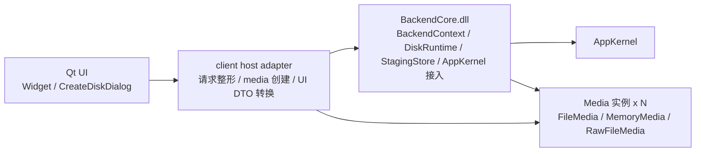
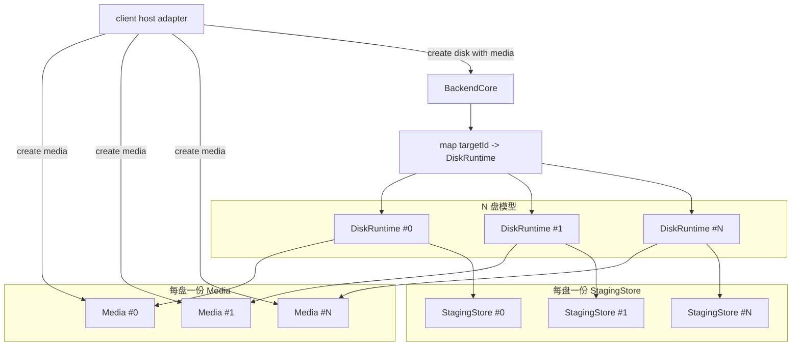
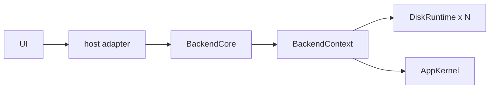
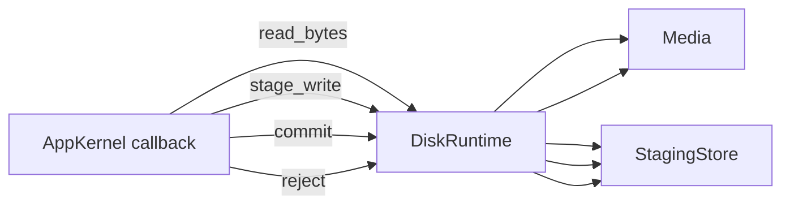

# YumeDisk Client Backend DLL 边界草案

本文档只作为 `docs/tmp` 临时草案，用来确认是否要把当前 `client` 中的后端主线抽成独立 DLL。

当前目标不是重做架构，而是把已经收好的最小闭环继续收口：

- `UI` 留在 `client.exe`
- 具体 `Media` 子类实现留在 `client.exe`
- 除此之外的当前后端能力，尽量下沉到独立 `BackendCore.dll`

## 1. 目标理解

这里的“抽 backend 为独立 DLL”，不是把当前 `windows/client/backend/Backend.*` 原样搬出去。

更准确的目标是：

- 新建一个独立的后端核心项目：`BackendCore`
- 让它承接当前最小闭环里真正属于运行时核心的部分
- `client` 侧只保留：
  - `Qt UI`
  - 介质实现构造
  - 很薄的一层宿主适配

当前阶段不追求：

- 多进程
- IPC
- 服务化
- 插件系统
- 为未来远程协议提前铺复杂总线

所以这里的 DLL 只是“本进程内的代码边界收口”，不是产品形态升级。

## 2. 结论先行

可以抽，而且方向成立。

但前提要写死：

- `BackendCore.dll` 不负责创建具体 `Media` 子类
- `BackendCore.dll` 不包含 `FileMedia`
- `client` 宿主侧先创建好介质实例，再移交给 `BackendCore`
- `UI` 不直接碰 `Media`
- `UI` 只通过宿主侧薄适配去调用 `BackendCore`
- `BackendCore` 应完整暴露当前 `AppKernel` 可用配置项，做到上层可控

也就是说，新的关系不是：

- `UI -> BackendCore -> 创建 RawFileMedia / MemoryMedia`

而是：

- `UI -> client 宿主适配 -> 创建 Media -> BackendCore`

这样才能同时满足：

- `BackendCore` 不依赖 `Qt`
- `BackendCore` 不依赖具体介质实现
- `UI` 和运行时继续分离

## 3. 建议边界

### 3.1 放入 `BackendCore.dll`

建议把这些内容收进 DLL：

- `BackendContext`
- `DiskRuntime`
- `StagingStore`
- `AppKernel` 会话管理
- 建盘 / 删盘 / 全删盘
- 回调事件线程
- `AppKernel` 回调处理
- 单盘运行时管理
- 调试快照 / 统计 / 日志
- `Media` 抽象接口
- `AppKernel` 当前可用配置项的完整对外控制面

这里的核心原则是：

- 只要它属于“如何驱动 N 盘 runtime 跑起来”，就应该进 DLL
- `FileMedia` 以及任何具体文件介质实现都不进入 DLL

### 3.2 留在 `client.exe`

建议把这些内容留在宿主侧：

- `Widget`
- `CreateDiskDialog`
- Qt 文本整形
- Qt 表单输入收集
- `rawFile` 路径选择
- 具体介质实现：
  - `FileMedia`
  - `MemoryMedia`
  - `RawFileMedia`
- 介质创建与介质侧校验
- `BackendSnapshot` 这类纯 UI 展示 DTO

这里的核心原则是：

- 只要它属于“用户怎么填、怎么选、怎么显示”，就不要进 DLL
- 只要它属于“具体用哪种本地介质实现”，也先留在宿主侧

## 4. 推荐的新分层



这张图里有两个关键点：

- `Media` 的创建控制权在 `Host`
- `Media` 的运行使用权在 `Core`

## 5. N 盘模型下的持有关系



这意味着：

- `Media` 不是全局一份
- `StagingStore` 不是全局一份
- 每个盘都是独立 runtime
- `BackendCore` 只统一管理这些 runtime

## 6. 控制链与数据链

### 6.1 控制链



控制链负责：

- 打开 / 关闭会话
- 建盘 / 删盘
- 查询快照
- 管理 `DiskRuntime`

### 6.2 数据链



数据链负责：

- 读请求直接走 `Media`
- 写请求先进入 `StagingStore`
- `commit` 再落到 `Media`
- `reject` 只清理暂存

## 7. 创建盘的推荐接口方向

这里不建议继续让 DLL 接收：

- `requestedMode`
- `rawFilePath`
- `capacityMiBText`
- Qt 字符串

因为这些都还是宿主侧 / UI 侧概念。

更建议 `BackendCore` 收到的是已经收口后的运行时参数：

```cpp
struct CreateDiskParams {
    uint32_t targetId;
    uint64_t diskSizeBytes;
    uint32_t sectorSize;
    bool readOnly;
};

bool createManagedDisk(
    const CreateDiskParams& params,
    std::unique_ptr<Media> media,
    std::wstring* outErrorText);
```

含义是：

- `diskSizeBytes` 由宿主侧先决定
- `Media` 由宿主侧先构造好
- `BackendCore` 只接管 runtime

## 7.1 `AppKernel` 配置暴露要求

这里需要额外写死一条边界：

- `BackendCore` 不应该只暴露一个“够当前 UI 用”的缩水配置面
- `BackendCore` 应完整暴露当前 `AppKernel` 已有的配置项
- 上层决定具体配置值，`BackendCore` 负责校验、承接和落实

按当前 `AppKernel` 头文件，至少应覆盖：

- session 级：
  - `HeartbeatIntervalMs`
  - `InitialEventQueueCapacity`
- disk 级：
  - `TargetId`
  - `SectorSize`
  - `DiskSizeBytes`
  - `QueueDepth`
  - `WriteSlotBytes`
  - `ReadWorkerCount`
  - `WriteWorkerCount`
  - `AckBatchMaxRanges`
  - `ReadOnly`

这条要求的意义不是让 UI 一开始就把所有选项都摊开。

真正要固定的是：

- `BackendCore` 不能私自藏配置
- `BackendCore` 不能把部分配置硬编码成不可控
- UI 当前可以先只开放最小必要项
- 但宿主上层必须有能力继续把这些参数完整传下去

## 8. 关于跨 DLL 传 `Media` 的风险

这一步可以做，但边界要谨慎。

### 8.1 最简单的做法

直接跨 DLL 传：

```cpp
std::unique_ptr<Media>
```

成立条件：

- 全部工程统一 toolchain
- 全部工程统一 CRT
- `Media` 的析构和对象释放约定完全一致

如果整个仓库长期都统一用同一套编译环境，这条路最省事。

### 8.2 更稳的做法

如果后面担心跨模块析构边界，可以改成：

- `Media*`
- 外加自定义 deleter / destroy callback

或者：

- `BackendCore` 不直接持有 C++ 对象所有权
- 改持有一组介质回调表

但这会增加一层复杂度。

### 8.3 当前阶段建议

当前阶段先按最小复杂度处理：

- 第一版先允许 `std::unique_ptr<Media>` 直接移交
- 前提是 `backendCore` 和 `client` 同仓、同工具链、同 CRT

如果后面真的出现边界问题，再收成销毁回调，不提前做复杂化。

## 9. 现有代码里需要迁移的职责

当前 `windows/client/backend/Backend.*` 里混有两类职责：

### 9.1 应迁入 `BackendCore`

- `BackendContext` 生命周期
- runtime 管理
- stats / debug snapshot 原始数据
- 与 `AppKernel` 的交互

### 9.2 应留在宿主侧

- `QString`
- `QFileInfo`
- 文本输入解析
- `rawFile` 文件路径校验
- `capacityMiBText -> diskSizeBytes`
- `BackendSnapshot` 这类 UI 展示对象

所以当前代码不能简单“整体搬 DLL”，而应先做一次职责切割。

## 10. 推荐的最小项目形态

建议最终先收成：

```text
windows/
├─ BackendCore/
│  ├─ BackendCore/
│  ├─ runtime/
│  ├─ StagingStore/
│  ├─ media/
│  │  └─ Media/
│  ├─ config/
│  └─ types/
└─ client/
   ├─ Widget/
   ├─ CreateDiskDialog/
   ├─ backendHost/
   └─ media/
      ├─ FileMedia/
      ├─ MemoryMedia/
      └─ RawFileMedia/
```

其中：

- `BackendCore` 只表达运行时核心
- `client/backendHost` 只做薄适配
- `client/media` 只放具体介质实现

## 11. 是否值得做

我认为值得，但要明确收益不是“功能更多”，而是：

- 把 UI 和运行时继续切开
- 把具体介质实现和后端控制面切开
- 为后续把 `client` 宿主替换成别的前端形态留出空间

同时也要明确它现在不解决的事：

- 不自动带来多进程能力
- 不自动带来远程能力
- 不自动减少 `AppKernel` 集成复杂度

它解决的是“当前最小闭环的结构收口”。

## 12. 当前建议结论

当前建议先按下面的判断推进：

- 方向：可以做
- 前提：`Media` 由宿主侧先创建，再交给 `BackendCore`
- 固定：`FileMedia` 不进入 `BackendCore`
- 固定：`BackendCore` 完整暴露 `AppKernel` 配置项，上层可控
- 边界：`Qt UI` 和具体 `Media` 子类都不进 DLL
- 策略：先做最小 DLL 收口，不提前上 callback table / plugin 化

如果这个草案成立，下一步就可以继续把它收成正式重构方案：

- 先定义 `BackendCore` 的最小导出接口
- 再定义 `client/backendHost` 的最小职责
- 最后拆当前 `windows/client/backend` 的代码归属
