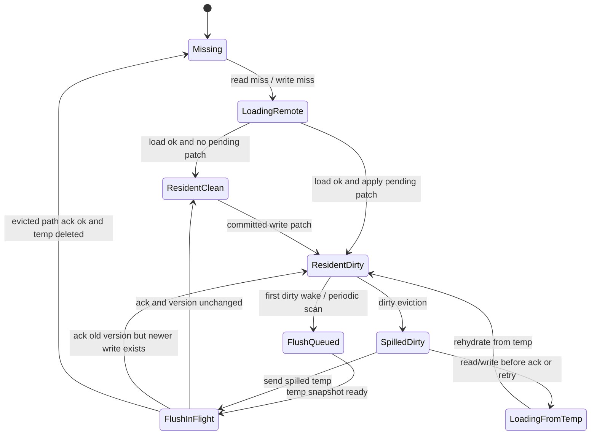
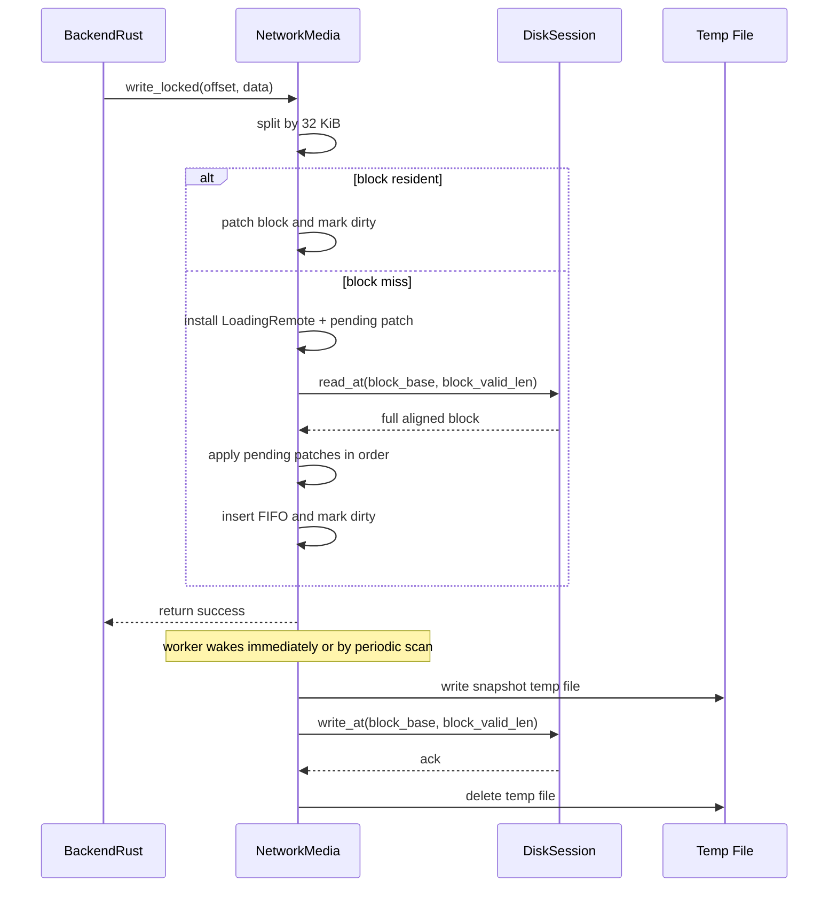
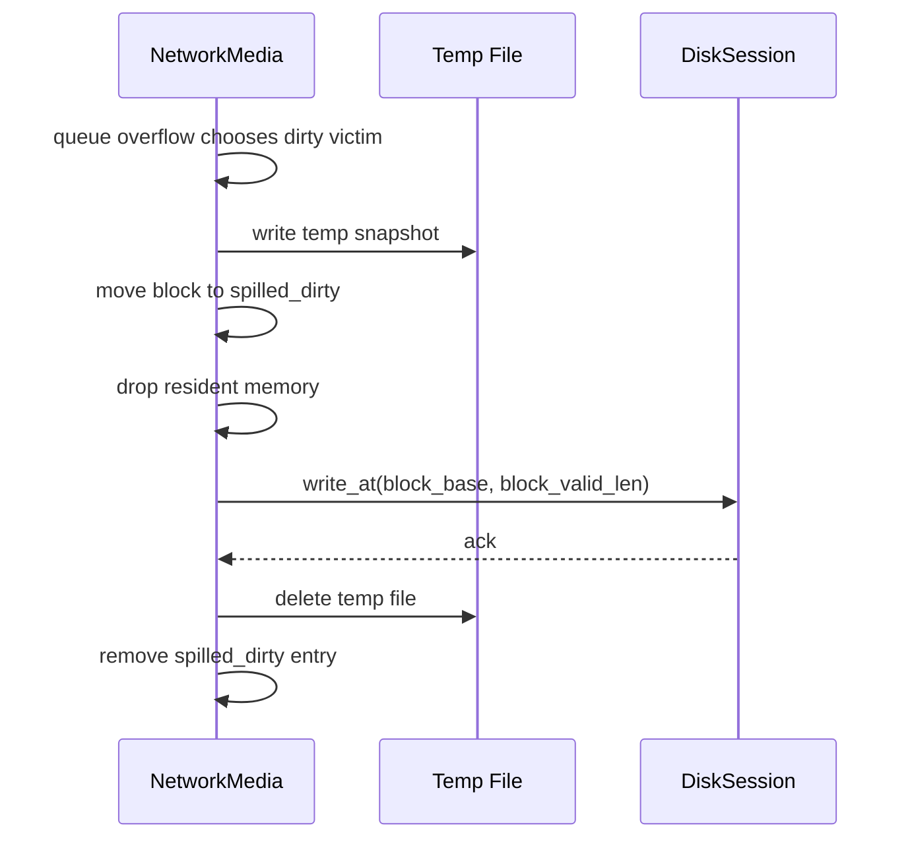

# NetworkMedia 缓存草案

## 1. 文档目标

本草案只讨论 `windows/tauri-client/src-tauri/src/backend/network_media.rs` 这一层的缓存重建。

目标是给后续实现提供一份足够细的设计底稿，范围固定为：

- 只改 `NetworkMedia`
- 不把缓存状态漂移到 `BackendRust`、`network-core`、`server`、前端状态层
- 不改正式协议
- 不改 server 数据面
- 不改 runtime/store 的公开模型

本草案不是 `todo`，也不是分阶段任务清单，而是面向实现的结构草案。

## 2. 当前代码边界

当前链路里与本设计直接相关的点如下：

- `NetworkMedia` 当前只是薄透传
  - `read_locked()` 按 `max_io_bytes` 分片后直接 `session.read_at(...)`
  - `write_locked()` 按 `max_io_bytes` 分片后直接 `session.write_at(...)`
- `BackendRust` 的写入不会把 AppKernel 的碎片写直接交给 `NetworkMedia`
  - AppKernel 先把分片写暂存在 `staging`
  - 只有 `WriteFinalCommitted` 事件到来后，才调用 `media.write_locked(...)`
- `BackendRust` 的读路径顺序是：
  - 先 `media.read_locked(...)`
  - 再叠加 `staging.overlay_read_locked(...)`
- server 当前是无状态数据面转发
  - `gateway` 把 `ReadAt/WriteAt` 转到上游 `storer`
  - `storer` 再落到文件后端

这意味着：

- `NetworkMedia` 可以独立持有“已提交后的本地块缓存”
- 不需要感知 AppKernel 的半包写序列
- 不需要把缓存信息外泄到其他层

## 3. 设计约束

本草案固定遵守以下约束。

### 3.1 作用域约束

缓存功能只存在于 `NetworkMedia`。

明确不做：

- 不在 `DiskRuntimeStore` 加缓存状态
- 不在 `OpenedNetworkDiskSession` 加缓存状态
- 不在 `network-core::DiskSession` 加缓存状态
- 不在 server 侧增加块缓存、脏块表、回写队列
- 不在协议里新增 flush/ack/barrier 操作

### 3.2 块模型约束

- 固定逻辑块大小：`32 KiB`
- 固定全局对齐方式：块起点只能是 `N * 32 KiB`
- 读写一体：同一份块对象同时服务读命中、写命中、脏块回写
- 写 miss 不做“局部直写远端”
- 写 miss 必须先拿到完整对齐块，再应用局部 patch

这里要特别明确：

- 缓存块永远是“全局对齐块”
- 不做“以本次请求起点为起点，再向后取 32 KiB”的滑动窗口块
- 不做“任意起始 offset 的 32 KiB 临时块”

也就是说，任意 I/O 都必须先映射到磁盘全局块：

```text
block_size  = 32768
block_index = offset / 32768
block_base  = block_index * 32768
block_range = [block_base, block_base + 32768)
```

例如：

- 读 `offset=4096, len=4096`
  - 命中/装入的是块 `[0, 32768)`
  - 不是 `[4096, 36864)`
- 读 `offset=20480, len=20480`
  - 会触达两个规范块：
    - `[0, 32768)`
    - `[32768, 65536)`
  - 不是从 `20480` 开始切一个单独的 `32 KiB` 窗口

### 3.3 2Q 约束

这里按你要求的“双队列版 2Q”来做：

- `FIFO`
- `LRU`

本草案不引入经典 2Q 里的 `ghost queue / A1out`。

### 3.4 文件约束

脏块淘汰时：

1. 先写临时文件
2. 再发网络写
3. 网络写成功后删除对应临时文件

周期扫描时：

1. 扫到 resident dirty block
2. 也先写临时文件快照
3. 再发网络写
4. 成功后删除这份临时文件快照

### 3.5 网络约束

当前 server 默认 `MaxIOBytes = 60 * 1024`，大于 `32 KiB`。

因此本草案要求 `NetworkMedia::bind(...)` 额外校验：

- `metadata.max_io_bytes >= 32 * 1024`

若小于该值，则直接拒绝挂载该网络盘。

这样可以保证：

- 一个逻辑块的远端读
- 一个逻辑块的远端写

都可以在一条协议请求里完成。

## 4. 总体结构

### 4.1 高层拓扑

```text
                  +-------------------------------------+
                  | BackendRust / AppKernel callbacks   |
                  | read_locked / write_locked          |
                  +------------------+------------------+
                                     |
                                     v
                  +-------------------------------------+
                  | NetworkMedia                        |
                  |  - 32 KiB block cache               |
                  |  - 2Q: FIFO + LRU                   |
                  |  - dirty tracking                   |
                  |  - temp-file spill                  |
                  |  - flush worker                     |
                  +-----------+---------------+---------+
                              |               |
                    cache hit |               | cache miss / flush
                              |               |
                              v               v
                     +--------+----+   +------+------------------+
                     | memory cache |   | DiskSession            |
                     | FIFO + LRU   |   | read_at / write_at     |
                     +--------+----+   +------+------------------+
                              |               |
                              |               v
                              |      gateway -> storer -> file
                              |
                              v
                     temp snapshot files
```

### 4.2 组件分层

虽然代码初始可以先都写在 `network_media.rs`，但内部逻辑建议按下面几类对象组织：

- `NetworkMedia`
  - 对外实现 `Media`
- `Inner`
  - 共享状态入口
- `CacheState`
  - 内存块表、FIFO/LRU、spill 表、flush 队列
- `FlushWorker`
  - 后台线程，负责扫描、写 temp、发网络写、删 temp
- `BlockEntry`
  - 单块内存状态
- `SpilledDirtyEntry`
  - 脏块从内存淘汰后留下的 temp-file 状态

## 5. 术语

- `block_index`
  - `offset / 32768`
- `block_base`
  - `block_index * 32768`
- `canonical block`
  - 指磁盘全局规范块
  - 起点固定为 `N * 32768`
  - 这是缓存里允许存在的唯一块形态
- `block_valid_len`
  - 该块在磁盘上的真实有效长度
  - 常规块为 `32768`
  - 尾块可能小于 `32768`
- `resident`
  - 块当前在内存 2Q 中
- `dirty`
  - 本地最新版本尚未被远端确认
- `spill`
  - 脏块已从内存淘汰，但 temp file 仍保存该块待同步数据
- `flush snapshot`
  - 为某个块某个版本生成的一次临时文件快照

## 6. 核心决策

## 6.1 固定逻辑块大小

所有缓存逻辑都按 `32 KiB` 对齐。

原因：

- 命中判断简单
- 写 miss 的补块逻辑固定
- 2Q 淘汰粒度固定
- temp file 粒度固定
- 网络回写粒度固定

这里再强调一次：

- 对齐是“相对整个磁盘空间”的全局对齐
- 不是“相对某次请求起点”的局部对齐

换句话说，缓存内部只允许存在这种块：

```text
[0, 32768)
[32768, 65536)
[65536, 98304)
...
```

不允许存在这种块：

```text
[4096, 36864)
[8192, 40960)
[20480, 53248)
```

后面文档里提到的：

- aligned read
- 整块读回
- 32 KiB 对齐块

都默认指上面的“全局规范块”，不是任意起始窗口。

尾块特殊处理规则：

- 逻辑块大小仍视为 `32 KiB`
- 但真实可读写长度为 `block_valid_len`
- 读远端时只读 `block_valid_len`
- 写远端时也只写 `block_valid_len`
- 块缓冲区内部仍可保留 `32 KiB` 容量

## 6.2 2Q 模型

缓存使用双队列：

- `FIFO`
  - 新块首次进入缓存时放这里
- `LRU`
  - FIFO 中的块再次命中后提升到这里

命中与迁移规则：

```text
首次装入   -> FIFO 尾部
FIFO 再命中 -> 提升到 LRU 尾部
LRU 再命中  -> 移动到 LRU 尾部
```

淘汰规则：

- `FIFO` 超长时，优先从 `FIFO` 头部淘汰
- `LRU` 超长时，从 `LRU` 头部淘汰
- resident block 只有在“非 loading、非 rehydrating、非 busy flush gate”时才可淘汰
- 如果队头块正忙，则跳过它继续找同队列下一个可淘汰块
- 若整条队列都不可淘汰，则容量暂时软超限，等待忙状态结束

建议把容量定义成 `NetworkMedia` 内部常量，而不是外露配置：

- `FIFO_MAX_BLOCKS`
- `LRU_MAX_BLOCKS`

初稿建议值可以从下面起步：

- `FIFO_MAX_BLOCKS = 128`
- `LRU_MAX_BLOCKS = 512`

对应约 `4 MiB + 16 MiB = 20 MiB` 的 resident 数据量。

这只是实现初值，不是协议或配置承诺。

## 6.3 单块写入模型

对任意写请求：

1. 先按 `32 KiB` 切成若干触达块
2. 每块独立处理
3. 命中块直接 patch
4. miss 块先补全整块，再 patch
5. patch 完后标脏

块内 patch 是字节级覆盖，不做追加日志。

## 6.4 写 miss 必须挂起

如果写入命中的块当前不在 resident cache：

- 不能直接把局部数据发给 server
- 不能直接在本地构造“不完整块”
- 必须先拉取完整对齐块
- 再应用写 patch

因此，miss 写路径一定要支持 `pending_patches`。

核心规则：

- 第一个 miss 写线程负责发起 aligned read
- 后续同块并发写线程不重复读
- 它们把自己的 patch 挂到该块的 `pending_patches`
- aligned read 回来后，统一按挂起顺序把 patch 应用到完整块

## 6.5 temp file 只是 flush 载体，不是跨进程恢复协议

本草案里的 temp file 用途是：

- 给“淘汰后的脏块”保留待同步副本
- 给“周期 flush 的 resident dirty block”生成一次发送快照

它不是：

- 跨进程崩溃恢复日志
- 启动后自动 replay 的 WAL
- 对外可见的正式持久化格式

这意味着：

- 进程重启后不做 temp file 恢复
- 启动时可以直接清理旧 temp 目录

## 6.6 后台 worker 初版建议单线程串行

回写 worker 建议初版只保留单线程串行执行：

```text
select next flush target
-> write temp snapshot
-> send session.write_at(...)
-> success: delete temp
-> failure: keep temp for retry
```

这样做的原因：

- 实现简单
- 不引入多路并行回写重排序
- 容易推断 temp 生命周期
- 容易和单 session 错误处理对齐

后续如果确认性能不足，再考虑有限并行；本草案先不展开。

## 7. 内部状态模型

## 7.1 `NetworkMedia` 外壳

`NetworkMedia` 建议从当前“直接持字段”改为“持有 `Arc<Inner>`”。

原因：

- 后台 worker 需要共享同一份状态
- `Media` 是按 `&self` 调用
- eject/drop 时需要统一停 worker 和清理 temp

建议的概念字段：

- 远端盘标识
- `DiskSession`
- `disk_size_bytes`
- `read_only`
- `max_io_bytes`
- `invalidation_handler`
- `Arc<Inner>`

## 7.2 `Inner` 共享对象

`Inner` 建议负责：

- `Mutex<CacheState>`
- `Condvar`
- flush worker 唤醒信号
- stop 标志
- temp 根目录
- flush 扫描间隔

锁约束：

- 不在持有 `CacheState` 锁时做网络 I/O
- 不在持有 `CacheState` 锁时做文件 I/O
- 锁只保护内存状态转移

## 7.3 `CacheState`

建议包含以下逻辑对象：

| 字段 | 作用 |
| --- | --- |
| `blocks` | resident block 表，键为 `block_index` |
| `fifo` | FIFO 队列，保存 resident block 的队列顺序 |
| `lru` | LRU 队列，保存 resident block 的队列顺序 |
| `spilled_dirty` | 已从内存淘汰、但尚未远端确认的脏块表 |
| `flush_queue` | 待处理 flush 任务队列 |
| `next_temp_id` | temp file 名字或 flush ticket 递增序号 |
| `worker_notified` | 减少重复唤醒的辅助标志 |

## 7.4 resident block 元数据

每个 resident block 建议至少包含：

| 字段 | 作用 |
| --- | --- |
| `block_index` | 逻辑块编号 |
| `valid_len` | 真实有效字节数 |
| `data` | 该块缓冲区 |
| `queue_kind` | 当前在 `FIFO` 还是 `LRU` |
| `access_count` | 是否已二次命中，用于 FIFO -> LRU 提升 |
| `dirty` | 当前是否有未同步修改 |
| `version` | 本地当前版本号，每次 patch 后递增 |
| `synced_version` | 已被远端确认的版本号 |
| `load_state` | `Ready / LoadingRemote / RehydratingFromTemp` |
| `flush_state` | `Idle / Queued / InFlight` |
| `pending_patches` | 等待完整块到齐后应用的 patch 列表 |

这里的关键不是具体字段名，而是要把三个维度分开：

- resident/非 resident
- 数据是否 dirty
- 当前是否处于 loading/flush 等瞬时动作

## 7.5 spilled dirty 元数据

脏块淘汰后，不能只剩一个“temp 文件路径”。

建议至少保存：

| 字段 | 作用 |
| --- | --- |
| `block_index` | 逻辑块编号 |
| `valid_len` | 真实有效长度 |
| `temp_path` | 当前 temp 文件路径 |
| `version` | 该 temp 对应的块版本 |
| `state` | `PendingSend / InFlight / RetryPending` |

为什么要单独有 `spilled_dirty` 表：

- 脏块淘汰后，远端还不一定是新数据
- 这时不能把该块当成普通 miss
- 后续对这块的读写必须先看 `spilled_dirty`

## 7.6 patch 结构

一个 `pending_patch` 需要表达：

- 块内偏移
- patch 字节
- 调用顺序

调用顺序要保留，是因为：

- 同块多个写在 aligned read 期间可能并发挂起
- 回填完整块后应用 patch 的顺序必须与提交顺序一致

## 8. 状态图

下面的图只表达单块生命周期，不表达 2Q 队列细节。



## 9. 读路径

## 9.1 总体规则

`read_locked(offset, buffer)` 的处理步骤：

1. 先做范围校验
2. 按 `32 KiB` 拆成若干触达块
3. 每块都先查 resident table
4. resident miss 时，再查 `spilled_dirty`
5. 两边都没有时，才走远端 aligned read
6. 把需要的子片段拷贝回用户 buffer

## 9.2 resident hit

如果块已经在 resident cache 且 `load_state = Ready`：

- 直接从块缓冲区复制所需区间
- 根据当前所在队列更新 2Q 顺序
  - FIFO 再命中则提升到 LRU
  - LRU 再命中则移到尾部

## 9.3 resident loading

如果块存在但当前正在：

- `LoadingRemote`
- `RehydratingFromTemp`

则当前读线程：

- 不重复发远端读
- 不重复做 temp rehydrate
- 直接等待 `Condvar`
- 等块转为 `Ready` 后重试读取

## 9.4 spilled dirty hit

如果 resident 没有命中，但 `spilled_dirty` 里存在：

- `PendingSend / RetryPending`
  - 直接从 temp file rehydrate 回 resident
  - 再读取
- `InFlight`
  - 先等本次发送结果
  - 若发送成功，则按普通 miss 重新从远端装入
  - 若发送失败，则从 temp file rehydrate 回 resident 再读取

这样做的原因：

- 脏块被淘汰后，远端数据不一定已更新
- 不能直接忽略 temp file 去读远端

## 9.5 普通 miss

普通 miss 处理：

1. 在 `blocks` 表里放一个 `LoadingRemote` 占位
2. 释放锁
3. 对该 `block_index` 发起一次 aligned read
4. 重新拿锁
5. 若成功：
   - 写入整块数据
   - 状态转 `Ready`
   - 插入 FIFO
   - 执行淘汰检查
6. 若失败：
   - 删除占位
   - 唤醒等待者
   - 映射错误返回

### 9.5.1 aligned read 长度

aligned read 的起点固定为：

- `block_base = block_index * 32768`

不是：

- 当前请求的 `offset`
- 也不是“向下取整后再叠一个任意窗口”

普通块：

- 读 `32768` 字节

尾块：

- 读 `block_valid_len`

### 9.5.2 为什么读 miss 要拿整块

因为后续同块写 miss 也依赖完整块。

只读局部会导致：

- patch 语义不完整
- flush 回写无法形成完整块镜像
- 同一物理区域可能被多个“任意起始 32 KiB 窗口”重复缓存，破坏唯一块映射

## 10. 写路径

## 10.1 总体规则

`write_locked(offset, data)` 的处理步骤：

1. 先做范围校验
2. 若只读，直接失败
3. 按 `32 KiB` 切分到触达块
4. 每块独立 patch
5. patch 后标脏并递增版本
6. 首次 dirty 时唤醒 flush worker
7. 定期扫描仍作为兜底

## 10.2 resident ready hit

如果块已 resident 且 `Ready`：

1. 直接把写入片段覆盖到块内对应位置
2. `version += 1`
3. `dirty = true`
4. 若先前是 clean，则可触发一次 flush worker 唤醒
5. 更新 2Q 顺序

## 10.3 resident loading hit

如果块当前正在：

- `LoadingRemote`
- `RehydratingFromTemp`

则当前写线程：

1. 把自己的 patch 追加到 `pending_patches`
2. 等待该块完成完整装载
3. 由装载完成的那条路径统一应用 patch
4. 当前写线程只需要确认自己的 patch 已进入块版本后返回

## 10.4 miss 写入

这是本草案最关键的路径。

写 miss 不能直接远端写局部数据，必须走下面流程：

```text
write miss
-> install LoadingRemote placeholder
-> attach current patch into pending_patches
-> release lock
-> remote aligned read full block
-> reacquire lock
-> materialize full block
-> apply pending_patches in order
-> mark dirty
-> insert FIFO
-> run eviction check
-> return success
```

这个流程满足你的要求：

- “写入块目前不在缓存里，则写入内容先挂起”
- “等远端读过来完整的以 32KiB 对齐的块，再执行写入”

## 10.5 spilled dirty 写入

如果目标块已被淘汰为 `spilled_dirty`：

- `PendingSend / RetryPending`
  - 直接从 temp file rehydrate 回 resident
  - 再 patch
- `InFlight`
  - 等当前发送结束
  - 若成功，则按普通 miss 从远端装回再 patch
  - 若失败，则从 temp file rehydrate 再 patch

不建议在 `spilled_dirty InFlight` 上直接覆盖 temp file。

原因：

- 会和正在发送的快照竞争同一路径
- 会让“正在发送的版本”和“最新版本”混在一起

## 10.6 版本规则

每块维护：

- `version`
- `synced_version`

规则如下：

- 每次本地 patch 后：`version += 1`
- flush 发送某个快照版本 `V`
- 若发送成功：
  - `synced_version = max(synced_version, V)`
- 只有当 `version == V` 时，才把块转为 clean
- 若发送时本地又被改成 `version > V`
  - 这次发送只能确认旧版本已到远端
  - 当前块仍保持 dirty
  - worker 之后继续发送新版本

这个版本规则能避免：

- flush 中途块又被写
- 结果旧快照 ack 把新写误判成已同步

## 11. 2Q 淘汰与脏块 spill

## 11.1 clean block 淘汰

clean block 淘汰最简单：

- 直接从 resident table 删除
- 同时从 FIFO/LRU 队列删除

## 11.2 dirty block 淘汰

dirty block 淘汰必须转成 spill：

1. 生成该块当前版本的 temp snapshot
2. 在 `spilled_dirty` 表中登记
3. 从 resident table 删掉该块
4. 把对应网络发送任务放进 `flush_queue`

逻辑上变成：

```text
ResidentDirty
-> write temp snapshot
-> move to spilled_dirty
-> enqueue flush
-> drop resident memory
```

## 11.3 为什么脏块淘汰不能直接丢

如果 dirty block 淘汰时只“排一个网络发送任务”但不留 temp：

- 发送前进程崩溃，数据丢
- 发送失败，没有可重试数据源
- 后续读回同块时，只能读到远端旧数据

所以 dirty eviction 一定要先落 temp。

## 11.4 dirty eviction 的唯一权威副本

需要明确一个原则：

- resident dirty block 在淘汰前，内存是权威副本
- dirty eviction 完成后，temp file 是权威副本

也就是说，dirty eviction 不应留下“两份都算权威”的长期状态。

这有助于后续推断：

- 该从哪份数据做重试
- 读命中应优先去哪取

## 12. flush worker

## 12.1 worker 职责

worker 负责两类对象：

- resident dirty blocks
- spilled dirty entries

它不负责：

- 直接参与前台读命中
- 直接决定 2Q 队列命中迁移

## 12.2 worker 触发源

本草案建议保留两个触发源：

### A. 周期扫描

固定时间扫描 2Q resident blocks。

建议初值：

- `DIRTY_SCAN_INTERVAL = 1s`

周期扫描的意义：

- 满足你的“固定时间扫描 2Q 缓存”要求
- 作为遗漏唤醒、重试补救、失败重发的兜底路径

### B. 首次标脏唤醒

当某个 clean resident block 第一次转为 dirty 时：

- 额外唤醒 worker 一次

原因：

- 若只靠 `1s` 扫描，所谓“即时同步”上限就是 1 秒
- 加一次唤醒后，正常情况下写入后很快就能进入 flush
- 周期扫描仍保留，不破坏你的固定扫描要求

如果后续确认你只想要纯周期机制，也可以去掉这条优化。

## 12.3 worker 处理顺序

建议 worker 每轮按下面顺序处理：

1. 先处理 `spilled_dirty`
2. 再处理 resident dirty blocks

原因：

- spilled dirty 已经离开内存，更脆弱
- 先把它们送走，能尽快释放 temp file 和不确定状态

resident dirty 的扫描顺序建议：

- FIFO 从头到尾
- LRU 从头到尾

这相当于先处理更老的块。

## 12.4 resident dirty flush

resident dirty block 的 flush 流程：

```text
resident dirty
-> snapshot current version V
-> write temp snapshot file
-> session.write_at(block_base, bytes_of_V)
-> success:
     if current version == V: mark clean
     else: keep dirty
     delete temp snapshot
-> failure:
     keep dirty
     keep temp snapshot only if needed for retry bookkeeping
```

这里 resident block 在 flush 期间不需要离开内存。

temp snapshot 只是这一次发送的载体。

## 12.5 spilled dirty flush

spilled dirty 的 flush 流程：

```text
spilled dirty entry
-> use existing temp file
-> session.write_at(block_base, snapshot bytes)
-> success:
     delete temp file
     remove spilled_dirty entry
-> failure:
     keep temp file
     state = RetryPending
```

## 12.6 网络错误处理

如果 `session.write_at(...)` 返回：

- `SessionUnavailable`
- `Transport(...)`
- `Protocol(...)`

则按当前 `NetworkMedia` 已有逻辑：

- 触发 invalidation handler
- 让该网络盘进入 invalid 状态

worker 在这种情况下应：

- 停止继续消费 flush 队列
- 尽量保留尚未删除的 temp 文件直到 `Drop`
- 后续 I/O 由上层失效路径接管

## 13. temp file 设计

## 13.1 目录布局

建议 temp 根目录：

```text
<system temp>/yumedisk-network-media/<remote_disk_id>/<session_id>/
```

示意：

```text
C:\Users\<user>\AppData\Local\Temp\
  yumedisk-network-media\
    A1b2C3d4E5f6G7h8\
      77\
        blk-0000000000000012-v5.bin
        blk-0000000000000099-v2.bin
```

命名建议包含：

- `block_index`
- `version`

这样调试和人工排查更直接。

## 13.2 文件内容

temp file 内容不需要做复杂封装。

初版可以直接写：

- 对应块的有效字节内容

元数据由内存状态持有：

- `block_index`
- `valid_len`
- `version`

若后续确认需要脱离进程恢复，再考虑把元数据也写进文件头；本草案先不这么做。

## 13.3 启动清理

由于本草案不做 crash recovery：

- `NetworkMedia::bind(...)` 创建 temp 目录前
- 可以先尝试删除同 `<remote_disk_id>/<session_id>` 目录下旧文件

如果 session id 是新的，这里通常是空目录。

如果目录删除失败：

- 记录日志即可
- 不必让挂载失败

## 14. 写入可见性与语义变化

这部分必须单独写清楚，因为它和当前实现语义不同。

## 14.1 当前实现语义

当前 `NetworkMedia.write_locked(...)` 成功，含义是：

- 远端 `session.write_at(...)` 已成功返回

也就是“写成功 == 远端已确认”。

## 14.2 引入缓存后的语义

按本草案实现后，`write_locked(...)` 成功，含义会变成：

- 本地缓存已接受这次写
- 该写已变成 resident dirty 或 spill dirty
- 后续会由 worker 异步同步到 server

也就是：

- “写成功 != 远端已经确认”
- “写成功 == 本地已提交到 `NetworkMedia` 自己的缓存状态”

## 14.3 这会带来的后果

后果一：

- 若写入刚返回成功，但之后 session 失效
- 这批已返回成功的写可能尚未真正同步到 server

后果二：

- 现在没有协议级 `flush/barrier/fua`
- 所以不会有“强制把所有缓存写落远端再返回”的正式机制

后果三：

- 跨块写入的远端到达顺序可能和本地提交顺序不完全一致
- 初版只保证“单块内最后版本覆盖前版本”
- 不提供全局写屏障语义

## 14.4 进程崩溃语义

按用户当前要求的 temp 写入时机：

- dirty eviction 时写 temp
- 周期 scan/flush 时写 temp

因此有一个明确窗口：

- 写入成功返回
- 但该块仍只是 resident dirty
- 且尚未来到第一次 flush snapshot

如果进程此时崩溃：

- 这部分最新写会丢

所以本草案必须明确：

- 当前方案是“会尽快向 server 同步”
- 不是“写返回后立刻 crash-safe”

如果未来你要求“写成功后必须 crash-safe”，则必须把 temp file 时机前移为：

- 块第一次从 clean -> dirty 时就先落 temp

那会是另一套更重的写路径，不属于本草案当前范围。

## 15. 生命周期与退出

## 15.1 mount 期间

`NetworkMedia::bind(...)` 除现有字段校验外，建议补：

- `max_io_bytes >= 32 KiB`
- 创建 temp 根目录
- 启动 flush worker

## 15.2 eject / remove

当前 eject 路径会把 `Box<dyn Media>` 从 BackendRust 取回后直接 `drop(media)`。

由于 `Media` trait 没有显式 `flush/close` 接口，所以 `NetworkMedia` 自己必须在 `Drop` 里兜住：

- 停 worker
- 停止接受新的后台 flush 任务
- 对剩余 resident dirty / spilled dirty 做一次 best-effort drain
- 清理 temp 目录

## 15.3 `Drop` 建议语义

`Drop` 初版建议：

1. 标记 `stopping = true`
2. 唤醒 worker 并等待退出
3. 尝试同步 flush 剩余 dirty
4. 无论同步 flush 成败，都尽量删除可删 temp

需要明确：

- 如果 `Drop` 时 session 已无效
- 那么剩余 dirty 最终仍可能丢失

本草案只要求：

- 尽力同步
- 不把残留 temp 无限堆在系统目录里

## 16. 时序图

## 16.1 写 miss



## 16.2 dirty eviction



## 17. 与现有实现的衔接点

## 17.1 只改 `NetworkMedia`

本草案实现后，其余层无需感知缓存：

- `runtime_flow.rs` 仍只做 `NetworkMedia::bind(...)`
- `DiskRuntimeStore` 不持有缓存句柄
- `OpenedNetworkDiskSession` 仍只保存 `session + metadata`
- server 不需要新增数据面状态

## 17.2 不改 `network-core::DiskSession`

`DiskSession` 仍只提供：

- `read_at(offset, buffer)`
- `write_at(offset, data)`

块对齐、2Q、temp、scan、flush 全在 `NetworkMedia` 内部完成。

## 17.3 不改 server 协议

因为：

- 当前会话 `max_io_bytes` 足够覆盖 `32 KiB`
- `ReadAt/WriteAt` 已能承载 aligned block I/O

所以本草案不要求：

- 新 op code
- 新 response body
- 新 server-side flush 协议

## 18. 推荐实现顺序

虽然本文件不是 `todo`，但为了后续落地更顺，建议实现顺序固定为：

1. 先把 `NetworkMedia` 改成 `Arc<Inner>` 结构
2. 先落 resident cache + 2Q + aligned read miss
3. 再落 write miss 的 `pending_patches`
4. 再落 dirty tracking + 版本号
5. 再落 temp snapshot 与 dirty eviction
6. 再落 flush worker 与周期扫描
7. 最后补 `Drop`、temp cleanup、失败重试

原因：

- 先把命中和 miss 的块模型跑通
- 再把回写和 temp 接进去
- 否则一开始就同时做 2Q、temp、worker、retry，调试会很乱

## 19. 测试矩阵

## 19.1 基础块访问

- 单块读 miss 后进入 FIFO
- FIFO 再命中后提升到 LRU
- LRU 命中后移动到尾部
- 跨块读能正确拼装结果
- 尾块读长度正确

## 19.2 写 miss 与挂起 patch

- 单块写 miss 会先发 aligned read
- aligned read 结束后才应用 patch
- 同块并发两个写 miss 只发一次 aligned read
- `pending_patches` 应按提交顺序生效

## 19.3 dirty 与版本

- resident hit 写入会标脏
- 连续两次写同块，版本递增
- flush 旧版本 ack 不会误清掉新版本 dirty

## 19.4 2Q 淘汰

- FIFO clean 淘汰直接丢
- FIFO dirty 淘汰会写 temp 并进入 `spilled_dirty`
- LRU clean/dirty 淘汰同理
- 忙块不可淘汰时容量可暂时软超限

## 19.5 temp 与 spill

- dirty eviction 前必须先生成 temp
- spilled dirty flush 成功后删除 temp
- spilled dirty flush 失败后保留 temp 并等待重试
- spilled dirty 被再次访问时能正确 rehydrate

## 19.6 周期扫描

- 周期扫描能找到 resident dirty block
- resident dirty block 扫描 flush 成功后删 snapshot
- 周期扫描能继续处理 `RetryPending`

## 19.7 终态错误

- `SessionUnavailable` 会触发 invalidation handler
- `Transport(...)` 会触发 invalidation handler
- `Protocol(...)` 会触发 invalidation handler
- 终态错误后不再继续正常 flush 队列

## 19.8 生命周期

- `Drop` 能停掉 worker
- `Drop` 能尽量清理 temp 目录
- `Drop` 时若 session 已失效，不应死锁或无限等待

## 20. 当前草案结论

本草案最终落点可以概括成一句话：

`NetworkMedia` 从“按请求直通远端”的薄适配，重建为“32 KiB 块级、双队列 2Q、带 temp spill 与后台回写”的本地缓存媒体层，而其余层继续保持无感。 

它满足你当前提出的关键要求：

- 缓存只存在于 `NetworkMedia`
- 2Q 使用内存，含 FIFO 和 LRU
- 脏块淘汰先写临时文件，再网络发送，成功后删除
- 固定时间扫描 2Q resident dirty block，也走 temp + 网络发送
- 写 miss 先挂起，等远端读回完整 `32 KiB` 对齐块后再应用写入

同时也把两件必须正视的语义变化明确写死了：

- 写成功不再等于“远端已确认”
- 当前 temp 时机不能提供“写返回后立刻 crash-safe”
