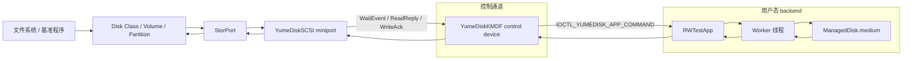
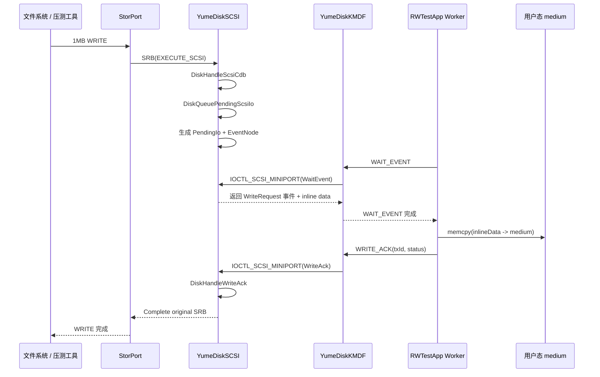
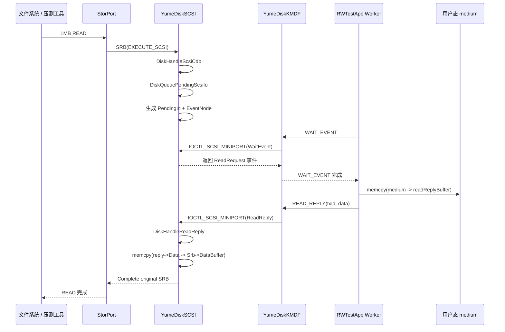
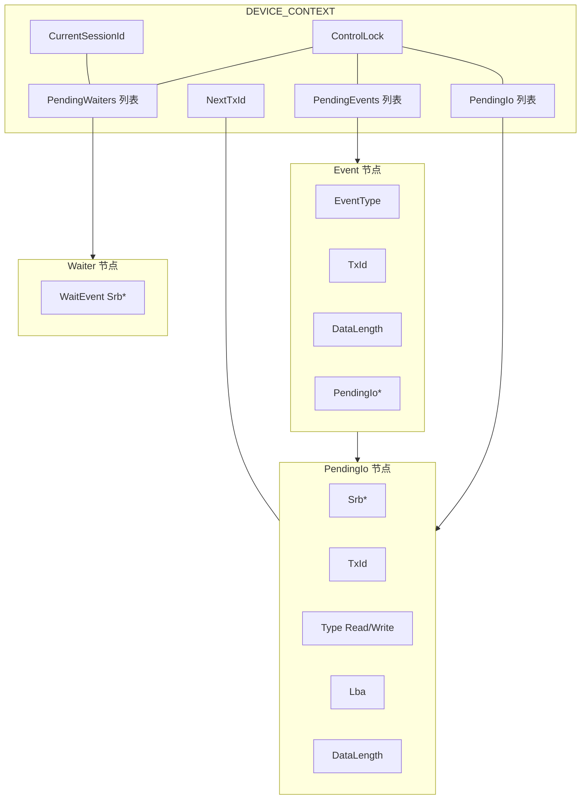
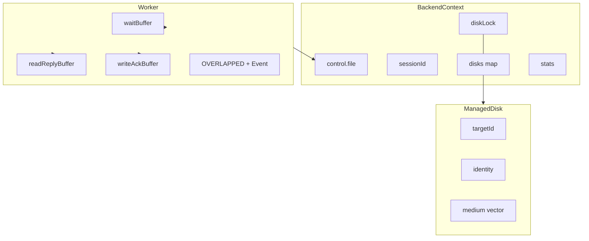
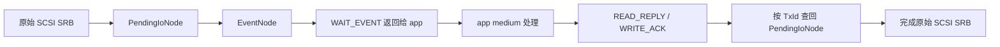

# YumeDisk 数据通路与队列概览

本文只描述当前实现，不讨论理想架构。

核心约束只有一条:

- 存储介质由 app 管理，数据最终落在 `RWTestApp` 的用户态 `medium` 上，不回落到 miniport 内核缓冲。

核心结论:

- 当前数据面是一个“块 I/O -> SCSI miniport -> 控制通道 -> 用户态 backend -> 控制通道 -> SCSI miniport -> 原始块 I/O 完成”的往返模型。
- `YumeDiskSCSI` 负责把块 I/O 转成事件和事务。
- `YumeDiskKMDF` 负责把用户态 control IOCTL 代理成 `IOCTL_SCSI_MINIPORT`。
- `RWTestApp` 负责真正的介质读写、事务应答和 worker 调度。

## 1. 宏观链路

说明:

- 左侧是普通块设备访问路径。
- 右侧是 app 侧 backend。
- 块 I/O 不在 miniport 内部直接命中内核介质，而是借助控制通道转交给 app。

## 2. 写路径

写路径上的显式数据复制点:

- miniport 把 `Srb->DataBuffer` 复制到 `WaitEvent` 返回消息的 inline payload。
- app 把 inline payload 复制到用户态 `medium`。

## 3. 读路径

读路径上的显式数据复制点:

- app 把 `medium` 复制到 `READ_REPLY` 消息。
- miniport 把 `READ_REPLY` 数据复制回 `Srb->DataBuffer`。

## 4. Miniport 队列结构

结构语义:

- `PendingIo`
  记录尚未完成的原始 SCSI 读写 SRB。
- `PendingEvents`
  记录已经生成、但还没被 app 的 `WAIT_EVENT` worker 取走的事件。
- `PendingWaiters`
  记录已经 pend 在 miniport 内部、等待事件到来的 `WAIT_EVENT` SRB。
- `EventNode -> PendingIo`
  用于把用户态应答重新关联回原始块 I/O。
- `ControlLock`
  保护 session、事务号和三条链表。

## 5. App 侧结构

结构语义:

- `workers`
  每个线程长期循环执行 `WAIT_EVENT -> 处理事件 -> READ_REPLY/WRITE_ACK`。
- `waitBuffer`
  用来接收 `WAIT_EVENT` 返回的事件和可能存在的写入 inline data。
- `readReplyBuffer`
  用来承载 read reply 的 payload。
- `writeAckBuffer`
  用来承载 write ack。
- `diskLock`
  当前实现下，app 对 `medium` 的访问是串行保护的。

## 6. 数据传输相关的关键事实

### 6.1 控制通道是并行队列

- `YumeDiskKMDF` 的默认 queue 是 `WdfIoQueueDispatchParallel`。
- 因此控制驱动本身没有把所有 worker 串成单队列。

### 6.2 数据面是事务式往返

- 原始块 I/O 不会在 `DiskHandleScsiCdb` 里直接完成。
- 读写请求会先进入 `PendingIo`。
- app 侧通过 `TxId` 进行匹配并回包。
- miniport 收到 `READ_REPLY` 或 `WRITE_ACK` 后，才完成原始 SRB。

### 6.3 当前实现依赖 inline data

- 写事件通过 `WAIT_EVENT` 的返回消息直接携带写入数据。
- 读事件的数据不走 `WAIT_EVENT` 返回，而是由 app 在后续 `READ_REPLY` 中回传。

### 6.4 当前实现没有真正使用内核介质缓冲

- `YUME_DISK` 结构里有 `Buffer` 字段。
- 但当前读写路径并不直接对这个字段进行数据面访问。
- 实际介质内容由 `RWTestApp` 的 `ManagedDisk.medium` 保存。

### 6.5 大 buffer 是当前路径的重要成本

- `RWTestApp` 默认 `queueDepth = 64`。
- `RWTestApp` 默认 `waitInlineDataCapacity = 8MB`。
- 每个 worker 都持有自己的 `waitBuffer` / `readReplyBuffer` / `writeAckBuffer`。
- `YumeDiskKMDF` 每次代理 command 时还会额外分配一个 `ioctlBuffer`。

### 6.6 每次命令都要经过同步等待

- `WAIT_EVENT`
- `READ_REPLY`
- `WRITE_ACK`

这三类命令最终都要经由 `ControlSendMiniportBuffer` 发成一次 `IOCTL_SCSI_MINIPORT`，并等待其完成。

## 7. 一次 I/O 涉及的对象关系

这条链路里的关键标识只有一个:

- `TxId`

它把“块设备看到的原始 I/O”和“用户态 backend 给回来的应答”绑定在一起。

## 8. 与性能分析最相关的观察点

- 单次 I/O 是否在进入 miniport 前已经被系统拆分成更小的请求。
- `WAIT_EVENT` 的实际返回大小是否远大于真实 payload。
- app 侧 `diskLock` 是否把多 worker 的介质访问串行化。
- `ControlSendMiniportBuffer` 的 buffer 分配、清零和等待成本是否占主导。
- `PendingEvents` 与 `PendingWaiters` 的匹配是否稳定，是否出现大量空轮询或低效唤醒。

## 9. 关键源码位置

- `windows/YumeDiskSCSI/YumeDiskSCSI/scsi/scsi.c`
- `windows/YumeDiskSCSI/YumeDiskSCSI/queue/queue.c`
- `windows/YumeDiskSCSI/YumeDiskSCSI/control/control.c`
- `windows/YumeDiskSCSI/YumeDiskSCSI/adapter/adapter.c`
- `windows/YumeDiskKMDF/YumeDiskKMDF/transport/transport.c`
- `windows/YumeDiskKMDF/YumeDiskKMDF/control/ioctl.c`
- `windows/YumeDiskKMDF/YumeDiskKMDF/device/device.c`
- `windows/tests/RWTestApp/main.cpp`

