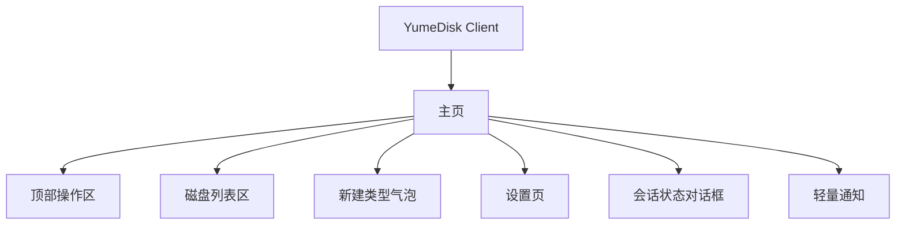
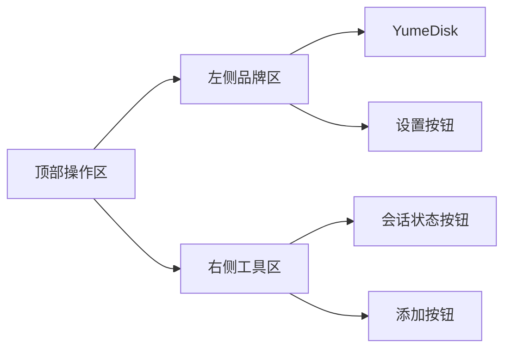
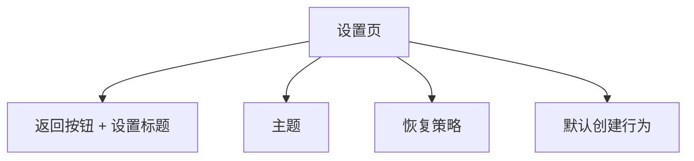
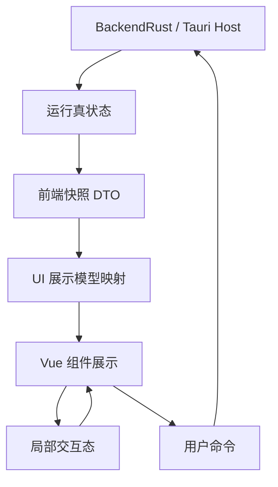

# YumeDisk Tauri Client UI 设计方案

## 1. 目标

本文档定义 `tauri-client` 的正式 UI 设计方案，基于当前静态概念稿和截图效果收束。

当前阶段目标不是建立复杂前端系统，而是把 YumeDisk 客户端从 CLI 最小闭环自然升级为桌面 UI：

- 用户能直观看到当前磁盘列表和会话状态。
- 用户能完成添加、连接、断开、编辑、删除磁盘的主路径。
- 用户能配置主题、恢复策略、默认创建行为。
- UI 只负责展示、输入和操作触发，不持有第二份业务真状态。
- 视觉层保持干净、紧凑、可长期扩展，不堆叠一次性特效。

## 2. 设计边界

### 2.1 UI负责

- 展示初始化状态、主页、设置页和轻量反馈。
- 展示 Backend / 配置快照映射出的磁盘列表。
- 承接用户输入，生成明确的创建、编辑、删除、连接、断开请求。
- 持有局部交互态，例如弹层是否打开、表单草稿、当前主题选择、通知显示。
- 通过 Tauri command 与宿主侧交互。

### 2.2 UI不负责

- 不直接管理 AppKernel 生命周期细节。
- 不维护磁盘真实运行态的第二份状态。
- 不在前端复制 BackendRust / BackendCore 的队列、worker、暂存层或 media 管理逻辑。
- 不展示 tagId、可见盘路径、底层 slot、worker 数量等调试信息。
- 不为未来网络盘提前构建复杂 UI 和复杂状态机。

## 3. 整体信息架构

客户端保留两态主结构：



### 3.1 主页直接承载启动过程

程序启动后直接进入主页，不再单独保留初始化页路由。

主页在启动期通过两层状态表达程序尚未完全可操作：

- 顶部会话状态按钮负责表达当前会话阶段；
- 磁盘列表负责承接启动期展示覆盖。

唯一启动顺序：

1. `restore_client_state`
2. `query_home_disk_list`
3. `open_session`
4. `rescan_runtime_disks`
5. 退出主页启动覆盖
6. 首次自动连接

行为要求：

- 程序一进入主页，顶部会话状态按钮先显示 `正在初始化`。
- 配置恢复出来的磁盘先进入统一无效覆盖，hover 原因显示 `正在初始化`。
- `open_session` 失败时，顶部状态切到 `会话失败`，磁盘列表统一保持 `invalid + 会话失败`。
- 只有启动重扫成功后，磁盘列表才恢复真实状态并开始自动连接。

### 3.2 主页

主页是长期停留页面，只保留用户最常用信息：

- 顶部左侧：`YumeDisk` 标题和设置入口。
- 顶部右侧：会话状态按钮和添加磁盘按钮。
- 主体区域：磁盘列表。
- 不再展示 log、session 详情、tagId、可见盘路径等调试信息。

### 3.3 设置页

设置页采用整页覆盖，不使用小对话框。

原因：

- 设置内容会逐步增加，整页承载比弹窗更稳定。
- 桌面窗口尺寸有限，整页覆盖能避免表单压缩。
- 返回按钮语义清晰，和主界面层级简单。

## 4. 页面布局

### 4.1 顶层窗口

窗口占满 Tauri WebView 可用区域，不再额外模拟系统标题栏。

布局规则：

- 根容器宽高为 `100vw × 100vh`。
- 页面背景使用主题变量。
- 主壳采用纵向 flex。
- 内容区域不可因列表过长撑爆窗口，磁盘列表内部滚动。

当前概念稿尺寸倾向：

| 对象 | 设计值 |
|---|---:|
| 外层 padding | `8px 16px 16px` |
| 面板圆角 | `18px` |
| 卡片圆角 | `16px` |
| 顶部间距 | `10px` |
| 列表间距 | `10px` |

### 4.2 顶部操作区

顶部结构：



左侧品牌区：

- `YumeDisk` 使用大标题。
- 标题垂直居中。
- 设置按钮紧跟标题右侧，使用齿轮图标。
- 不展示副标题。

右侧工具区：

- 会话状态使用可点击按钮，而不是静态标签。
- 添加按钮使用圆形主按钮，仅展示 `+` 图标。
- 添加按钮作为新建磁盘气泡的锚点。

会话状态按钮固定三态：

| 阶段 | 顶部展示 | 交互 |
|---|---|---|
| `initializing` | 旋转指示器 + `正在初始化` | 点击打开状态对话框 |
| `ready` | 绿圆点 + `会话正常` | 点击打开状态对话框 |
| `failed` | 红圆点 + `会话失败` | 点击打开状态对话框 |

会话状态按钮不是二级调试入口，而是主页查看当前会话状态和执行失败重试的唯一正式入口。

### 4.3 磁盘列表面板

面板头部：

- 左侧标题：`磁盘列表`。
- 标题旁展示数量，只显示数字，例如 `7`。
- 右侧先展示重扫按钮，再展示自动连接统计，例如 `自动连接 3 / 5`。
- 重扫入口当前使用刷新图标按钮，不再显示“重扫”文字。

面板主体：

- 使用纵向滚动列表。
- 每个磁盘一张卡片。
- 列表内部滚动，顶部和外部窗口不滚动。

## 5. 磁盘卡片设计

### 5.1 展示字段

每张卡片只展示必要用户信息：

| 字段 | 示例 | 说明 |
|---|---|---|
| 图标 | `M` / `F` | 内存盘使用 `M`，文件盘使用 `F` |
| 名称 | `系统缓存盘` | 用户可识别名称 |
| 摘要 | `内存盘 · 稠密 · 64 GB` | 类型、实现、容量 |
| 文件路径 | `D:\Images\archive.raw` | 仅文件盘展示 |
| 标签 | `自动连接` | 仅启用自动连接时展示 |
| 状态 | `已连接` / `未连接` / `无效` | 右上角状态 |

不展示内容：

- tagId。
- 可见盘路径。
- 最近校验时间。
- 只读 meta。
- `memory` / `rawFile` 英文标签。
- 复制、统计等非当前主路径按钮。

### 5.2 类型文案

内存盘摘要：

| 介质 | 摘要格式 |
|---|---|
| 稠密内存盘 | `内存盘 · 稠密 · {容量}` |
| 稀疏内存盘 | `内存盘 · 稀疏 · {容量}` |

内存盘最终只允许落成稠密或稀疏两类。`自动` 不是一种盘类型，只是创建时的选择策略：根据容量大小和当前策略阈值自动选择稠密或稀疏。创建完成后，列表摘要必须展示最终结果，例如 `内存盘 · 稠密 · 64 GB` 或 `内存盘 · 稀疏 · 128 GB`，不能展示 `内存盘 · 自动 · {容量}`。

文件盘摘要：

| 介质 | 摘要格式 |
|---|---|
| RAW 文件盘 | `文件盘 · RAW · {容量}` |

内存盘描述行保持为空。文件盘描述行展示文件路径，并做单行省略。

### 5.3 状态设计

状态只保留三个值：

| 状态 | 展示 | 视觉 |
|---|---|---|
| connected | `已连接` | 成功色文本，卡片启用主题渐变 |
| disconnected | `未连接` | 普通弱化标签 |
| invalid | `无效` | 警示色标签，hover 时展示无效原因 |

`运行中`、`选中` 等额外状态当前不进入主页展示。

主页启动阶段额外叠加一层展示覆盖：

| 会话阶段 | 展示相位 | 卡片状态 | 悬停说明 |
|---|---|---|---|
| `initializing` | `startup` | `invalid` | `正在初始化` |
| `failed` | `startup` | `invalid` | `会话失败` |
| `ready` 且启动重扫成功 | `normal` | 展示真实状态 | 由真实状态决定 |

这层覆盖只存在于主页展示映射，不进入 Backend 真实磁盘状态。

### 5.4 已连接视觉

已连接卡片使用强调色渐变，而不是仅靠状态文字。

效果规则：

- 卡片背景叠加一层由左向右衰减的主题强调色。
- 边框使用 `accent-border`。
- 不增加按钮泛光。
- 不使用大面积外发光，避免抢占信息层级。

CSS 语义等价：

```css
.disk-card.is-connected {
  background:
    linear-gradient(180deg, var(--bg-surface-selected), var(--bg-surface-selected)),
    linear-gradient(90deg, var(--accent-soft), rgba(255, 255, 255, 0));
  border-color: var(--accent-border);
}
```

### 5.5 操作按钮

卡片右侧操作只在 hover 或 focus-within 时出现。

按钮集合固定为：

| 状态 | 主按钮 | 次按钮 |
|---|---|---|
| 已连接 | `断开` | 编辑、删除 |
| 未连接 | `连接` | 编辑、删除 |
| 无效 | `连接`（禁用） | 编辑、删除 |

规则：

- 不提供选中磁盘功能。
- 所有磁盘都具备同一组操作。
- 操作按钮不做上移动画。
- 删除按钮使用危险色 hover。
- 编辑和删除可以打开后续统一对话框或确认流程。

### 5.6 响应式行为

桌面窗口优先，避免过早换行。

规则：

- 常规宽度下卡片保持三列：图标、主信息、操作区。
- 文件路径单行省略，不因长路径撑开卡片。
- 窄窗口下才允许操作区换到下一行。
- 极窄窗口下隐藏图标，保证名称和主操作可见。

当前概念稿断点：

| 断点 | 行为 |
|---:|---|
| `max-width: 440px` | 顶部和列表头允许纵向排列，卡片变成两列 |
| `max-width: 280px` | 卡片变成单列，隐藏盘图标 |

后续实现如果基于 Element Plus 响应式能力，可保持同等语义，不必完全复制像素值。

## 6. 新建磁盘入口

### 6.1 入口行为

用户点击顶部右侧 `+` 按钮后，不直接打开创建对话框，而是先打开轻量类型选择气泡。

原因：

- 添加磁盘有一级类型分叉。
- 一级选择很轻，不需要一开始就打开复杂表单。
- 用户先选“要创建什么”，再进入对应参数输入。

### 6.2 气泡内容

气泡包含三个选项：

| 选项 | 图标 | 状态 | 后续动作 |
|---|---|---|---|
| 内存盘 | `M` | 可点击 | 打开内存盘创建对话框 |
| 文件盘 | `F` | 可点击 | 打开文件盘创建对话框 |
| 网络盘 | `N` | 禁用 | 仅作为未来占位 |

气泡样式：

- 横向排列。
- 无小三角。
- 不使用发光效果。
- 贴近 `+` 按钮。
- 位置根据 `+` 按钮当前坐标动态计算。

### 6.3 消失逻辑

气泡关闭条件：

- 再次点击 `+`。
- 点击气泡外部。
- 按 `Esc`。
- 选择可用类型后。
- 窗口尺寸变化时重新计算位置，不直接关闭。

### 6.4 后续创建对话框

类型选择后进入具体创建对话框。

对话框整体规则：

- 使用居中 modal，不使用整页覆盖。
- 弹层背景使用主题 overlay。
- 面板使用主题 surface、弱边框，创建类对话框只保留右上和右下圆角，左上和左下为直角。
- 标题区固定在顶部，不参与内容滚动。
- 如果存在 tab，tab 头固定在标题区下方，不参与内容滚动。
- 底部 `取消` / `创建` 操作属于内容区的一部分，位于滚动内容末尾，而不是额外悬浮 footer。
- 当窗口高度不足时，只允许字段内容区纵向滚动，不允许整页滚动或横向滚动。
- 按 `Esc` 关闭当前创建对话框。
- 创建成功后关闭对话框并展示轻量通知。
- 创建失败时保持对话框打开，并在表单内或 Toast 中提示错误。

### 6.5 内存盘创建对话框

内存盘表单最小字段：

| 字段 | 说明 |
|---|---|
| 名称 | 用户可识别磁盘名 |
| 容量 | 目标盘容量，当前 UI 使用 MiB 输入 |
| 介质选择 | 自动 / 稠密 / 稀疏 |
| 启动自动连接 | 是否写入配置并在启动时恢复 |

介质选择语义：

| 选项 | 语义 | 最终介质 |
|---|---|---|
| 自动 | 按容量策略选择最终实现 | `denseMem` 或 `sparseMem` |
| 稠密 | 明确创建稠密内存盘 | `denseMem` |
| 稀疏 | 明确创建稀疏内存盘 | `sparseMem` |

`自动` 的关键约束：

- `自动` 只存在于创建表单和默认创建策略中。
- Backend / 配置中不应把已创建磁盘记录为 `auto` 类型。
- 创建请求在进入 Backend 前必须解析成 `denseMem` 或 `sparseMem`。
- 主页列表只展示解析后的最终介质。
- 自连接恢复时按已保存的最终介质恢复，不重新走自动选择。

自动选择策略：

- 当前阶段只需要一个简单容量阈值。
- 小于等于阈值选择 `denseMem`。
- 大于阈值选择 `sparseMem`。
- 阈值属于上层创建策略配置，不是 BackendCore / BackendRust 的 Media 类型。
- 如果后续需要调整阈值，放到设置页“默认创建行为”或高级设置中，不改变已创建磁盘的最终类型。

内存盘表单校验：

| 字段 | 校验 |
|---|---|
| 名称 | 非空，去除首尾空白 |
| 容量 | 正整数，单位 MiB |
| 介质选择 | 必须为自动 / 稠密 / 稀疏之一 |

内存盘对话框布局补充：

- 使用“固定标题 + 独立纵向滚动内容区”的结构。
- 小高度窗口下，字段、错误提示和底部操作按钮一起滚动。
- 不使用额外 tab 容器占高。

### 6.6 文件盘创建对话框

文件盘创建对话框包含公共盘名输入和两个 tab。

公共字段：

| 字段 | 说明 |
|---|---|
| 名称 | 用户可识别磁盘名 |

tab 结构：

| Tab | 用途 |
|---|---|
| 选择现有文件 | 使用已有镜像文件创建文件盘 |
| 创建文件 | 先创建新的镜像文件，再创建文件盘 |

tab 行为补充：

- `Element Plus Tabs` 只承担页签头和选中状态，不承担内容区滚动布局。
- 对话框正文区自行根据当前 tab 渲染对应内容。
- 这样可以保证正文内容始终垂直靠顶排列，不被 `el-tab-pane` 的默认高度语义拉出中部空白。

选择现有文件字段：

| 字段 | 说明 |
|---|---|
| 文件路径 | 已存在镜像文件路径 |
| 浏览 | 打开系统文件选择器 |

创建文件字段：

| 字段 | 说明 |
|---|---|
| 容量 | 新文件容量，当前 UI 使用 MiB 输入 |
| 文件路径 | 新文件保存路径 |
| 浏览 | 打开系统文件保存选择器 |
| 文件格式 | 当前只开放 RAW |

文件盘对话框布局补充：

- 使用“固定标题 + 固定页签头 + 独立纵向滚动正文区”的结构。
- 纵向滚动区只包含当前 tab 的字段、错误提示与底部操作按钮。
- 不允许页签头随内容滚动。
- 不允许出现横向滚动。

网络盘当前不开放表单。

文件格式展示：

| 格式 | 当前状态 | 说明 |
|---|---|---|
| RAW | 可用 | 当前最小闭环唯一实现 |
| VMDK | 占位 | FileMedia 后续扩展 |
| VHD | 占位 | FileMedia 后续扩展 |
| VHDX | 占位 | FileMedia 后续扩展 |
| VDI | 占位 | FileMedia 后续扩展 |
| QCOW2 | 占位 | FileMedia 后续扩展 |

实现要求：

- 在真实 Tauri UI 中，未实现格式应禁用或隐藏，不能让用户提交未支持格式。
- 当前 Backend 只接收 `rawFile` 能力。
- 文件盘卡片图标统一使用 `F`。
- 文件盘列表描述行展示路径，并做单行省略。

文件盘表单校验：

| 场景 | 校验 |
|---|---|
| 选择现有文件 | 名称非空，路径非空，文件存在，格式当前为 RAW |
| 创建文件 | 名称非空，容量为正整数，路径非空，目标可创建，格式当前为 RAW |

## 7. 设置页设计

### 7.1 结构

设置页为整页覆盖：



顶部：

- 左侧返回按钮。
- 标题 `设置`。
- 不使用独立窗口或嵌套弹窗。

内容区：

- 纵向滚动。
- 每个设置分区使用清晰标题。
- 设置项使用 Element Plus 表单 / 列表能力实现。

### 7.2 主题设置

主题设置拆成两层：

| 配置 | 可选值 |
|---|---|
| 模式 | `暗色` / `亮色` |
| 颜色 | `彼岸红` / `珊瑚橘` / `落日金` / `薄荷绿` / `月光蓝` / `暮光紫` |

主题只在设置页配置，主页不再提供主题选择。

### 7.3 当前设置页边界

当前正式设置页只展示主题设置。

以下内容仍属于配置领域，但当前不在设置页正式展示：

- 启动恢复策略；
- 默认创建行为；
- Backend / AppKernel 高级参数。

这些项后续如果重新开放，仍然必须遵守“先有单一宿主真状态，再决定 UI 入口”的原则，不允许先在前端堆一套孤立设置卡片。

## 8. 主题系统

### 8.1 主题模型

主题由两个维度组成：

```ts
type ThemeMode = "dark" | "light";
type ThemeColor =
  | "higanRed"
  | "coralOrange"
  | "sunsetGold"
  | "mintGreen"
  | "moonlightBlue"
  | "twilightPurple";
```

DOM 语义：

```html
<body data-theme-mode="dark" data-theme-color="higanRed">
```

不建议运行时拼接整份 CSS 字符串。应使用 `data-*` 选择器和 CSS 变量做主题切换。

原因：

- 主题值是有限枚举，不需要动态生成样式表。
- CSS 变量天然适合表达颜色、边框、背景、文本层级。
- 与 Element Plus 变量覆盖机制更容易协同。
- 切换成本低，减少运行时样式注入和调试成本。

### 8.2 基础语义变量

颜色变量应按语义定义，不按具体色值命名。

基础变量：

| 变量 | 用途 |
|---|---|
| `--bg-page` | 页面背景 |
| `--bg-window` | 主窗口背景 |
| `--bg-surface` | 面板背景 |
| `--bg-surface-elevated` | 弹层背景 |
| `--bg-surface-selected` | 弱选中 / hover 背景 |
| `--bg-overlay` | 覆盖层背景 |
| `--border-soft` | 弱边框 |
| `--border-strong` | 强边框 |
| `--text-primary` | 主文本 |
| `--text-regular` | 常规文本 |
| `--text-secondary` | 次级文本 |
| `--text-muted` | 弱化文本 |
| `--success` | 成功状态 |
| `--warning` | 警告状态 |
| `--danger` | 危险状态 |

强调色变量：

| 变量 | 用途 |
|---|---|
| `--accent` | 主强调色 |
| `--accent-strong` | 强强调色 |
| `--accent-soft` | 弱强调背景 |
| `--accent-border` | 强调边框 |

### 8.3 当前色彩家族

| key | 中文名 | 主色 | 强色 | 用途 |
|---|---|---|---|---|
| `higanRed` | 彼岸红 | `#C34458` | `#d45a6d` | 默认主题 |
| `coralOrange` | 珊瑚橘 | `#F88379` | `#f99d95` | 暖色主题 |
| `sunsetGold` | 落日金 | `#CD8B44` | `#d9a05c` | 暖金主题 |
| `mintGreen` | 薄荷绿 | `#A1C48C` | `#b3d4a2` | 清爽主题 |
| `moonlightBlue` | 月光蓝 | `#7389AC` | `#8b9fbd` | 冷色主题 |
| `twilightPurple` | 暮光紫 | `#665176` | `#7d6a90` | 暗紫主题 |

### 8.4 明暗模式

暗色模式：

- 页面背景偏深灰。
- 面板背景使用略亮灰面。
- 边框低对比。
- 强调色主要用于按钮、已连接卡片、激活 chip。

亮色模式：

- 页面背景使用暖灰白。
- 面板背景接近白色。
- 边框使用低透明深色。
- 强调色在浅色下需要局部降低亮度，保证文字可读。

## 9. 动画与反馈

### 9.1 动画原则

保留必要状态过渡，去掉按钮上移动画和泛光。

允许使用：

- 弹层出现淡入 / 缩放。
- 设置页进入轻微横向过渡。
- 初始化旋转动画。
- Toast 淡入上移。
- hover 背景和边框颜色变化。

不使用：

- 按钮 hover 上移。
- 大面积外发光。
- 磁盘卡片选择态动画。
- 与业务状态无关的装饰性动效。

### 9.2 Toast

Toast 用于轻量反馈，例如：

- 初始化完成。
- 主题已切换。
- 创建成功。
- 删除成功。
- 连接 / 断开完成。

位置：

- 左下角固定堆叠。

行为：

- 默认显示约 `3.4s` 到 `3.5s`。
- 不阻塞主流程。
- 后续实现优先使用 Element Plus `ElMessage` / `ElNotification`，但位置和视觉要贴合当前方案。

## 10. Element Plus 落地映射

实现时遵循 `docs/ui/Element-Plus-UI规范提示词.md`：能用 Element Plus 就不手写等价复杂度组件。

推荐映射：

| UI对象 | 推荐实现 |
|---|---|
| 磁盘列表滚动 | `ElScrollbar` |
| 设置页表单 | `ElForm` / `ElFormItem` |
| 设置项选择 | `ElSegmented` / `ElRadioGroup` / `ElButtonGroup` |
| 开关项 | `ElSwitch` |
| 新建类型气泡 | `ElPopover` 或受控浮层 |
| 创建 / 编辑表单 | `ElDialog` |
| 删除确认 | `ElPopconfirm` / `ElMessageBox.confirm` |
| Toast | `ElMessage` / `ElNotification` |
| 图标按钮 | `ElButton` + icon |

注意：

- Element Plus 负责基础交互、可访问性和弹层行为。
- YumeDisk 的视觉统一通过全局 CSS 变量和少量 Element 变量覆盖完成。
- 不为了完全复刻概念稿而重写一套基础组件。
- 只有 Element Plus 无法表达的布局、渐变、品牌视觉，才写局部 CSS。

## 11. 前端结构建议

按照 `windows/tauri-client/AGENTS.md`，前端使用标准 Vue / TypeScript 结构，不沿用 Qt/C++ 按类目录拆法。

建议拆分：

```text
windows/tauri-client/src
├── app
│   ├── App.vue
│   └── providers
├── pages
│   └── home
│       └── HomePage.vue
├── widgets
│   ├── AppHeader
│   │   └── AppHeader.vue
│   ├── DiskList
│   │   └── DiskList.vue
│   └── SettingsPage
│       └── SettingsPage.vue
├── features
│   ├── createDisk
│   ├── connectDisk
│   ├── removeDisk
│   ├── editDisk
│   └── switchTheme
├── entities
│   └── disk
│       ├── model.ts
│       └── mapper.ts
└── shared
    ├── api
    ├── styles
    └── ui
```

职责边界：

| 层 | 职责 |
|---|---|
| `app` | 应用壳、初始化、全局 provider、主题装配 |
| `pages` | 页面级结构和页面级编排 |
| `widgets` | 顶部栏、磁盘列表、设置页等大块 UI |
| `features` | 创建、连接、断开、删除、编辑、切主题等用户动作 |
| `entities` | 磁盘领域模型、展示模型、DTO 映射 |
| `shared` | 通用 API、样式变量、基础 UI、工具函数 |

## 12. 状态模型

### 12.1 状态分类



运行真状态：

- session 是否打开。
- 磁盘是否存在。
- 磁盘连接状态。
- 后端配置实际值。
- 自连接恢复结果。

宿主持有状态：

- 每个 `DiskRuntime` 只保留一份唯一 `media` 字段。
- 内存盘的 `media` 在当前 App 常驻期内常驻保留。
- 内存盘连接时，`media` 临时移交给 `BackendRust`；断开时再回收到同一字段。
- 文件盘断开或转为无效时，`media` 置空，不在宿主长期持有打开文件句柄。
- 文件盘重新连接时，如果 `media` 为空，则按当前文件路径即时重建。
- 无效盘没有 `media` 实例。
- 该持有语义只保证当前 App 常驻期内成立，不保证跨进程持久化。

前端展示模型：

- 磁盘名称。
- 摘要文案。
- 类型图标。
- 状态标签。
- 文件路径展示。
- 按钮文案。

局部交互态：

- 新建气泡是否打开。
- 设置页是否打开。
- 当前表单草稿。
- hover / focus。
- toast 队列。

### 12.2 不允许的状态复制

前端不应长期保存并自行推导：

- 某盘是否真实连接。
- 某盘是否已经从 Backend 删除。
- AppKernel 是否真实运行。
- Backend 配置是否真实生效。

前端可以乐观展示“处理中”，但最终必须以 Backend 返回或下一次快照刷新为准。

## 13. Tauri 命令边界

UI 通过 Tauri command 调用宿主能力。

建议命令按能力拆分：

| 能力 | 命令示例 | 说明 |
|---|---|---|
| 恢复配置 | `restore_client_state` | 从 `.yumedisk` 恢复客户端配置和 `DiskRuntime` 列表 |
| 查询主页磁盘 | `query_home_disk_list` | 获取当前主页需要的运行时磁盘快照 |
| 打开会话 | `open_session` | 打开 `BackendRust` / `AppKernel` 会话并返回会话快照 |
| 创建 | `createDisk` | 创建盘配置并在宿主侧立即生成对应 `Media` 实例，但不自动连接 |
| 删除 | `removeDisk` | 删除指定磁盘 |
| 连接 | `connectDisk` | 使用 `DiskRuntime` 当前唯一 `media` 字段并正式建盘 |
| 断开 | `disconnectDisk` | 从 `BackendRust` 断开指定磁盘；内存盘回收 `media`，文件盘清空 `media` |
| 更新 | `updateDiskConfig` | 修改名称、自连接、路径等配置 |
| 设置 | `updateClientSettings` | 更新主题和其他客户端设置 |
| 重扫 | `rescanRuntimeDisks` | 只重扫当前进程内运行时磁盘列表，不重读配置文件 |

返回结构要求：

- 返回明确 DTO，不暴露 Rust 内部结构。
- 错误返回包含 code、message、可选 detail。
- UI 文案不直接展示底层错误原文，应映射成用户能理解的提示。

创建命令边界：

- `createDisk` 不接收 `auto` 作为最终介质类型。
- 内存盘创建请求必须在前端 feature 或 Tauri command 入口处把自动策略解析为 `denseMem` / `sparseMem`。
- 文件盘当前只提交 `rawFile`。
- VMDK / VHD / VHDX / VDI / QCOW2 只属于 UI 占位和未来 FileMedia 扩展，不进入当前 Backend 请求。
- `createDisk` 成功后只代表配置建立成功；内存盘会立即建立内存 `media`，文件盘只记录配置并在需要时按路径重建。
- `connectDisk` 才是把盘真正交给 `BackendRust` 并创建系统可见盘的动作。
- `disconnectDisk` 后，内存盘会回收同一份 `media`；文件盘会清空 `media`，下次连接按路径重新打开。
- `rescanRuntimeDisks` 只作用于当前进程运行时磁盘列表，不重读配置，也不重新触发自动连接。

启动与重试边界：

- 启动链固定为“`restore_client_state -> query_home_disk_list -> open_session -> rescan_runtime_disks -> 退出启动覆盖 -> 自动连接`”。
- 会话失败后的重试链固定为“`open_session -> rescan_runtime_disks -> 自动连接`”。
- 重试不重复执行 `restore_client_state`，也不重建整个主页。

## 14. 配置持久化

配置固定保存在用户家目录 `.yumedisk` 下。

建议配置内容：

| 配置 | 内容 |
|---|---|
| UI 主题 | mode、color |
| Backend 配置 | AppKernel / BackendRust 对外可控配置 |
| 磁盘配置 | 名称、类型、容量、文件路径、自连接 |
| 创建默认值 | 默认一级类型、默认内存选择策略、默认文件实现 |
| 恢复策略 | 启动是否自动恢复、通知显示时长等 |

原则：

- 配置是“希望恢复什么”，不是“当前真实运行态”。
- 启动恢复后，主页展示恢复结果。
- 内存盘恢复只代表重新创建同类内存盘，不代表恢复数据内容。
- 已创建内存盘配置保存最终类型 `denseMem` 或 `sparseMem`，不保存 `auto` 作为磁盘类型。
- `DiskRuntime` 当前持有的 `media` 实例不直接写入配置；配置只记录如何重建该实例。
- 内存盘如果在当前 App 进程内断开后重新连接，可以继续使用原有内存数据；App 退出后这部分内存数据丢失。

## 15. 截图验收基线

当前正式视觉基线来自 `C:\Users\0\Pictures\Screenshots` 下 2026-05-12 的截图：

| 截图 | 内容 |
|---|---|
| `屏幕截图 2026-05-12 135622.png` | 亮色彼岸红主页 |
| `屏幕截图 2026-05-12 135715.png` | 亮色珊瑚橘主页 |
| `屏幕截图 2026-05-12 135748.png` | 亮色薄荷绿主页与通知 |
| `屏幕截图 2026-05-12 135800.png` | 亮色月光蓝主页与通知 |
| `屏幕截图 2026-05-12 135811.png` | 亮色暮光紫主页与通知 |
| `屏幕截图 2026-05-12 135826.png` | 暗色彼岸红主页 |
| `屏幕截图 2026-05-12 135845.png` | 暗色设置页 |
| `屏幕截图 2026-05-12 135900.png` | 暗色添加气泡 |
| `屏幕截图 2026-05-12 135911.png` | 暗色主题补充状态 |

后续 UI 实现以这些截图表达的整体密度、层级、主题效果为参考，而不是逐像素锁死。

## 16. 验收标准

### 16.1 主页

- 顶部只包含标题、设置、会话状态、添加按钮。
- 主页不展示 log、session 详情、debug 字段。
- 磁盘列表数量在标题旁只显示数字。
- 列表头右侧先展示刷新图标按钮，再展示自动连接统计。
- 程序启动后直接进入主页，不再单独展示初始化页。
- 启动期所有磁盘统一显示 `invalid` 覆盖，hover 原因显示 `正在初始化` 或 `会话失败`。
- 已连接卡片有主题渐变效果。
- 未连接卡片保持普通弱化状态。
- 卡片按钮只在 hover / focus 时出现。
- 卡片按钮固定为连接 / 断开、编辑、删除。
- 启用自动连接的盘在状态标签左侧显示 `自动连接` 标签。

### 16.2 会话状态入口

- 顶部会话状态块是可点击按钮，不是静态标签。
- 初始化态显示旋转指示器和 `正在初始化`。
- 成功态显示绿圆点和 `会话正常`。
- 失败态显示红圆点和 `会话失败`。
- 点击状态按钮可打开会话状态对话框。
- 对话框只负责查看当前状态；只有失败态显示 `重试` 按钮。
- 重试只执行“打开会话 -> 启动重扫 -> 自动连接”，不重复恢复配置。

### 16.3 新建流程

- 点击 `+` 打开三选项气泡。
- 气泡跟随 `+` 按钮定位。
- 气泡无三角。
- 网络盘选项禁用。
- 点击外部、按 `Esc`、选择类型后关闭。
- 选择内存盘后打开内存盘创建对话框。
- 选择文件盘后打开文件盘创建对话框。
- 内存盘 `自动` 只作为创建策略，提交前必须解析为稠密或稀疏。
- 文件盘未实现格式不能提交。
- 创建成功后只建立盘配置；内存盘会在运行时建立 `media`，文件盘不会自动连接到系统。

### 16.4 连接语义

- 手动点击连接前，磁盘只存在于客户端列表和宿主内存中，不存在系统可见盘。
- 手动点击连接时，`DiskRuntime` 当前唯一 `media` 字段必须被移交给 `BackendRust`。
- 手动点击断开时，内存盘必须重新接回该 `media`；文件盘必须清空该 `media`。
- 内存盘在当前 App 常驻期间断开后再次连接，数据不丢。
- App 退出后，内存盘数据丢失；再次启动只能按配置重建空介质。
- 首次自动连接只在程序首次进入主页且启动重扫成功后触发一次。
- 托盘重新显示主窗口不重复触发自动连接。

### 16.5 设置页

- 设置页整页覆盖主页。
- 返回按钮能回到主页。
- 主题模式和颜色能切换并即时生效。
- 主题只在设置页配置。
- 当前正式设置页只展示主题设置。

### 16.6 主题

- 支持暗色 / 亮色。
- 支持六个颜色家族。
- 主题切换使用 CSS 变量和选择器，不拼接整份样式。
- Element Plus 变量与全局主题变量保持一致。

### 16.7 响应式

- 常规桌面窗口不提前换行。
- 长文件路径单行省略。
- 窄窗口下布局仍可操作。
- 列表滚动不破坏顶部工具区。

## 17. 当前正式边界

当前正式 UI 结构已经固定以下边界：

1. 启动链只允许通过主页单一编排模块驱动。
2. `正在初始化 / 会话失败` 只属于主页展示覆盖，不属于 Backend 真实磁盘状态。
3. 会话状态按钮与会话状态对话框是查看会话阶段和执行失败重试的唯一正式入口。
4. 自动连接只在首次主页启动链末尾执行，不在托盘重新显示时重复触发。
5. 设置页当前只承接主题设置，不提前堆叠尚未确定的控制面板内容。

## 18. 关键约束总结

- UI 是客户端操作面，不是 Backend 的第二实现。
- 主页只展示用户决策需要的信息。
- Element Plus 优先，少量自定义 CSS 只做品牌视觉和布局补足。
- 主题用变量和选择器，不运行时拼接整份 QSS 式样式。
- 动效服务于状态表达，不做装饰性泛光和按钮位移动画。
- 网络盘只保留入口占位，不提前展开复杂产品设计。
- 当前方案以最小闭环为核心，后续功能必须沿主路径逐步补齐。
