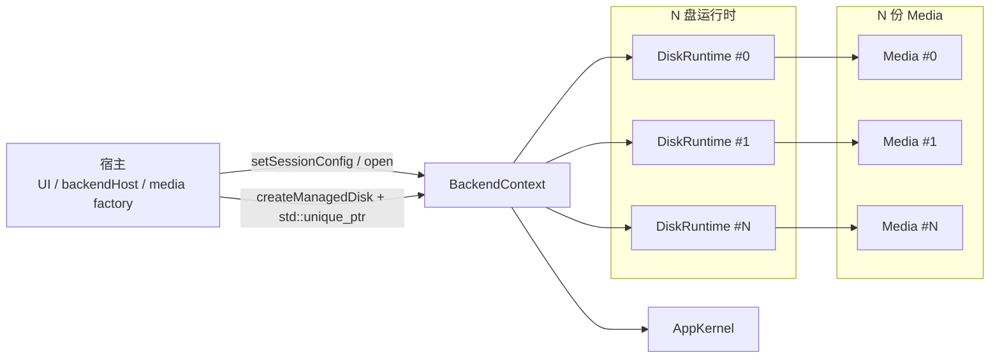

# BackendCore SDK文档

本文档面向 `BackendCore` 的宿主接入方，描述当前唯一有效的 `DLL + C++ API` 使用方式。

如果你在看的是：

- 宿主如何链接 `BackendCore`
- 哪些头文件和类型属于正式公开面
- `Media` 应该由谁实现、由谁创建、何时移交
- `BackendContext` 的生命周期和每个接口怎么用
- 每个接口的参数含义、可选值、失败条件、常见坑

看这份文档即可。

如果你需要的是：

- 为什么客户端要拆成 `UI / backendHost / BackendCore / Media`
- `BackendCore` 在整体客户端中的结构位置
- 后续完整客户端重构路线

请看 `docs` 下的正式结构文档和进度文档。

## 目录

1. [目标与边界](#1-目标与边界)
2. [交付物与部署](#2-交付物与部署)
3. [公开接口边界](#3-公开接口边界)
4. [职责分配](#4-职责分配)
5. [核心对象模型](#5-核心对象模型)
6. [宿主接入流程](#6-宿主接入流程)
7. [公开常量与类型](#7-公开常量与类型)
8. [Media 接口约束](#8-media-接口约束)
9. [BackendContext 方法参考](#9-backendcontext-方法参考)
10. [常见错误文本与返回语义](#10-常见错误文本与返回语义)
11. [常见坑](#11-常见坑)
12. [最小接入示例](#12-最小接入示例)
13. [接入检查清单](#13-接入检查清单)

## 1. 目标与边界

`BackendCore` 是 `YumeDisk` 客户端的运行时核心，以 `Windows DLL` 形式交付。

它只负责：

- `AppKernel` session 打开、关闭、状态查询。
- 每盘一个 `DiskRuntime` 的运行时管理。
- 每盘一个 `StagingStore` 的 staged write / commit / reject。
- 宿主移交 `Media` 后的读写驱动。
- 建盘、删盘、全删盘。
- runtime 级日志、统计、调试快照。

它不负责：

- `Qt UI`
- `QString / QFileInfo / 表单输入`
- 路径选择、文本解析、输入态校验文案
- 具体介质创建
- 具体介质实现
- 可见盘扫描策略

当前固定边界是：

- 宿主创建具体 `Media`
- 宿主决定 `DiskConfig`
- 宿主决定具体盘类型与对应 `Media` 实现
- 宿主调用 `BackendContext::createManagedDisk`
- `BackendCore` 接管运行时与 `Media` 所有权

## 2. 交付物与部署

当前 `BackendCore SDK` 的交付边界固定为：

- `BackendCore.dll`
- 对应 import library
- 公开头文件 `windows/BackendCore/BackendCore/BackendCore.h`
- 本文档

运行时依赖：

- `AppKernel.dll`

当前 ABI / 构建约束固定为：

- 同仓
- 同编译器
- 同 CRT
- 同进程内使用

当前不做：

- `C ABI`
- callback table
- 跨语言 ABI 包装
- 多进程 / IPC 边界

部署要求：

| 项目 | 要求 | 说明 |
| --- | --- | --- |
| `BackendCore.dll` | 宿主可执行文件可加载 | 一般放在宿主 `.exe` 同级 |
| `AppKernel.dll` | 宿主可执行文件可加载 | `BackendCore` 运行时依赖 |
| include | 只包含 `BackendCore.h` | 不要包含内部目录头 |
| link | 只链接 `BackendCore` | 不要直接把 `AppKernel` 当作上层 SDK 接口用 |

## 3. 公开接口边界

当前唯一正式公开头文件是：

- `BackendCore.h`

当前唯一正式公开命名空间是：

- `BackendCore`

宿主可依赖的公开面只有：

- 常量
- `SessionConfig`
- `DiskConfig`
- `ManagedDiskSnapshot`
- `BackendStatsSnapshot`
- `DebugSnapshot`
- `Media`
- `BackendContext`

以下内容都属于内部实现，宿主不要直接依赖：

- `config/*`
- `runtime/*`
- `StagingStore/*`
- `types/*`
- `media/Media/*`
- `scan`
- `AppKernel` 内部头

固定规则：

- 宿主只包含 `BackendCore.h`
- 宿主只链接 `BackendCore`
- 宿主不要包含 `BackendCore` 内部目录头文件

## 4. 职责分配

| 事项 | 归属 | 说明 |
| --- | --- | --- |
| 介质类型选择 | 宿主 | `denseMem / sparseMem / rawFile` 由宿主决定 |
| 介质实例创建 | 宿主 | `BackendCore` 不创建具体 `Media` |
| UI 输入解析 | 宿主 | 文本转数值、路径校验都不进入 core |
| disk 配置决定 | 宿主 | `DiskConfig` 必须由宿主显式提供 |
| staged write / commit / reject | `BackendCore` | 不让 `Media` 再自带一套暂存状态机 |
| session / disk runtime 真状态 | `BackendCore` | 上层只读快照，不持有第二份真状态 |
| 可见盘枚举 | 宿主共享模块 | 不下沉到 `AppKernel`，也不作为 `BackendCore` SDK 主接口 |

## 5. 核心对象模型



其中：

- `BackendContext` 是 session 级唯一入口。
- 每块盘对应一个独立 `DiskRuntime`。
- 每块盘对应一份独立 `Media`。
- `Media` 创建控制权在宿主，运行期持有权在 `BackendCore`。

## 6. 宿主接入流程

### 6.1 最小接入顺序

1. 包含 `BackendCore.h`
2. 创建 `BackendContext`
3. 可选设置 `SessionConfig`
4. 调用 `open`
5. 宿主自行准备 `DiskConfig`
6. 宿主自行创建具体 `Media`
7. 调用 `createManagedDisk`
8. 周期读取快照、日志、统计
9. 退出时先删盘，再 `close`

### 6.2 当前固定要求

- `diskSizeBytes` 由宿主显式给出。
- `Media::sizeBytes()` 必须与 `diskSizeBytes` 一致。
- `rawFile / denseMem / sparseMem` 的选择逻辑属于宿主。
- `BackendCore` 不替宿主推导介质类型或路径。
- `BackendCore` 不替宿主修正错配容量。

### 6.3 推荐调用顺序

```text
BackendContext ctor
  -> setSessionConfig(optional)
  -> open
  -> createManagedDisk x N
  -> query/snapshot as needed
  -> removeManagedDisk / removeAllManagedDisks
  -> close
```

## 7. 公开常量与类型

### 7.1 公开常量

#### 7.1.1 配置默认值

| 常量 | 当前值 | 用途 | 备注 |
| --- | --- | --- | --- |
| `defaultSectorSize` | `4096` | `DiskConfig.sectorSize` 默认值 | 当前客户端默认按 `4KiB` 组织 |
| `defaultQueueDepth` | `32` | `DiskConfig.queueDepth` 默认值 | 每盘队列深度默认值 |
| `defaultWriteSlotBytes` | `1048576` | `DiskConfig.writeSlotBytes` 默认值 | 默认 `1MiB` |
| `defaultReadWorkerCount` | `4` | `DiskConfig.readWorkerCount` 默认值 | 读 worker 默认值 |
| `defaultWriteWorkerCount` | `2` | `DiskConfig.writeWorkerCount` 默认值 | 写 worker 默认值 |
| `defaultAckBatchMaxRanges` | `32` | `DiskConfig.ackBatchMaxRanges` 默认值 | 默认等于 `defaultQueueDepth` |
| `defaultHeartbeatIntervalMs` | `1000` | `SessionConfig.heartbeatIntervalMs` 默认值 | session heartbeat 默认 `1s` |
| `defaultInitialEventQueueCapacity` | `1024` | `SessionConfig.initialEventQueueCapacity` 默认值 | session 事件队列初始容量 |

#### 7.1.2 运行时只读常量

| 常量 | 当前值 | 用途 | 备注 |
| --- | --- | --- | --- |
| `diskArrivalPollMs` | `100` | 建盘后可见盘轮询间隔 | 仅表示当前实现行为，不是对外配置面 |
| `diskArrivalTimeoutMs` | `2000` | 建盘后可见盘轮询超时 | 超时后路径可能仍为 pending |
| `eventWaitPollMs` | `100` | event thread wait 周期 | 仅表示当前实现行为 |
| `maxBufferedLogLines` | `256` | 内部日志缓冲上限 | 超过后最旧日志被丢弃 |

坑点：

- `defaultSectorSize` 当前是 `4096`，不要把它和 `windows/shared/yumedisk_proto.h` 里的 `YUMEDISK_DEFAULT_SECTOR_SIZE == 512` 混为一谈。
- `diskArrivalPollMs / diskArrivalTimeoutMs / eventWaitPollMs` 是当前实现常量，不是宿主可控配置。

### 7.2 宿主侧盘类型标签

`denseMem / sparseMem / rawFile` 这类盘类型标签，当前已经从 `BackendCore` SDK 解耦出去。

这意味着：

- `BackendCore` 不再公开 `MediaKind`
- `BackendCore` 不再公开 `mediaKindToText`
- `ManagedDiskSnapshot` 不再回传盘类型标签
- `createManagedDisk()` 不再接收盘类型参数

当前口径是：

- 盘类型标签属于宿主的介质选择和展示逻辑
- `BackendCore` 只关心宿主最终移交的 `Media`

推荐做法：

| 事项 | 推荐归属 |
| --- | --- |
| `denseMem / sparseMem / rawFile` 选择 | 宿主 |
| 类型标签文本显示 | 宿主 |
| 具体 `Media` 子类创建 | 宿主 |
| 数据面读写和 staged write | `BackendCore` |

坑点：

- 不要再把“盘类型标签”当成 core 真状态。
- 如果 UI 仍要显示类型列，应由宿主用 `targetId -> mediaText` 自己维护展示元数据。

### 7.3 `SessionConfig`

定义：

```cpp
struct SessionConfig {
    UINT32 heartbeatIntervalMs = defaultHeartbeatIntervalMs;
    UINT32 initialEventQueueCapacity = defaultInitialEventQueueCapacity;
};
```

字段说明：

| 字段 | 类型 | 默认值 | 必填 | 允许值 | 说明 |
| --- | --- | --- | --- | --- | --- |
| `heartbeatIntervalMs` | `UINT32` | `1000` | 是 | `> 0` | session heartbeat 周期，单位毫秒 |
| `initialEventQueueCapacity` | `UINT32` | `1024` | 是 | `> 0` | event queue 初始容量 |

校验规则：

- `heartbeatIntervalMs == 0` 会导致 `open()` 失败。
- `initialEventQueueCapacity == 0` 会导致 `open()` 失败。

坑点：

- `setSessionConfig()` 只能在 `open()` 前生效；session 已打开时更新会被忽略，只会记一条日志。

### 7.4 `DiskConfig`

定义：

```cpp
struct DiskConfig {
    ULONG targetId = YUMEDISK_MAX_TARGETS;
    ULONG sectorSize = defaultSectorSize;
    uint64_t diskSizeBytes = 0;
    UINT32 queueDepth = defaultQueueDepth;
    UINT32 writeSlotBytes = defaultWriteSlotBytes;
    UINT16 readWorkerCount = defaultReadWorkerCount;
    UINT16 writeWorkerCount = defaultWriteWorkerCount;
    UINT32 ackBatchMaxRanges = defaultAckBatchMaxRanges;
    bool readOnly = false;
};
```

字段说明：

| 字段 | 类型 | 默认值 | 允许值 | 说明 |
| --- | --- | --- | --- | --- |
| `targetId` | `ULONG` | `255` | `255` 或 `0..254` | `255` 表示自动分配；`0..254` 表示显式 target |
| `sectorSize` | `ULONG` | `4096` | `> 0` | 扇区大小；`diskSizeBytes` 必须按它对齐 |
| `diskSizeBytes` | `uint64_t` | `0` | `> 0` 且 `% sectorSize == 0` | 盘总字节数 |
| `queueDepth` | `UINT32` | `32` | `> 0` | 每盘队列深度 |
| `writeSlotBytes` | `UINT32` | `1048576` | `> 0` | 单 write slot 字节数 |
| `readWorkerCount` | `UINT16` | `4` | `> 0` | 读 worker 数 |
| `writeWorkerCount` | `UINT16` | `2` | `> 0` | 写 worker 数 |
| `ackBatchMaxRanges` | `UINT32` | `32` | `> 0` | 单批次 write ack 最大 range 数 |
| `readOnly` | `bool` | `false` | `true / false` | 只读盘标记 |

补充说明：

| 特殊值 | 含义 |
| --- | --- |
| `targetId == 255` | 自动找第一个空闲 target |
| `targetId > 254` 且不等于 `255` | 非法 |

校验规则：

- `targetId` 必须是 `255` 或 `0..254`。
- `sectorSize` 必须大于 `0`。
- `diskSizeBytes` 必须大于 `0`，且必须被 `sectorSize` 整除。
- `queueDepth / writeSlotBytes / readWorkerCount / writeWorkerCount / ackBatchMaxRanges` 都必须大于 `0`。

坑点：

- `targetId == 255` 只是“在当前 `BackendContext` 内自动找空位”，不是全系统扫描。
- `diskSizeBytes` 必须与 `Media::sizeBytes()` 完全一致；core 不会替你修正。

### 7.5 `ManagedDiskSnapshot`

定义：

```cpp
struct ManagedDiskSnapshot {
    ULONG targetId = 0;
    uint64_t diskSizeBytes = 0;
    ULONG sectorSize = 0;
    bool readOnly = false;
    std::wstring visiblePath;
    std::wstring physicalDrivePath;
    std::wstring lifecycleText;
    bool online = false;
};
```

字段说明：

| 字段 | 含义 | 备注 |
| --- | --- | --- |
| `targetId` | 当前盘 target | 由 core runtime 持有 |
| `diskSizeBytes` | 当前盘容量 | 与建盘时配置一致 |
| `sectorSize` | 当前盘扇区大小 | 与建盘时配置一致 |
| `readOnly` | 当前盘是否只读 | 与建盘时配置一致 |
| `visiblePath` | 系统可见路径 | 可能为空或 pending |
| `physicalDrivePath` | 物理盘路径文本 | 仅作展示和辅助定位，不建议当主键 |
| `lifecycleText` | 生命周期文本 | 见下表 |
| `online` | 当前是否在线 | 当前实现等于 `lifecycle == running` |

`lifecycleText` 当前可能值：

| 值 | 含义 |
| --- | --- |
| `init` | 初始化态 |
| `starting` | 启动态 |
| `running` | 运行态 |
| `removing` | 删除中 |
| `closing` | 关闭中 |
| `closed` | 已关闭 |
| `broken` | 异常态 |
| `unknown` | 查询失败或暂不可知 |

坑点：

- 建盘刚成功时，`visiblePath` 和 `physicalDrivePath` 可能还没稳定刷新出来。
- 不要把 `visiblePath` 为空理解成建盘失败；先看 `targetId / lifecycleText / online`。

### 7.6 `BackendStatsSnapshot`

定义：

```cpp
struct BackendStatsSnapshot {
    UINT64 heartbeatSent = 0;
    UINT64 commandFailures = 0;
    UINT64 protocolFailures = 0;
    UINT64 eventsQueued = 0;
    UINT64 eventsDropped = 0;
    UINT64 diskCount = 0;
};
```

字段说明：

| 字段 | 含义 | 说明 |
| --- | --- | --- |
| `heartbeatSent` | 已发送 heartbeat 数 | 来自 `AppKernel` session stats |
| `commandFailures` | 命令失败计数 | 来自 `AppKernel` session stats |
| `protocolFailures` | 协议失败计数 | 来自 `AppKernel` session stats |
| `eventsQueued` | 已入队事件数 | 来自 `AppKernel` session stats |
| `eventsDropped` | 已丢弃事件数 | 来自 `AppKernel` session stats |
| `diskCount` | 当前 core 管理盘数 | 当前实现来自 core 的 runtime map 大小，不是 driver 再查一遍 |

### 7.7 `DebugSnapshot`

定义：

```cpp
struct DebugSnapshot {
    std::wstring sessionStateText;
    BackendStatsSnapshot stats;
    std::vector<ManagedDiskSnapshot> disks;
};
```

字段说明：

| 字段 | 含义 | 说明 |
| --- | --- | --- |
| `sessionStateText` | session 文本状态 | 与 `querySessionStateText()` 一致 |
| `stats` | 统计快照 | 与 `queryBackendStats()` 一致 |
| `disks` | 盘快照数组 | 与 `snapshotManagedDisks()` 一致 |

## 8. Media 接口约束

定义：

```cpp
class Media {
public:
    virtual ~Media() = default;

    virtual bool readLocked(
        UINT64 offset,
        void* buffer,
        UINT32 length) = 0;

    virtual bool writeLocked(
        UINT64 offset,
        const void* buffer,
        UINT32 length) = 0;

    virtual uint64_t sizeBytes() const = 0;
};
```

### 8.1 方法说明

#### `bool readLocked(UINT64 offset, void* buffer, UINT32 length)`

参数说明：

| 参数 | 含义 | 要求 |
| --- | --- | --- |
| `offset` | 读取起始偏移 | 以字节为单位 |
| `buffer` | 读取目标缓冲区 | 不能为空，长度至少为 `length` |
| `length` | 读取字节数 | 可为 `0` |

返回语义：

| 返回值 | 含义 |
| --- | --- |
| `true` | 读取成功 |
| `false` | 读取失败，core 会把本次 I/O 视为失败 |

逻辑说明：

- core 在调用前已完成基础越界检查。
- core 会先从 `Media` 读取原始数据，再叠加 staged write overlay。
- `Media` 不需要理解 staged write。

#### `bool writeLocked(UINT64 offset, const void* buffer, UINT32 length)`

参数说明：

| 参数 | 含义 | 要求 |
| --- | --- | --- |
| `offset` | 写入起始偏移 | 以字节为单位 |
| `buffer` | 源缓冲区 | 不能为空，长度至少为 `length` |
| `length` | 写入字节数 | 可为 `0` |

返回语义：

| 返回值 | 含义 |
| --- | --- |
| `true` | 写入成功 |
| `false` | 写入失败，core 会认为 commit 失败 |

逻辑说明：

- `writeLocked` 只在 staged write 被最终 `commit` 时调用。
- `stage_write` 自身并不会直接调用 `Media::writeLocked`。

#### `uint64_t sizeBytes() const`

返回值说明：

| 返回值 | 含义 |
| --- | --- |
| `>= 0` | 介质固定容量，单位字节 |

硬约束：

- 必须稳定返回固定值。
- 必须与建盘时的 `DiskConfig.diskSizeBytes` 完全一致。

### 8.2 并发语义

| 接口 | 当前并发语义 | 说明 |
| --- | --- | --- |
| `readLocked` | 可与其他 `readLocked` 并发 | core 当前对读取使用 shared lock |
| `writeLocked` | 不与 `readLocked / writeLocked / stageWrite / commit / reject` 并发 | core 当前对写路径使用 unique lock |
| `sizeBytes` | 只要求结果稳定 | 一般应是无副作用查询 |

### 8.3 宿主实现要求

- `sizeBytes()` 稳定返回固定容量。
- `readLocked` 越界必须失败。
- `writeLocked` 越界必须失败。
- 不要在 `Media` 内再做 staged write / commit / reject 二次状态机。
- 只读语义如果需要，由具体介质配合宿主配置保证。

### 8.4 当前推荐实现归属

- `denseMem / sparseMem`：宿主内存介质子类
- `rawFile`：宿主文件介质子类
- 后续如果扩展 `VHD / VMDK / QCOW`，也继续作为宿主侧 `Media` 子类实现，不进入 `BackendCore`

## 9. BackendContext 方法参考

### 9.1 构造与析构

#### `BackendContext()`

作用：

- 构造一个未打开的 runtime context。

初始状态：

- 尚未打开 session
- 内部还未启动 event thread
- `SessionConfig` 使用默认值

#### `~BackendContext()`

作用：

- 自动调用 `close()`

坑点：

- 如果宿主希望控制关闭顺序，仍建议显式先删盘、再 `close()`，不要只依赖析构收尾。

### 9.2 `void setSessionConfig(const SessionConfig& sessionConfig)`

参数说明：

| 参数 | 含义 | 要求 |
| --- | --- | --- |
| `sessionConfig` | session 配置 | 必须满足 `heartbeatIntervalMs > 0`、`initialEventQueueCapacity > 0` |

行为：

- session 未打开时：覆盖当前配置。
- session 已打开时：忽略这次更新，并写日志 `[backend] ignore session config update while open`。

坑点：

- 它不是热更新接口。

### 9.3 `SessionConfig sessionConfig() const`

返回值：

| 返回值 | 含义 |
| --- | --- |
| 当前缓存的 `SessionConfig` | 不代表内核侧被动态改写后的值，只表示 core 当前持有配置 |

### 9.4 `bool open()`

行为：

- 首次调用时：
  - 校验 `SessionConfig`
  - 创建内部 `stopEvent`
  - 调用 `AkOpen`
  - 启动 event thread
  - 记录 session 打开日志
- 如果已经打开：直接返回 `true`

返回语义：

| 返回值 | 含义 |
| --- | --- |
| `true` | session 已打开或本次打开成功 |
| `false` | 打开失败 |

失败来源：

| 场景 | 日志 / 状态体现 |
| --- | --- |
| session 配置非法 | 日志记录 `invalid session config` |
| `CreateEventW` 失败 | 日志记录 `create stop event failed` |
| `AkOpen` 失败 | 日志记录 `open session failed, status=0x...` |
| event thread 启动失败 | 日志记录 `start event thread failed` |

如何定位失败：

- `open()` 本身没有 `outErrorText`。
- 失败后优先看：
  - `querySessionStateText()`
  - `snapshotLogLines()`

`querySessionStateText()` 当前可能返回：

| 文本 | 含义 |
| --- | --- |
| `open-failed(0xXXXXXXXX)` | 最近一次 `open()` 失败 |
| `closed` | 已关闭 |
| `query-failed(0xXXXXXXXX)` | 已打开但查询 session 状态失败 |
| `session=..., lifecycle=..., transport=..., disks=...` | 正常已打开 |

### 9.5 `void close()`

行为：

- 先执行 `removeAllManagedDisks(true)`
- 再停止 event thread
- 再 `AkClose`
- 再清空 runtime map 和 media
- 再释放 `stopEvent`

特性：

- 可重复调用
- 已关闭时不会报错

坑点：

- `close()` 内部用的是 `removeAllManagedDisks(true)`，这是 best-effort 收尾路径。

### 9.6 `std::wstring querySessionStateText() const`

作用：

- 返回面向调试/展示的 session 文本状态

返回文本模式：

| 模式 | 含义 |
| --- | --- |
| `open-failed(0x...)` | 最近一次打开失败 |
| `closed` | 已关闭 |
| `query-failed(0x...)` | 已打开但 session 状态查询失败 |
| `session=..., lifecycle=..., transport=..., disks=...` | 正常状态 |

适用场景：

- UI 顶部状态展示
- 打开失败后的快速诊断

### 9.7 `std::vector<std::wstring> snapshotLogLines() const`

作用：

- 返回当前日志缓冲的快照

行为：

- 返回的是复制后的快照，不是内部可变引用
- 当前最多保留 `256` 行
- 新日志超过上限时，最旧日志会被丢弃

坑点：

- `appendLog()` 同时会写 `OutputDebugStringW`，所以调试器和内存缓冲会看到相同文本流

### 9.8 `std::vector<ManagedDiskSnapshot> snapshotManagedDisks() const`

作用：

- 返回当前由 core 管理的所有盘快照

行为：

- 基于 runtime map 生成快照
- 会尝试即时刷新一次可见盘 identity
- 即时刷新不会阻塞等待新设备长期出现，当前使用的是零超时快速刷新

坑点：

- `visiblePath / physicalDrivePath` 可能短时间内仍未稳定
- 不要把快照对象当作实时句柄

### 9.9 `bool queryBackendStats(BackendStatsSnapshot* outStats, std::wstring* outErrorText = nullptr) const`

参数说明：

| 参数 | 含义 | 要求 |
| --- | --- | --- |
| `outStats` | 输出统计结构 | 不能为空 |
| `outErrorText` | 可选错误文本 | 可为空 |

返回语义：

| 返回值 | 含义 |
| --- | --- |
| `true` | 查询成功 |
| `false` | 查询失败 |

当前可能错误文本：

| 错误文本 | 含义 |
| --- | --- |
| `invalid-parameter` | `outStats == nullptr` |
| `session-not-open` | 当前 session 未打开 |
| `0xXXXXXXXX` | `AkQuerySessionStats` 返回的状态码 |

### 9.10 `bool queryDebugSnapshot(DebugSnapshot* outSnapshot, std::wstring* outErrorText = nullptr) const`

参数说明：

| 参数 | 含义 | 要求 |
| --- | --- | --- |
| `outSnapshot` | 输出调试快照 | 不能为空 |
| `outErrorText` | 可选错误文本 | 可为空 |

行为：

- 先填充 `sessionStateText`
- 再填充 `disks`
- 最后调用 `queryBackendStats()`

返回语义：

| 返回值 | 含义 |
| --- | --- |
| `true` | 查询成功 |
| `false` | 查询失败 |

当前可能错误文本：

| 错误文本 | 含义 |
| --- | --- |
| `invalid-parameter` | `outSnapshot == nullptr` |
| `session-not-open` | `queryBackendStats()` 失败透传 |
| `0xXXXXXXXX` | `queryBackendStats()` 失败透传 |

坑点：

- 即使 `sessionStateText` 和 `disks` 可以算出来，只要 `queryBackendStats()` 失败，整个 `queryDebugSnapshot()` 仍会返回 `false`。

### 9.11 `ULONG findFirstFreeTarget()`

作用：

- 返回当前 `BackendContext` 里第一个未被占用的 target

返回语义：

| 返回值 | 含义 |
| --- | --- |
| `0..254` | 找到空闲 target |
| `255` | 没有空闲 target |

坑点：

- 它只看当前 core runtime map，不会扫描全系统所有磁盘。

### 9.12 `bool createManagedDisk(DiskConfig diskConfig, std::unique_ptr<Media> media, std::wstring* outErrorText = nullptr)`

参数说明：

| 参数 | 含义 | 要求 |
| --- | --- | --- |
| `diskConfig` | 建盘配置 | 必须通过 `DiskConfig` 校验 |
| `media` | 具体介质实例 | 不能为空，且 `sizeBytes()` 必须等于 `diskConfig.diskSizeBytes` |
| `outErrorText` | 可选错误文本 | 可为空 |

核心逻辑：

1. 检查 session 已打开
2. 若 `targetId == 255`，自动分配 target
3. 校验 `diskConfig / media`
4. 检查 target 是否已存在
5. 建立 `DiskRuntime`
6. 接管 `Media` 所有权
7. 调用 `AkCreateDisk`
8. 记录日志并尽力刷新系统可见路径

返回语义：

| 返回值 | 含义 |
| --- | --- |
| `true` | 建盘成功，`media` 所有权已移交 |
| `false` | 建盘失败，`media` 仅在进入 core 前或 core 建盘失败清理时被处理 |

当前可能错误文本：

| 错误文本 | 含义 |
| --- | --- |
| `session-not-open` | session 未打开 |
| `no-free-target` | 自动分配 target 时没有空位 |
| `invalid-media-instance` | `media == nullptr` |
| `invalid-target-id` | `targetId` 非法 |
| `invalid-sector-size` | `sectorSize == 0` |
| `invalid-disk-size-bytes` | 容量为 `0` 或未按 `sectorSize` 对齐 |
| `invalid-queue-depth` | `queueDepth == 0` |
| `invalid-write-slot-bytes` | `writeSlotBytes == 0` |
| `invalid-read-worker-count` | `readWorkerCount == 0` |
| `invalid-write-worker-count` | `writeWorkerCount == 0` |
| `invalid-ack-batch-max-ranges` | `ackBatchMaxRanges == 0` |
| `media-size-mismatch` | `media->sizeBytes()` 与 `diskSizeBytes` 不一致 |
| `target-already-exists` | 当前 target 已被本 context 使用 |
| `media-instance-missing` | runtime 内部接入前状态异常 |
| `media-instance-already-set` | runtime 内部重复接入 media |
| `0xXXXXXXXX` | `AkCreateDisk` 失败状态码 |

坑点：

- `media` 成功移交后，宿主不能再继续访问原实例。
- 建盘成功不等于 `visiblePath` 立刻可见；系统路径刷新有窗口期。
- `diskConfig.diskSizeBytes` 与 `media->sizeBytes()` 任何不一致都会被拒绝。

### 9.13 `bool removeManagedDisk(ULONG targetId, std::wstring* outErrorText = nullptr)`

参数说明：

| 参数 | 含义 | 要求 |
| --- | --- | --- |
| `targetId` | 目标盘 id | 必须指向当前 context 管理的盘 |
| `outErrorText` | 可选错误文本 | 可为空 |

返回语义：

| 返回值 | 含义 |
| --- | --- |
| `true` | 删除成功 |
| `false` | 删除失败 |

当前可能错误文本：

| 错误文本 | 含义 |
| --- | --- |
| `session-not-open` | session 未打开 |
| `target-not-found` | 当前 target 不在 runtime map 中 |
| `0xXXXXXXXX` | `AkRemoveDisk` 失败状态码 |

行为说明：

- 如果 runtime 已存在但 `handle == nullptr`，core 会直接清理 runtime 和 media。
- 正常路径下会先 `AkRemoveDisk`，再清理 media 和 runtime。

### 9.14 `bool removeAllManagedDisks(bool closing)`

参数说明：

| 参数 | 含义 | 推荐值 |
| --- | --- | --- |
| `closing` | 是否处于 close 收尾路径 | 普通显式删盘时传 `false`；`close()` 内部传 `true` |

返回语义：

| 返回值 | 含义 |
| --- | --- |
| `true` | 全部删除成功，或 `closing == true` 的 best-effort 收尾完成 |
| `false` | 至少有一个盘删除失败，且 `closing == false` |

行为差异：

| `closing` | 行为 |
| --- | --- |
| `false` | 只要某盘删除失败，最终返回 `false` |
| `true` | 即使某盘删除失败，也继续清理并最终返回 `true` |

坑点：

- `closing == true` 时，它是“尽力收尾”语义，不是“严格所有盘都成功移除”语义。

### 9.15 `void appendLog(const std::wstring& text)`

作用：

- 将宿主文本并入 core 日志缓冲，并输出到 `OutputDebugStringW`

参数说明：

| 参数 | 含义 |
| --- | --- |
| `text` | 要追加的日志文本 |

行为：

- 日志进入内部 ring buffer
- 超过 `maxBufferedLogLines` 后丢弃最旧行
- 同时输出到调试器

适用场景：

- 宿主希望把 UI 层或 host 层事件并入 core 统一日志流

## 10. 常见错误文本与返回语义

### 10.1 典型错误文本

| 错误文本 | 常见来源 | 处理建议 |
| --- | --- | --- |
| `session-not-open` | 先建盘/查统计，后开 session | 先 `open()` |
| `no-free-target` | 自动 target 分配没有空位 | 释放旧 target，或显式选未占用 target |
| `target-already-exists` | 同一个 `BackendContext` 内重复建同 target | 先删旧盘或换 target |
| `target-not-found` | 删盘 target 不存在 | 先刷新盘快照确认 |
| `media-size-mismatch` | `Media::sizeBytes()` 和 `diskSizeBytes` 不一致 | 修正宿主配置或介质容量 |
| `invalid-disk-size-bytes` | 容量为 `0` 或未按扇区对齐 | 修正容量和对齐 |
| `invalid-sector-size` | `sectorSize == 0` | 修正扇区大小 |
| `0xXXXXXXXX` | 底层 `AppKernel`/驱动返回错误 | 结合日志和 session 状态排查 |

### 10.2 文本状态不是结构化协议

需要注意：

- `querySessionStateText()` 和 `outErrorText` 都是调试友好文本，不是稳定协议字段。
- 如果上层要做强逻辑分支，优先用：
  - 显式返回值
  - `DiskConfig`
  - 快照结构
  - target id

不要把日志文本或状态文本当正式协议字段长期解析。

## 11. 常见坑

### 11.1 把 `setSessionConfig()` 当热更新

不会生效。session 打开后调用只会被忽略并记日志。

### 11.2 把 `denseMem / sparseMem` 当 core 自动分配策略

不是。`BackendCore` 只记录类型标签，真正如何分配由宿主的 `Media` 实现决定。

### 11.3 误以为建盘成功后系统路径立刻稳定

不保证。`visiblePath` 和 `physicalDrivePath` 有刷新窗口，短时间 pending 是正常现象。

### 11.4 误以为 `findFirstFreeTarget()` 扫系统全局

不是。它只看当前 `BackendContext` 的 runtime map。

### 11.5 误以为 `removeAllManagedDisks(true)` 严格成功

不是。`true` 表示 close 收尾路径下的 best-effort 清理。

### 11.6 `queryDebugSnapshot()` 不是“永不失败的全量快照”

不是。它内部依赖 `queryBackendStats()`；session 未打开时仍会失败。

### 11.7 忘记 `AppKernel.dll`

只拷 `BackendCore.dll` 不够。宿主加载时还需要 `AppKernel.dll`。

### 11.8 跨 DLL 传 `std::unique_ptr<Media>` 的前提

当前成立前提是：

- 同仓
- 同 toolchain
- 同 CRT
- 同进程

如果这些前提破坏，先不要硬上。

## 12. 最小接入示例

```cpp
#include "BackendCore.h"

class DenseMemMedia final : public BackendCore::Media {
public:
    explicit DenseMemMedia(std::vector<unsigned char> bytes)
        : memory(std::move(bytes)) {}

    bool readLocked(UINT64 offset, void* buffer, UINT32 length) override;
    bool writeLocked(UINT64 offset, const void* buffer, UINT32 length) override;
    uint64_t sizeBytes() const override { return memory.size(); }

private:
    std::vector<unsigned char> memory;
};

BackendCore::BackendContext context;
BackendCore::DiskConfig diskConfig{};
std::wstring errorText;

diskConfig.targetId = YUMEDISK_MAX_TARGETS;
diskConfig.sectorSize = BackendCore::defaultSectorSize;
diskConfig.diskSizeBytes = 64ull * 1024ull * 1024ull;
diskConfig.queueDepth = BackendCore::defaultQueueDepth;
diskConfig.writeSlotBytes = BackendCore::defaultWriteSlotBytes;
diskConfig.readWorkerCount = BackendCore::defaultReadWorkerCount;
diskConfig.writeWorkerCount = BackendCore::defaultWriteWorkerCount;
diskConfig.ackBatchMaxRanges = BackendCore::defaultAckBatchMaxRanges;
diskConfig.readOnly = false;

if (!context.open()) {
    const std::wstring stateText = context.querySessionStateText();
    const auto logs = context.snapshotLogLines();
}

if (!context.createManagedDisk(
        diskConfig,
        std::make_unique<DenseMemMedia>(
            std::vector<unsigned char>((size_t)diskConfig.diskSizeBytes)),
        &errorText)) {
    context.appendLog(L"[host] createManagedDisk failed: " + errorText);
}
```

真实仓内参考：

- 宿主接入：`windows/client/backendHost/BackendHost/BackendHost.cpp`
- 内存介质：`windows/client/media/MemoryMedia/MemoryMedia.h`
- raw 文件介质：`windows/client/media/RawFileMedia/RawFileMedia.h`

## 13. 接入检查清单

- 是否只包含了 `BackendCore.h`
- 是否只通过 `BackendContext` 进入 core
- 是否由宿主自己决定盘类型和对应 `Media` 子类
- 是否由宿主自己创建具体 `Media`
- 是否保证 `Media::sizeBytes()` 与 `DiskConfig.diskSizeBytes` 一致
- 是否明确 `targetId == 255` 的自动分配语义
- 是否理解 `denseMem / sparseMem / rawFile` 已经属于宿主概念，而不是 core SDK 概念
- 是否在成功建盘后不再继续持有已移交的 `Media`
- 是否把 `AppKernel.dll` 放到宿主可执行文件同级目录
- 是否避免依赖 `BackendCore` 内部目录头文件
